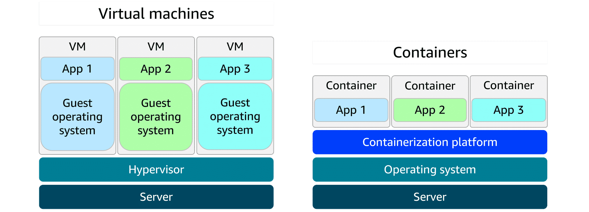
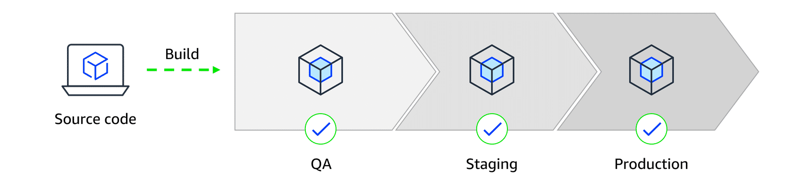

# Module 1: Introduction to the Cloud

## MODULE 1 INTRODUCTION

Welcome to AWS Cloud Practitioner Essentials

The AWS Cloud Practitioner Coffee Shop

Client (Customer) -> Barista (Server)

## THE AWS CLOUD

### What is Cloud Computing?

Defining cloud computing:
> On-demand delivery of IT resources over the Internet with pay-as-you-go pricing.

Cloud deployment types:

- **Cloud-based deployment**: In a cloud-based deployment model, you have the flexibility to migrate your existing resources to the cloud, design and build new applications within the cloud environment, or use a combination of both.

For instance, a company might migrate data resources to the cloud, then develop an application comprised of virtual servers, databases, and networking components entirely hosted in the cloud.

- **On-premises deployment**: Deploying resources on premises using virtualization and resource management tools does not provide many of the benefits of cloud computing. However, it is sometimes sought for its ability to provide dedicated resources and low latency.

In most cases this deployment model is the same as legacy IT infrastructure while using application management and virtualization technologies to try increasing resource utilization.

- **Hybrid deployment**: In a hybrid deployment, cloud-based resources and on-premises infrastructure work together. This approach is ideal for situations where legacy applications must remain on premises due to maintenance preferences or regulatory requirements.

For instance, a company might choose to retain certain regulated legacy applications on-premises while using cloud services for advanced data processing and analytics.

Multi-cloud deployments can also be considered hybrid deployments.

### Benefits of the AWS Cloud (6 keys)

- **Trade fixed expense for variable expense** By using the AWS Cloud, businesses can transition from fixed investments to variable costs. With variable costs, customer expenses are better aligned with actual usage, thus creating more financial flexibility.

- **Benefit from massive economies of scale**: Like buying a product in bulk can result in lower prices per unit, the vast global infrastructure of AWS can result in lower costs for customers. This means that AWS can be used by many organizations, from small startups to major corporations. Businesses big and small can access advanced technologies that were previously only accessible to large enterprises.

- **Stop guessing capacity**: Customers can dynamically scale AWS Cloud resources up or down based on real-time demand. This means businesses can achieve optimal performance without provisioning more or less infrastructure than they need.

- **Increase speed and agility**: With the cloud, businesses can rapidly deploy applications and services, accelerating time to market and facilitating quicker responses to changing business needs and market conditions.

- **Stop spending money to run and maintain data centers**: The AWS Cloud eliminates the need for businesses to invest in physical data centers. This means customers aren't required to spend time and money on utilities and ongoing maintenance. With AWS taking care of the physical infrastructure of the cloud, customer resources can be reallocated to more strategic initiatives.

- **Go global in minutes**: Businesses don't need to set up their own infrastructure to expand internationally. AWS provides a robust global infrastructure that customers can use to deploy applications and services across multiple areas in minutes.

### Introduction to AWS Global Infrastructure

- AWS Regions and Availability Zones

**AWS Regions**: AWS Regions are physical locations around the world that contain groups of data centers. These groups of data centers are called Availability Zones. Each AWS Region consists of a minimum of three physically separate Availability Zones within a geographic area.

**Availability Zones**: An Availability Zone consists of one or more data centers with redundant power, networking, and connectivity. Regions and Availability Zones are designed to provide low-latency, fault-tolerant access to services for users within a given area.

- Achieving high availability with AWS Global Infrastructure

AWS infrastructure is designed with high availability and fault tolerance in mind. Availability Zones (AZs) are configured as isolated resources, and they are each equipped with independent power, networking, and connectivity.

It's recommended to distribute your resources across multiple AZs. That way, if one AZ encounters an outage, your business applications will continue to operate without interruption. With this approach of redundancy and resource isolation, AWS customers can achieve the benefits of high availability and fault tolerance.

### The AWS Shared Responsibility Model

## CLOUD IN REAL LIFE

### Applying Cloud Concepts to Real Life Use Cases

## MODULE 1 CONCLUSION

# Module 2: Compute in the Clou

## Intooduction to Amazon Elastic Compute Cloud (Amazon EC2)

Amazon EC2 is more flexible, cost-effective, and faster than managing on-premises servers. It offers on-demand compute capacity that can be quickly launched, scaled, and terminated, with costs based only on active usage.

The flexibility of Amazon EC2 allows for faster development and deployment of applications. You can launch as many or as few virtual servers as needed and configure security, networking, and storage. You can also scale resources up or down based on usage, such as handling high traffic or compute-heavy tasks.

## COMPUTE IN THE CLOUD

### Amazon EC2 Instance Types

- **General Purpose**: General purpose instances provide a balanced mix of compute, memory, and networking resources. They are ideal for diverse workloads, like web services, code repositories, and when workload performance is uncertain.
- **Compute Optimized**: Compute optimized instances are ideal for compute-intensive tasks, such as gaming servers, high performance computing (HPC), machine learning, and scientific modeling.
- **Memory Optimized**: Memory optimized instances are used for memory-intensive tasks like processing large datasets, data analytics, and databases. They provide fast performance for memory-heavy workloads.Memory optimized instances are used for memory-intensive tasks like processing large datasets, data analytics, and databases. They provide fast performance for memory-heavy workloads.
- **Accelerated Computing**: Accelerated computing instances use hardware accelerators, like graphics processing units (GPUs), to efficiently handle tasks, such as floating-point calculations, graphics processing, and machine learning.
- **Storage Optimized**: Storage optimized instances are designed for workloads that require high performance for locally stored data, such as large databases, data warehousing, and I/O-intensive applications.

### How to Provision AWS Resources

Interacting with AWS services

- AWS Management Console
- AWS CLI
- AWS SDK

### Demo: Launching an Amazon EC2 Instance

Amazon Machine Images (AMIs)

- Create your own
- Use available AWS AMIs
- Purchase from AWS Marketplace

AMIs repeatably launch instances with the same configuration, including operating system, application server, and applications. You can create your own AMI or use pre-configured AMIs provided by AWS or third-party vendors.

### Amazon EC2 Pricing

**On-Demand Instances**: Pay only for the compute capacity you consume with no upfront payments or long-term commitments required.

**Reserved Instances**: Get a savings of up to 75 percent by committing to a 1-year or 3-year term for predictable workloads using specific instance families and AWS Regions.

**Spot Instances**: Bid on spare compute capacity at up to 90 percent off the On-Demand price, with the flexibility to be interrupted when AWS reclaims the instance.

**Saving Plans**: Save up to 72 percent across a variety of instance types and services by committing to a consistent usage level for 1 or 3 years.

**Dedicated Hosts**: Reserve an entire physical server for your exclusive use. This option offers full control and is ideal for workloads with strict security or licensing needs.

**Dedicated Instances**: Pay for instances running on hardware dedicated solely to your account. This option provides isolation from other AWS customers.

## AUTO SCALING AND LOAD BALANCING

### Scaling Amazon EC2

- Scalability is the ability to handle increasing or decreasing workloads by provisioning or deprovisioning resources as needed. AWS provides two main approaches to scaling:

Scaling up: Adding more resources to an existing instance, such as CPU or memory, to handle increased demand.

Scaling out: Adding more instances to distribute the load across multiple resources, improving performance and availability.

- Elasticity is the ability to automatically scale resources up or down based on demand. AWS Auto Scaling allows you to set scaling policies that automatically adjust the number of instances in response to changes in demand, ensuring optimal performance and cost efficiency.

- **Amazon EC2 Auto Scaling** automatically adjusts the number of EC2 instances based on changes in application demand, providing better availability. It offers two approaches. **Dynamic scaling** adjusts in real time to fluctuations in demand. **Predictive scaling** preemptively schedules the right number of instances based on anticipated demand.

### Directing Traffic with Elastic Load Balancing (ELB)

**Elastic Load Balancing** (ELB) automatically **distributes** incoming application traffic across multiple resources, such as EC2 instances, to optimize performance and reliability. A load balancer serves as the single point of contact for all incoming web traffic to an Auto Scaling group. As the number of EC2 instances fluctuates in response to traffic demands, incoming requests are first directed to the load balancer. From there, the traffic is distributed evenly across the available instances.

Although ELB and Amazon EC2 Auto Scaling are distinct services, they work in tandem to enhance application performance and ensure high availability. Together, they enable applications running on Amazon EC2 to scale effectively while maintaining consistent performance.

**Routing methods**:

- Round Robin: Distributes incoming traffic sequentially across all available instances, ensuring an even distribution of requests.
- Least Connections: Directs traffic to the instance with the fewest active connections, optimizing resource utilization and improving response times.
- IP Hash: Routes traffic based on the client's IP address, ensuring that requests from the same client are consistently directed to the same instance, which can be beneficial for session persistence.
- Least Response Time: Directs traffic to the instance with the lowest response time, enhancing performance by routing requests to the most responsive resources.

### Messaging and Queuing

> Decoupling service: A design pattern that allows components of an application to operate independently by using messaging or queuing services to communicate asynchronously.

Amazon EventBridge, Amazon SNS, and Amazon SQS are AWS services that help different parts of an application communicate effectively in the cloud. These services support building event-driven and message-based systems. Together, they help create scalable, reliable applications that can handle high traffic and can enhance communication between components.

EventBridge is a serverless event bus that makes it easy to connect applications using data from various sources. It allows you to build event-driven applications by routing events from sources like AWS services, SaaS applications, and custom applications to targets such as AWS Lambda functions, Amazon SQS queues, and more.

Amazon SNS (Simple Notification Service) is a fully managed messaging service that enables you to decouple microservices, distributed systems, and serverless applications. It allows you to send messages to multiple subscribers through various protocols, such as email, SMS, and HTTP endpoints.

Amazon SQS (Simple Queue Service) is a fully managed message queuing service that enables you to decouple and scale microservices, distributed systems, and serverless applications. It allows you to send, store, and receive messages between software components at any volume without losing messages or requiring other services to be available.

## MODULE 2 CONCLUSION

# Module 3: Exploring Compute Services

## INTRODUCTION

Unmanaged vs. Managed Services

Fully-managed Services

## AWS SERVERLESS, CONTAINERS AND SOLUTIONS OVERVIEW

### AWS Lambda

Lambda is a serverless compute service that runs code in response to events without the need to provision or manage servers. It automatically manages the underlying infrastructure, scaling resources based on the volume of requests. You are charged only for the compute time consumed, down to the millisecond. Lambda handles execution, scaling, and resource allocation. You can optimize performance by configuring the appropriate memory size for your function.

Use cases:

- Real-time image processing for a social media application: A social media company uses Lambda to process images uploaded by users. When a photo is uploaded, Lambda is triggered to resize the image, apply filters, and save it in an optimized format to storage. This event-driven, serverless approach makes sure that the application can handle high volumes of uploads without needing to manage infrastructure.

**Why Lambda**: It automatically scales based on uploads and charges only for the time spent processing each image.

- Personalized content delivery for a news aggregator: A news aggregator uses Lambda to fetch and process news articles from multiple sources, then it tailors recommendations based on user preferences. When a user opens the application or performs a search, Lambda functions are triggered to retrieve data, run personalization logic, and return relevant content.

**Why Lambda**: It automatically scales with user traffic and reduces costs by running code only when users interact.

- Real-time event handling for an online game: A gaming company uses Lambda to handle in-game events like player actions, game state changes, and real-time leader board updates. Each event (like scoring a point or unlocking an achievement) triggers a Lambda function that updates player data and game status.

**Why Lambda**: It handles thousands of events, in real-time, with no need to manage servers. Costs scale with usage, which is ideal for peak gaming times.

The key components of AWS Lambda are the **function, triggers, and runtimes**. These components handle code, respond to events, and provide the language environment. Customers do not need to manage servers, scaling, or operating systems. AWS takes care of all that.

### Containers and Orchestration on AWS

Containers and VMs

Deployment consistency with containers

Scaling containers with orchestration

AwS Container services:

- Amazon Elastic Container Service (**Amazon ECS**) is a scalable container orchestration service for running and managing containers on AWS, like Docker containers. Docker is a software platform for building, testing, and deploying applications quickly.
  
Amazon ECS launch types

  **Amazon ECS with Amazon EC2** is ideal for small-to-medium businesses that need full control over infrastructure. Suitable for custom applications requiring specific hardware or networking configurations, with the flexibility of Amazon EC2 and the simplicity of Amazon ECS.

  **Amazon ECS with AWS Fargate** is perfect for startups or small teams building web applications with variable traffic. It's a serverless option—no server management required—so teams can focus on development while Amazon ECS handles scaling and orchestration.

- Amazon Elastic Kubernetes Service (**Amazon EKS**) is a fully managed service for running Kubernetes on AWS. It simplifies deploying, managing, and scaling containerized applications using open-source Kubernetes, with ongoing support and updates from the broader community.

Amazon EKS launch types

 **Amazon EKS with Amazon EC2**: This is best for enterprises needing full control over infrastructure. It offers deep customization of EC2 instances alongside Kubernetes scalability—ideal for complex, large-scale workloads.

 **Amazon EKS with AWS Fargate**: This is great for teams wanting Kubernetes flexibility without managing servers. It combines Kubernetes power with serverless simplicity, helping to scale applications quickly across various use cases.

Amazon Elastic Container Registry (**Amazon ECR**) is where you can store, manage, and deploy container images. It supports container images that follow the Open Container Initiative (OCI) standards. You can push, pull, and manage images in your Amazon ECR repositories using standard container tooling and command line interfaces (CLIs).

**AWS Fargate** is a serverless compute engine for containers. It works with both Amazon ECS and Amazon EKS. Fargate is a container hosting platform, unlike Amazon ECS and Amazon EKS, which are both container orchestration services.

When using Fargate, you do not need to provision or manage servers. Fargate manages your server infrastructure for you. You can focus more on innovating and developing your applications, and you pay only for the resources that are required to run your containers.

### Additional AWS Compute Services

- Elastic Beanstalk is a fully managed service that streamlines the deployment, management, and scaling of web applications. Developers can upload their code, and Elastic Beanstalk automatically handles the provisioning of infrastructure, scaling, load balancing, and application health monitoring. It supports various programming languages and frameworks, such as Java, .NET, Python, Node.js, Docker, and more. It provides full control over the underlying AWS resources while automating many operational tasks.

**Good for**: Deploying and managing web applications, RESTful APIs, mobile backend services, and microservices architectures, with automated scaling and simplified infrastructure management

- AWS Batch is a fully managed service that you can use to run batch computing workloads on AWS. It automatically schedules, manages, and scales compute resources for batch jobs, optimizing resource allocation based on job requirements.

**Good for**: Processing large-scale, parallel workloads in areas like scientific computing, financial risk analysis, media transcoding, big data processing, machine learning training, and genomics research

- Amazon Lightsail is a cloud service offering virtual private servers (VPSs), storage, databases, and networking at a predictable monthly price. It’s ideal for small businesses, basic workloads, and developers seeking a straightforward AWS experience without the complexity of the full AWS Management Console.

**Good for**: Basic web applications, low-traffic websites, development and testing environments, small business websites, blogs, and learning cloud services

- AWS Outposts is a fully managed hybrid cloud solution that extends AWS infrastructure and services to on-premises data centers. It provides a consistent experience between on premises and the AWS Cloud, offering compute, storage, and networking components.

**Good for**: Low-latency applications, data processing in remote locations, migrating and modernizing legacy applications, and meeting regulatory compliance or data residency requirements

## CONCLUSION

# Module 4: Going Global

## INTRODUCTION

How to choose a Region or set of Regions
AWS edge locations
Infrastructure as code and CloudFormation

## AWS GLOBAL INFRASTRUCTURE

### Choosing AWS Regions

- Compliance: Compliance is an important consideration when selecting Regions for deploying business resources. Different geographical locations have varying regulatory requirements and data protection laws that organizations must follow. For example, the General Data Protection Regulation (GDPR) is designed to protect the personal data and privacy of individuals within the European Union (EU). An online retail company operating in the EU would be required to meet GDPR compliance to protect customer data. GDPR compliance includes obtaining proper consent for data collection and providing mechanisms for data access and deletion.
- Proximity: When selecting a Region, you also want to consider how to achieve low latency for your users. Regions closer to your user base minimize data travel time, which reduces latency and enhances application responsiveness. Choosing a Region or set of Regions farther away from customers could introduce delays, which might impact user satisfaction and overall system efficiency.
- Feature availability: You also want to consider which specific features and services are available in each Region. AWS is constantly expanding features and services to multiple locations, but not all Regions contain all AWS offerings. For example, AWS GovCloud Regions are specifically designed to meet the compliance and security requirements of US government agencies and their contractors. These Regions have stringent physical, operational, and personnel security controls in place. These controls are only available in specific Regions to meet certain governmental regulatory requirements.
- Pricing: When selecting a Region, pricing is also a factor that can influence your decision. Some Regions have lower operational costs than others. These operational costs can impact the overall expenses for hosting applications and services. Tax laws and regulations can also play a role in cost. Some Regions might offer tax incentives or have lower tax rates, which can affect customer pricing. Additionally, data sovereignty laws in certain Regions might require data to be stored locally, affecting both compliance and cost.

### Diving Deeper into AWS Global Infrastructure

Benefit of deploying the resources to multiple Regions:  

- High availability and fault tolerance. If one Region experiences an outage, resources in other Regions can continue to operate, minimizing downtime and ensuring business continuity.
- Low latency for global users. Deploying resources in multiple Regions allows you to serve users from the Region closest to them, reducing latency and improving performance.

AWS Region: A physical location around the world where AWS operates multiple data centers

Availability Zone: Separate, distinct locations with one or more data centers that are engineered to be isolated from failures in other areas

Edge location: Locations that cache content to deliver data, video, and applications to users with lower latency

> Regions are physical locations around the world that contain multiple data centers. Each Region contains at least three Availability Zones. Each Availability Zone contains one or more data centers. Edge locations are devices in areas outside of Regions. These devices provide user access to frequently accessed data with low latency.

### Infrastructure and Automation

**CloudFormation** is an infrastructure as code (IaC) service that allows you to define and provision AWS infrastructure using a declarative template. With CloudFormation, you can create and manage resources like EC2 instances, S3 buckets, and VPCs in a predictable and repeatable way. You can use CloudFormation to automate the deployment of your infrastructure, ensuring consistency across environments and reducing the risk of manual errors.

Interacting with AWS resources:

- Programmatic Access
- AWS Management Console
- IaC

## CONCLUSION

# Module 5: Networking

## INTRODUCTION

**Networking components**

Amazon Virtual Private Cloud (Amazon VPC): An Amazon VPC lets you provision a logically isolated section of the AWS Cloud where you can launch AWS resources in a virtual network that you define.

Subnet: Subnets are used to organize your resources and can be made publicly or privately accessible. A private subnet is commonly used to contain resources like a database storing customer or transactional information. A public subnet is commonly used for resources like a customer-facing website.

### Introduction to Networking

## NETWORK COMPONENTS IN THE AWS CLOUD

### Organizing AWS Cloud Resources

Virtual Private Cloud: Amazon VPC is used to establish boundaries around your AWS resources.
Virtual Private Gateway: A virtual private gateway allows protected internet traffic to enter into the VPC.
Virtual private network (VPN) connection: A VPN encrypts your internet traffic, helping protect it from anyone who might try to intercept or monitor it.

### More Ways to Connect to the AWS Cloud

### Subnets, Security Groups, and Network Access Control Lists (ACLs)

### Amazon VPC Demo

### Global Networking

## CLOUD IN REAL LIFE

## CONCLUSION

# Module 7: Databases

## INTRODUCTION

- Deciding to maintain own database or use a managed service

## AWS DATABASE SERVICES

### Relational Database Services

Relational databases

Amazon Relational Database Service (Amazon RDS)

- Supported database engines: Amazon Aurora, PostgreSQL, MySQL, MariaDB, Oracle Database, and SQL Server
- Use cases
- Benefits
  - Cost optimization
  - Multi-AZ deployments for high availability
  - Performance optimization with read replicas
  - Security controls

Amazon Aurora: Aurora is a managed relational database designed to help reduce unnecessary I/O operations. It's compatible with MySQL and PostgreSQL, provides high performance and availability, and automatically scales alongside your workloads. Aurora replicates data across multiple Availability Zones for enhanced durability and fault tolerance, and features automated backups, encryption at rest, and continuous monitoring.

- Benefits
  - High performance and availability
  - Automated storage and backup management
  - Advanced replication and fault tolerance

### NoSQL Databases Services

### AWS Databases Demostration

### In-Memory Caching Services

### Additional AWS Database Services

## CONCLUSION
