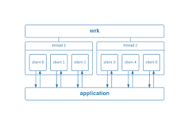
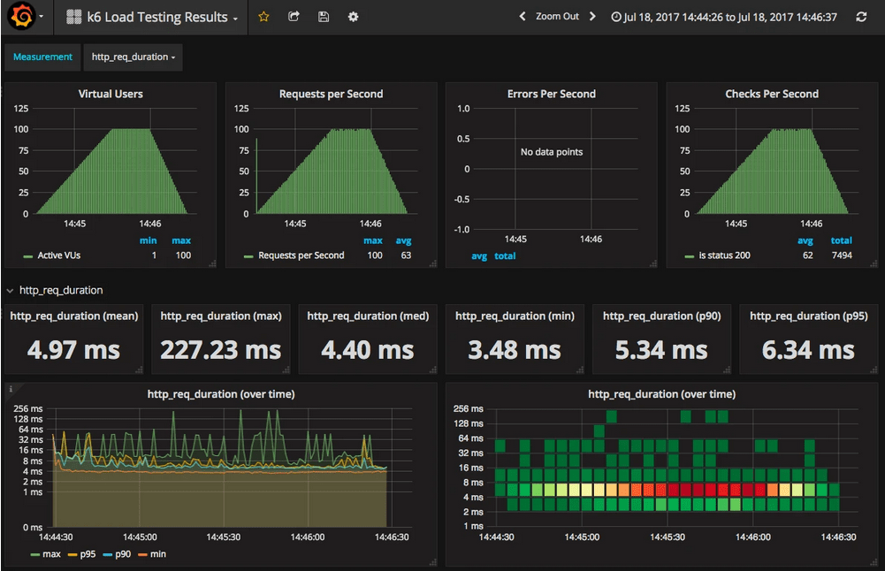

# "Tam Quốc Diễn Nghĩa" làng Benchmark: ab, wrk và k6 – Ai mới là trùm cuối?

Chào anh em,

Chuyện là hôm nọ mình có làm một con web game 2D sương sương để đem đi thuyết trình ở lớp. Mọi thứ đều ổn cho đến khi mình chợt nghĩ: "Nhỡ đâu lúc mình đang thao thao bất tuyệt thì 30 cái máy tính ở dưới cùng truy cập và... BÙM! Server sập?"

Hiệu ứng Demo (Demo Effect) là một cái gì đó rất tâm linh. Để ăn ngon ngủ yên, mình quyết định phải **Benchmark** (kiểm thử chịu tải) hệ thống.

Và thế là cuộc hành trình đi tìm "Thanh Long Đao" để chém server bắt đầu. Mình đã thử qua 3 cái tên sừng sỏ nhất: **Apache Benchmark (ab), wrk,** và **k6**. Dưới đây là bài review chân thực (và đau thương) của mình.

## 1. Apache Benchmark (ab) - "Cụ tổ" huyền thoại

Đầu tiên, mình tìm đến `ab`. Đây là công cụ có sẵn trên hầu hết các máy macOS/Linux. Nó giống như chiếc xe đạp Phượng Hoàng của ông nội để lại: Cũ, bền, ai cũng biết đi, nhưng không đua được với bọn trẻ trâu bây giờ.


Cài đặt trên ubuntu/debian nếu chưa có:

```zsh
sudo apt update
sudo apt install apache2-utils
```

**Cách dùng**: Siêu đơn giản, gõ một dòng là chạy:

```zsh
ab -n 1000 -c 10 <http://localhost:8080/>
```

Bắn 1000 request với 50 kết nối đồng thời vào server

```zsh
❯ ab -n 1000 -c 50 http://localhost:8080/
```

Kết quả thu được:

```zsh
This is ApacheBench, Version 2.3 <$Revision: 1923142 $>
Copyright 1996 Adam Twiss, Zeus Technology Ltd, http://www.zeustech.net/
Licensed to The Apache Software Foundation, http://www.apache.org/

Benchmarking localhost (be patient)
Completed 100 requests
Completed 200 requests
Completed 300 requests
Completed 400 requests
Completed 500 requests
Completed 600 requests
Completed 700 requests
Completed 800 requests
Completed 900 requests
Completed 1000 requests
Finished 1000 requests


Server Software:        nginx/1.29.4
Server Hostname:        localhost
Server Port:            8080

Document Path:          /
Document Length:        444 bytes

Concurrency Level:      50
Time taken for tests:   0.079 seconds
Complete requests:      1000
Failed requests:        0
Total transferred:      677000 bytes
HTML transferred:       444000 bytes
Requests per second:    12591.92 [#/sec] (mean)
Time per request:       3.971 [ms] (mean)
Time per request:       0.079 [ms] (mean, across all concurrent requests)
Transfer rate:          8324.93 [Kbytes/sec] received

Connection Times (ms)
              min  mean[+/-sd] median   max
Connect:        0    0   0.4      0       2
Processing:     0    4   1.6      3      12
Waiting:        0    3   1.5      3      11
Total:          1    4   1.6      3      12

Percentage of the requests served within a certain time (ms)
  50%      3
  66%      4
  75%      4
  80%      5
  90%      6
  95%      7
  98%      9
  99%     10
 100%     12 (longest request)
```

**Cảm nhận**:

- **Ưu điểm**: Mì ăn liền. Cần check nhanh xem server còn sống hay đã "ngỏm" thì dùng ab là chuẩn bài. Không cần cài cắm lằng nhằng.

- **Nhược điểm**:
  - **Yếu sinh lý**: ab chỉ chạy đơn luồng (single-thread). Tức là khi mình muốn test server chịu tải cao, thì chính ông ab bị nghẽn cổ chai trước cả server.
  - **Lỗi thời**: Không hỗ trợ tốt HTTP/2.

**=> Kết luận**: Dùng để "khều" nhẹ server thì được. Chứ đem đi đánh trận lớn (High concurrency) thì `ab` thở oxy không kịp.

## 2. wrk - "Kẻ hủy diệt" cục súc

Thấy `ab` hơi yếu, mình chuyển sang `wrk`. Nếu ab là xe đạp, thì `wrk` chính là chiếc xe tăng húc đổ cổng dinh Độc Lập.



**Sức mạnh**: Thằng này chạy đa luồng (multithread), tận dụng tối đa sức mạnh CPU để spam request. Mình đã thử bắn vào con Nginx tội nghiệp của mình:

```zsh
docker run --rm --network host williamyeh/wrk -t12 -c400 -d30s <http://localhost:8080/>
```

- Các tham số:

  - -t12: Dùng 12 threads (tùy theo CPU mà chỉnh cho phù hợp).

  - -c400: Tạo 400 kết nối đồng thời (con số này càng cao thì server càng mệt).

  - -d30s: Chạy trong 30 giây.

```zsh
❯ docker run --rm --network host williamyeh/wrk -t12 -c400 -d30s http://localhost:8080/
```

- Kết quả thu được:

```zsh
Running 30s test @ http://localhost:8080/
  12 threads and 400 connections
  Thread Stats   Avg      Stdev     Max   +/- Stdev
    Latency    28.39ms   96.39ms   2.00s    98.59%
    Req/Sec     1.72k   382.59     9.09k    91.79%
  613055 requests in 30.09s, 398.73MB read
  Socket errors: connect 0, read 0, write 0, timeout 107
Requests/sec:  20374.45
Transfer/sec:     13.25MB
```

**Kết quả**: Nó bắn ra **20374.45** request/giây! Server mình không những không sập mà còn cười khẩy. Nhưng quan trọng là `wrk` cho mình cảm giác quyền lực tuyệt đối.

- **Ưu điểm**: Nhanh, mạnh, trâu bò. Muốn test ngưỡng giới hạn (stress test) xem server chịu được bao nhiêu đòn thì phải dùng con này.

- **Nhược điểm**:

  - **Output xấu**: Màn hình kết quả toàn text, nhìn hoa cả mắt.

  - **Khó chiều**: Muốn kịch bản phức tạp (ví dụ: login xong mới mua hàng) thì phải viết script bằng Lua (ngôn ngữ từ thời Napoléon). Khá khoai.

**=> Kết luận**: Dành cho dân hardcore thích bạo lực. Chỉ quan tâm số to, không quan tâm cảm xúc người dùng.

## 3. k6 - "Giáo sư" hiện đại & tinh tế

Sau khi đã chán cảnh đấm đá túi bụi của `wrk`, mình tìm đến `k6`. Đây là tool mới nổi, được viết bởi Grafana. Nó giống như một anh chàng IT mặc suit, đeo kính, làm việc khoa học.



**Sự khác biệt**: Thay vì spam 1 URL như điên, `k6` cho phép mình viết kịch bản bằng **Javascript** (chân ái của Web Dev). Mình có thể giả lập người dùng thật:

1. Vào trang chủ.

2. Nghỉ 1 giây (để đọc chữ).

3. Tải ảnh.

4. Nghỉ 2 giây.

```js
import http from 'k6/http';
import { sleep } from 'k6';
export default function () {
  http.get('<http://localhost:8080>');
  sleep(1); // Người dùng thật thì phải biết nghỉ!
}
```

- **Ưu điểm**:

  - **Thực tế**: Giả lập được hành vi "con người" (User Journey) chứ không phải zombie.

  - **Đẹp**: Output có màu sắc, thanh loading, biểu đồ ASCII art nhìn rất "nghệ".

  - **Dễ viết**: JS thì ai mà chẳng biết (hoặc ít nhất là copy paste được).

- **Nhược điểm**: Chạy hơi tốn RAM hơn so với wrk một chút (vì nó phải tải engine JS).

**=> Kết luận**: Dành cho việc test hiệu năng thực tế (Performance Test) để báo cáo sếp hoặc show cho khách hàng.
