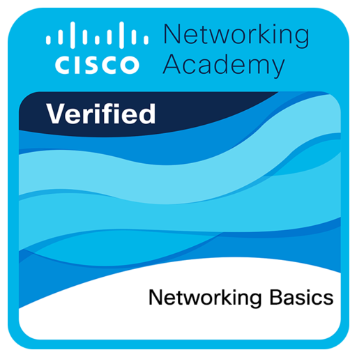

## Introduction

---

### First Time in this Course

### Student Resources

### Download Cisco Packet Tracer (PT)

- <https://www.netacad.com/resources/lab-downloads?courseLang=en-US>

---

## Module 1: Communication in a Connected World

---

## Module 2: Network Components, Types, and Connections

---

## Module 3: Wireless and Mobile Networks

---

## Module 4: Build a Home Network

---

## Checkpoint Exam: Build a Small Network

---

## Module 5: Communication Principles

---

## Module 6: Network Media

---

## Module 7: The Access Layer

---

## Checkpoint Exam: Network Access

---

## Module 8: The Internet Protocol

---

## Module 9: IPv4 and Network Segmentation

---

## Module 10: IPv6 Addressing Formats and Rules

---

## Module 11: Dynamic Addressing with DHCP

---

## Checkpoint Exam: The Internet Protocol

---

## Module 12: Gateways to Other Networks

---

## Module 13: The ARP Process

---

## Module 14: Routing Between Networks

---

## Module 15: TCP and UDP

---

## Module 16: Application Layer Services

---

## Module 17: Network Testing Utilities

---

## Checkpoint Exam: Protocols for Specific Tasks

---

## Networking Basics Course Final Exam

After all your hard work, Cisco will reward you with a certificate of completion. You can share this certificate on your resume, LinkedIn profile, or with potential employers to demonstrate your knowledge of networking basics. Congratulations on completing the course!

