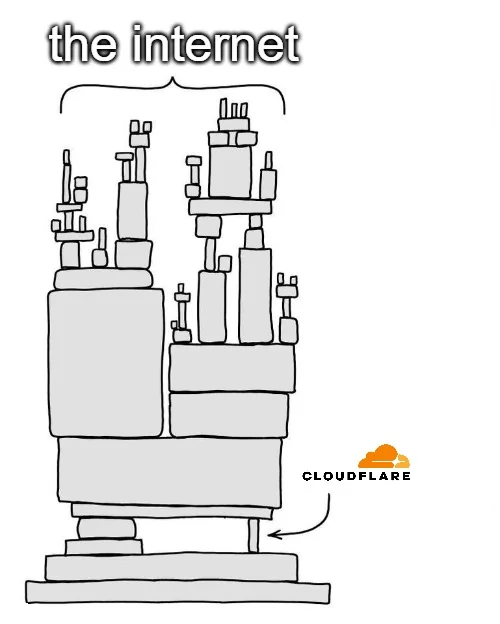
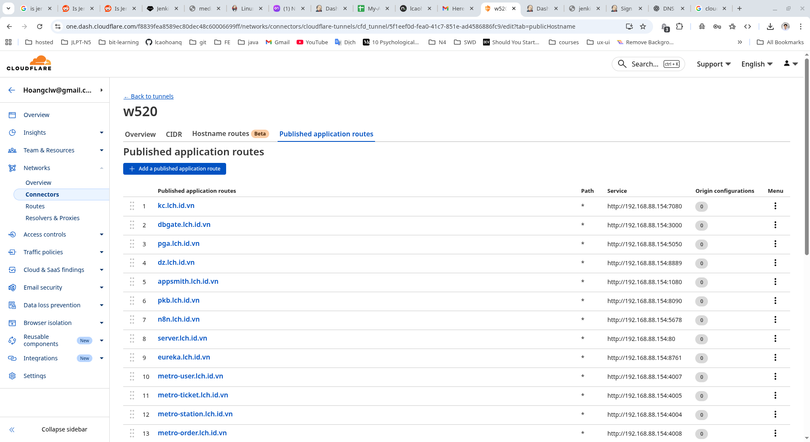

# Mở đầu

- Hôm 18-11-2025 Cloudflare sập, có thể đọc thêm ở đây: [Cloudflare gặp sự cố](https://devops.vn/new/cloudflare-sap-cloudflare-gap-su-co-tren-dien-rong-ngay-18-11-2025/), toàn bộ các dịch vụ quan trọng sử dụng DNS của Cloudflare đều bị ảnh hưởng, lỗi 500 hàng loạt trên Canva, Liên Minh Huyền Thoại,...



- Mình đã bắt đầu sử dụng Cloudfare khi làm Homelab server, và mọi đồ án nhỏ, lớn trên trường, và vụ sập đó khiến mình suy nghĩ rằng, trong ngành tech này mong manh nhỉ. Công ty siêu lớn như vậy rồi, có thể xem là xương sống của Internet, bao nhiêu cái pipeline, health check, monitoring,... vẫn không tránh được bug. Bài viết này chủ yếu là tổng hợp lại kiến thức của mình, vì nhiều quá, có nơi để lưu trữ và xem lại.

# Tunnel

Cloudflare Tunnel (trước đây gọi là Argo Tunnel) là một dịch vụ của Cloudflare cho phép bạn kết nối máy chủ nội bộ hoặc ứng dụng web với mạng lưới của Cloudflare mà không cần phải mở cổng trên tường lửa hoặc cấu hình NAT. Điều này giúp tăng cường bảo mật và đơn giản hóa việc triển khai ứng dụng.

- Ví dụ đơn giản: mình có một homelab server, giờ mình truy cập vào sẽ bằng private IP (192.168.x.x), rồi giờ mình về quê, hay đổi mạng, lên tầng, xuống tầng nhà,... mình cần di chuyển thì mình không thể kết nối vào bằng private IP được mình cần public IP. Giờ có 2 cách:
  - Cách 1: Mở port trên router, cấu hình NAT, DDNS,... (cách này khá phức tạp và không an toàn)
  - Cách 2: Dùng Tunnel, có rất nhiều tool hỗ trợ điều này, nếu đã từng code backend thì các bạn sẽ nghe tới **ngrok**, **localtunnel**,... khi run chúng lên sẽ tạo 1 url nối tới service chạy ở server bằng một url random, khi restart sẽ đổi url khác. Cách này khá bất tiện, xài **ngrok** hay **localtunnel** thì phải chạy tool này liên tục trên server, nếu server tắt thì không truy cập được. Chúng chỉ cho mục đích demo nhanh, không dùng cho production. Phương án cuối cùng là dùng một dịch vụ chuyên dụng như **Cloudflare Tunnel**.

- Vì dùng đồ nhà Cloudflare nên sẽ tận dụng được hệ sinh thái, bảo bật, chống ddos cực tốt của Cloudflare.



- Cách hoạt động (râu ria nói sau):
  - Tạo một **subdomain** từ domain đã gắn vào cloudflare route đến domain của service đang chạy trên server nội bộ.
  - Trên hình với một domain `lch.id.vn` mình tạo nhiều **subdomain** rồi route cho từng service khác nhau như:
    - `kc.lch.id.vn` route đến service Keycloak chạy trên port 7080
    - `dz.lch.id.vn` route đến service Dozzle chạy trên port 8889

## Các lỗi xảy ra

### Route xong rồi sao load mãi không vào được

Nhớ bật firewall cho port service đó nhé

```zsh
# Check UFW status
sudo ufw status

# Mở port nếu chưa mở
sudo ufw allow 7080/tcp

# Hoặc tắt UFW (không khuyến khích)
sudo ufw disable

# Reload 
sudo ufw reload
```

- Lỗi tiếp theo

This site can’t be reached
Check if there is a typo in jenkins.lch.id.vn. DNS_PROBE_FINISHED_NXDOMAIN

- Thường thì các bạn cài mới, setup mới luôn tunnel thì sẽ không vào được ngay, vì DNS chưa kịp cập nhật, các bạn chờ khoảng 5-10 phút rồi thử lại.
- Trường hợp của mình là domain gắn cả năm rồi, những vẫn bị lỗi này thì mình check như sau
  - Service nội bộ vẫn vào được
  - Tunnel vẫn healthy
  - Check thử xem list tunnel có hiện ra không

```zsh
lcaohoanq@kebiansv:~$ cloudflared tunnel list
2026-01-06T08:26:26Z ERR Cannot determine default origin certificate path. No file cert.pem in [~/.cloudflared ~/.cloudflare-warp ~/cloudflare-warp /etc/cloudflared /usr/local/etc/cloudflared]. You need to specify the origin certificate path by specifying the origincert option in the configuration file, or set TUNNEL_ORIGIN_CERT environment variable originCertPath=
Error locating origin cert: client didn't specify origincert path
```

- Rồi xong, đã bắt bệnh, do file cert.pem bị mất, mình login lại rồi check thử vào được ngay.

```zsh
lcaohoanq@kebiansv:~$ cloudflared tunnel login

# Test lại
lcaohoanq@kebiansv:~$ cloudflared tunnel list
```

# Zero Trust

- Không tin tưởng mặc định vào bất kỳ thiết bị hoặc người dùng nào, ngay cả khi họ đã được xác thực trong mạng nội bộ. Mọi truy cập đều phải được kiểm tra và xác minh trước khi được phép truy cập vào tài nguyên.
