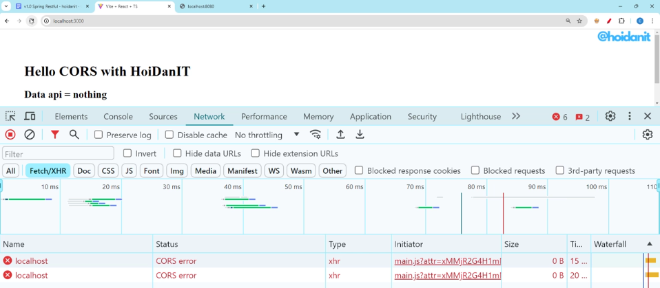
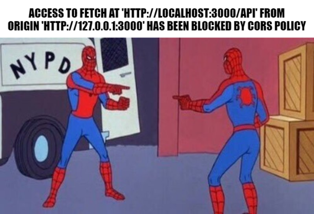
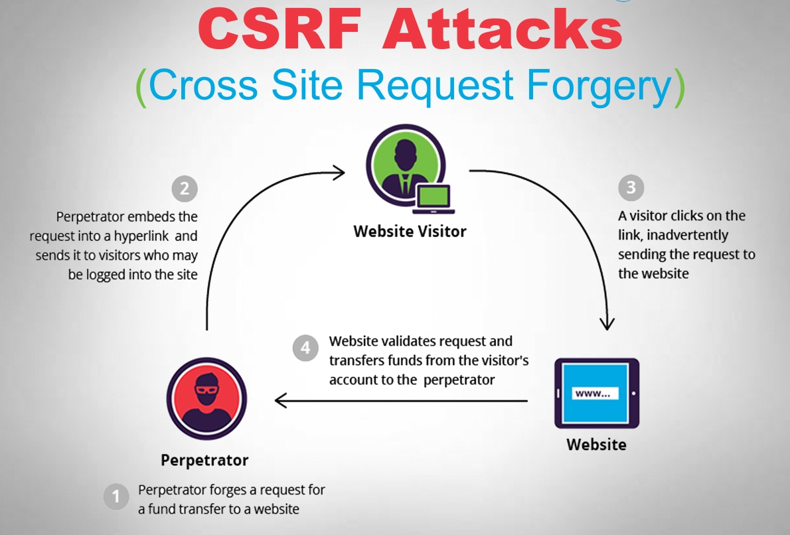

- Một lỗi kinh điển, thường gặp trong quá trình làm website
- Chỉ xảy ra với mô hình stateless và sử dụng browser

## CORS là gì?

- Tài liệu chính thức: [MDN CORS](https://developer.mozilla.org/en-US/docs/Web/HTTP/CORS)

- Trình duyệt mặc định chỉ cho phép gọi request từ cùng một nguồn (same-origin policy), nói rõ hơn như này:
  - Mình đang start React app ở `http://localhost:3000`
  - Trình duyệt chỉ cho phép mình gọi API từ `http://localhost:3000/api/xyz`
  - Nếu mình gọi API từ `http://localhost:5000/api/xyz` thì trình duyệt sẽ block request này

# Tại sao lại có CORS?

## Mục đích
- Bảo vệ người dùng khỏi các cuộc tấn công **Cross-Site Request Forgery** (CSRF)

- CORS sinh ra để giúp lướt web an toàn hơn, và cung cấp thêm sức mạnh cho server, khi có thể quyết định **tên miền nào** được phép truy cập tài nguyên của mình.

- Nếu không có CORS, một trang web độc hại có thể gửi yêu cầu đến các trang web khác mà người dùng đã đăng nhập, dẫn đến việc lạm dụng quyền truy cập của người dùng mà họ không hề hay biết

## Ví dụ 
Tưởng tượng case sau: mình đang dùng browser, sử dụng `facebook.com`, trình duyệt sẽ lưu cookie đăng nhập của mình, bla bla, access, refresh, cookies,... 

Rồi một hôm mình được gửi một link (hot-girl.xyz), mình tò mò click vào. 

Nếu facebook không có CORS, trang `hot-girl.xyz` có thể gửi request đến `facebook.com/api/auth/login` với cookie đăng nhập của mình, thực hiện các hành động như đăng bài, gửi tin nhắn, hoặc thậm chí thay đổi cài đặt tài khoản mà mình không hề hay biết.

# Cách fix CORS

- Có thể fix ở phía client hoặc server, **fix ở server** là tốt nhất

- Tùy từng backend framework các bạn xài mà có cách fix khác nhau

- Ví dụ với Spring Boot: https://viblo.asia/p/part-2-cau-hinh-cors-trong-spring-boot-o-cac-cap-controller-global-va-trong-spring-security-va-ly-do-tai-sao-PAoJenAZL1j

- Ví dụ với ExpressJs: https://viblo.asia/p/cors-la-gi-cors-voi-nodejs-Qbq5QyyL5D8

- Tuy nhiên, khi đi làm thực tế, nếu server không do bạn viết, hoặc đối tác cung cấp không thể sửa đổi thì làm thế nào?

## Cách 1: Disable Security của trình duyệt

- https://stackoverflow.com/questions/3102819/disable-same-origin-policy-in-chrome
> không khuyến khích dùng cách này

## Cách 2: Server - Server

- Khuyến khích dùng cách này, vì control 100%
- CORS chỉ xảy ra giữa client-server, còn server gọi server sẽ không dính CORS
- Flow: Client -> Server A (CORS) không cho sửa
> Client -> Server B (đã setup CORS) -> Server A

## Cách 3: Dùng Proxy cho Frontend 

- Cần kiểm tra xem tool sử dụng có hỗ trợ proxy không

> Client -> Proxy -> Server A (CORS) không cho sửa

- Cách này giống với cách 2 ở trên

- Với React Vite, có thể cấu hình proxy trong file `vite.config.js`
- Khái niệm proxy này bạn nào dùng `nginx` (**reverse proxy**) sẽ thấy quen thuộc