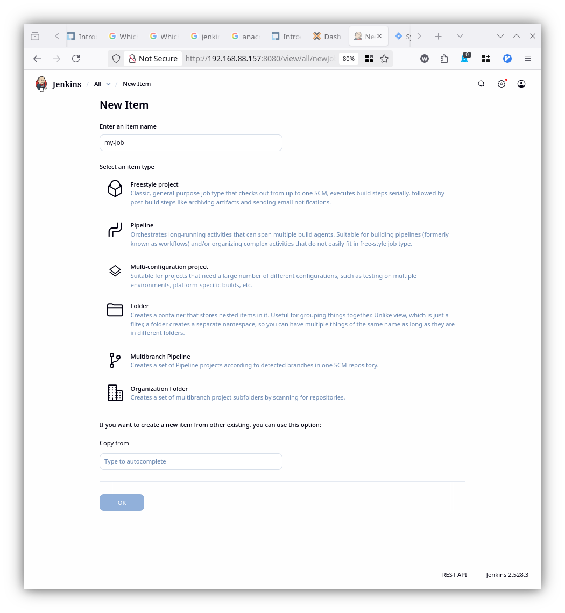
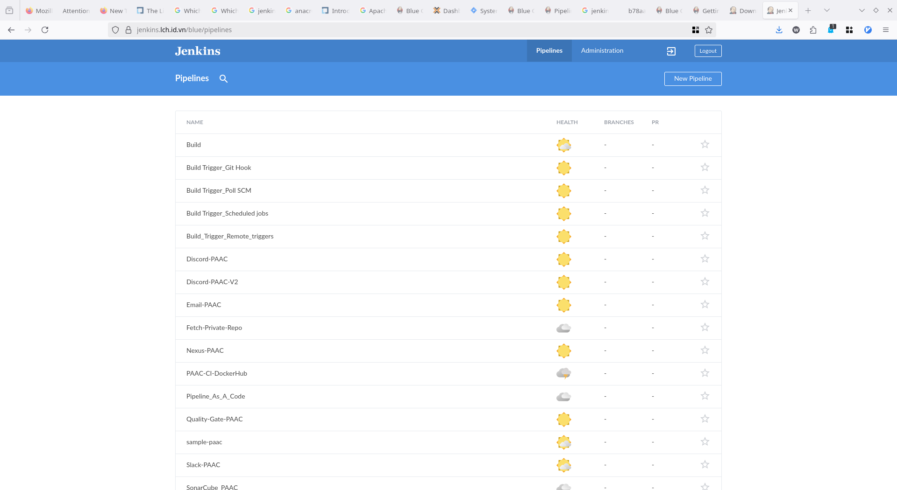
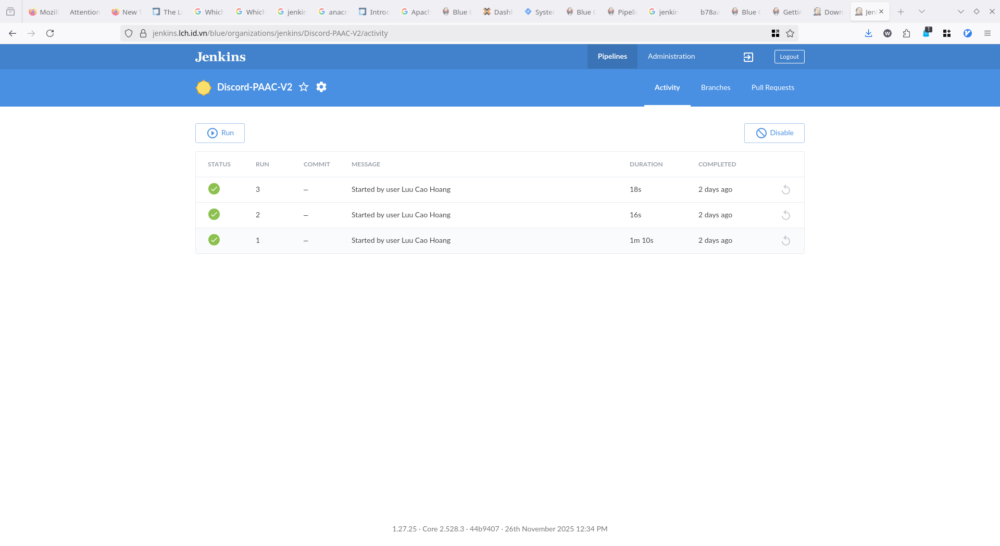
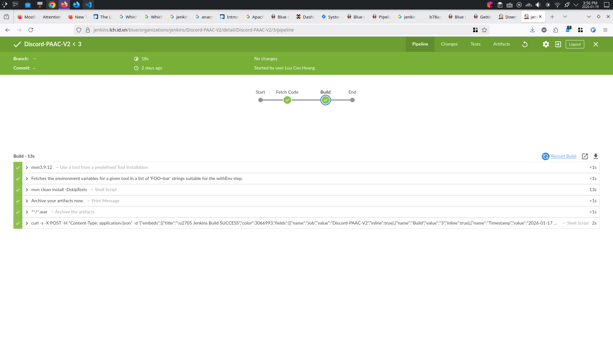

# Jenkins là gì?

- Mình làm với CI/CD nhiều nhất với Github Actions trước khi chuyển sang Jenkins, vì Github Actions tích hợp sẵn với Github, dễ sử dụng, có nhiều action hỗ trợ sẵn. Tuy nhiên, khi làm với dự án lớn hơn, cần nhiều tùy chỉnh hơn, cần chạy trên server riêng, hoặc cần tích hợp với nhiều công cụ khác nhau, Jenkins là lựa chọn tốt hơn vì nó mạnh mẽ, linh hoạt, và có cộng đồng lớn hỗ trợ.

# Cài đặt

- <https://www.jenkins.io/doc/book/installing/linux/#debianubuntu>

- Cài JDK trước

```zsh
sudo apt update
sudo apt install fontconfig openjdk-21-jre
java -version
```

- Cài Jenkins

```zsh
sudo wget -O /etc/apt/keyrings/jenkins-keyring.asc \
  https://pkg.jenkins.io/debian-stable/jenkins.io-2023.key
echo "deb [signed-by=/etc/apt/keyrings/jenkins-keyring.asc]" \
  https://pkg.jenkins.io/debian-stable binary/ | sudo tee \
  /etc/apt/sources.list.d/jenkins.list > /dev/null
sudo apt update
sudo apt install jenkins
```

- Kiểm tra
  - `jenkins --version`: kiểm tra phiên bản jenkins
  - `systemctl status jenkins`: kiểm tra trạng thái jenkins, chú ý password lưu ở `/var/lib/jenkins/secrets/initialAdminPassword`
  - `ls /var/lib/jenkins/`: kiểm tra các file cấu hình jenkins

```zsh
lcaohoanq@kebiansv:~$ jenkins --version
2.528.3
lcaohoanq@kebiansv:~$ systemctl status jenkins
● jenkins.service - Jenkins Continuous Integration Server
     Loaded: loaded (/usr/lib/systemd/system/jenkins.service; enabled; preset: enabled)
     Active: active (running) since Tue 2026-01-06 07:58:06 UTC; 3min 43s ago
   Main PID: 20733 (java)
      Tasks: 50 (limit: 38279)
     Memory: 923.3M (peak: 933.0M)
        CPU: 30.662s
     CGroup: /system.slice/jenkins.service
             └─20733 /usr/bin/java -Djava.awt.headless=true -jar /usr/share/java/jenkins.war --webroot=/var/cache/jenkins/war --httpPort=8080

Jan 06 07:58:00 kebiansv jenkins[20733]: [LF]> This may also be found at: /var/lib/jenkins/secrets/initialAdminPassword
Jan 06 07:58:00 kebiansv jenkins[20733]: [LF]>
Jan 06 07:58:00 kebiansv jenkins[20733]: [LF]> *************************************************************
Jan 06 07:58:00 kebiansv jenkins[20733]: [LF]> *************************************************************
Jan 06 07:58:00 kebiansv jenkins[20733]: [LF]> *************************************************************
Jan 06 07:58:06 kebiansv jenkins[20733]: 2026-01-06 07:58:06.411+0000 [id=62]        INFO        jenkins.InitReactorRunner$1#onAttained: Completed initialization
Jan 06 07:58:06 kebiansv jenkins[20733]: 2026-01-06 07:58:06.429+0000 [id=38]        INFO        hudson.lifecycle.Lifecycle#onReady: Jenkins is fully up and running
Jan 06 07:58:06 kebiansv systemd[1]: Started jenkins.service - Jenkins Continuous Integration Server.
Jan 06 07:58:08 kebiansv jenkins[20733]: 2026-01-06 07:58:08.187+0000 [id=77]        INFO        h.m.DownloadService$Downloadable#load: Obtained the updated data file for >
Jan 06 07:58:08 kebiansv jenkins[20733]: 2026-01-06 07:58:08.187+0000 [id=77]        INFO        hudson.util.Retrier#start: Performed the action check updates server succe>

lcaohoanq@kebiansv:~$ ls /var/lib/jenkins/
config.xml                     jenkins.telemetry.Correlator.xml  nodeMonitors.xml  secret.key                secrets  userContent
hudson.model.UpdateCenter.xml  jobs                              plugins           secret.key.not-so-secret  updates  users
lcaohoanq@kebiansv:~$ 

lcaohoanq@kebiansv:~$ id jenkins
uid=111(jenkins) gid=112(jenkins) groups=112(jenkins)

lcaohoanq@kebiansv:~$ sudo ss -tlnp | grep 8080
LISTEN 0      50                             *:8080             *:*    users:(("java",pid=20733,fd=9))
```

- Trường hợp chưa vào được `ip:8080` do filewall

```zsh
lcaohoanq@kebiansv:~$ sudo ufw allow 8080
Rule added
Rule added (v6)
lcaohoanq@kebiansv:~$ sudo ufw reload
Firewall reloaded
lcaohoanq@kebiansv:~$ sudo ufw status
```

- Đã vào được giờ bắt nhập mật khẩu lúc cài đặt jenkins

```zsh
lcaohoanq@kebiansv:~$ sudo cat /var/lib/jenkins/secrets/initialAdminPassword
```


## Đổi port mặc định

Mình vừa có task quản lí server khác, và port 8080 bị chiếm mất (đang chạy một docker container Spring Boot), nên mình sẽ đổi port jenkins sang **8082**, do Jenkins cài sau nên chạy
``systemctl status jenkins` sẽ báo lỗi và không start được.

Mình có làm theo cách này: <https://stackoverflow.com/questions/28340877/how-to-change-port-number-for-jenkins-installation-in-ubuntu-12-04>

- Mở file `/etc/default/jenkins`, tìm dòng `HTTP_PORT=8080`, đổi thành `HTTP_PORT=8082`, lưu lại
  - sudo systemctl daemon-reload
  - sudo systemctl restart jenkins

```bash
➜  ~ grep -n "PORT" /etc/default/jenkins
63:HTTP_PORT=8082
73:# --httpPort=$HTTP_PORT (default 8080; disable with -1)
74:# --httpsPort=$HTTP_PORT
80:JENKINS_ARGS="--webroot=/var/cache/$NAME/war --httpPort=$HTTP_PORT"
```

- Nếu cách trên không được thì ta có thể đổi trực tiếp trong file service của systemd ở `/usr/lib/systemd/system/jenkins.service`, tìm dòng `Environment="JENKINS_PORT=8080"`, đổi thành `Environment="JENKINS_PORT=8082"`, lưu lại
  - sudo systemctl daemon-reload
  - sudo systemctl restart jenkins

```bash
➜  ~ grep -n "PORT" /usr/lib/systemd/system/jenkins.service
72:Environment="JENKINS_PORT=8082"
81:#Environment="JENKINS_HTTPS_PORT=443"
98:#Environment="JENKINS_HTTP2_PORT="
```

Kiểm tra lại nhé, đã thấy `--httpPort=8082` rồi

```bash
➜  ~ systemctl status jenkins
● jenkins.service - Jenkins Continuous Integration Server
     Loaded: loaded (/usr/lib/systemd/system/jenkins.service; enabled; preset: enabled)
    Drop-In: /etc/systemd/system/jenkins.service.d
             └─override.conf
     Active: active (running) since Sun 2026-01-18 22:46:18 +07; 16h ago
   Main PID: 187022 (java)
      Tasks: 64 (limit: 11936)
     Memory: 1.8G (peak: 2.4G)
        CPU: 11min 47.578s
     CGroup: /system.slice/jenkins.service
             └─187022 /usr/bin/java -Djava.awt.headless=true -jar /usr/share/java/jenkins.war --webroot=/var/cache/jenkins/war --httpPort=8082 

Jan 18 23:36:47 fptu-thitkho-cbbz jenkins[187022]: 2026-01-18 16:36:47.006+0000 [id=28]        INFO        hudson.util.Retrier#start: Performed the action check updates se>
Jan 18 23:50:02 fptu-thitkho-cbbz jenkins[187022]: 2026-01-18 16:50:02.759+0000 [id=93]        INFO        o.j.p.g.w.s.DefaultPushGHEventSubscriber#onEvent: Received PushE>
Jan 18 23:51:16 fptu-thitkho-cbbz jenkins[187022]: 2026-01-18 16:51:16.959+0000 [id=1300]        INFO        o.j.p.g.w.s.DefaultPushGHEventSubscriber#onEvent: Received Pus>
Jan 18 23:54:07 fptu-thitkho-cbbz jenkins[187022]: 2026-01-18 16:54:07.577+0000 [id=1300]        INFO        o.j.p.g.w.s.DefaultPushGHEventSubscriber#onEvent: Received Pus>
Jan 19 00:01:44 fptu-thitkho-cbbz jenkins[187022]: 2026-01-18 17:01:44.359+0000 [id=92]        INFO        o.j.p.g.w.s.DefaultPushGHEventSubscriber#onEvent: Received PushE>
Jan 19 00:03:38 fptu-thitkho-cbbz jenkins[187022]: 2026-01-18 17:03:38.481+0000 [id=28]        INFO        o.j.p.g.w.s.DefaultPushGHEventSubscriber#onEvent: Received PushE>
Jan 19 00:03:50 fptu-thitkho-cbbz jenkins[187022]: 2026-01-18 17:03:50.268+0000 [id=92]        INFO        o.j.p.g.w.s.DefaultPushGHEventSubscriber#onEvent: Received PushE>
Jan 19 00:03:53 fptu-thitkho-cbbz jenkins[187022]: 2026-01-18 17:03:53.354+0000 [id=28]        INFO        o.j.p.g.w.s.DefaultPushGHEventSubscriber#onEvent: Received PushE>
Jan 19 07:55:36 fptu-thitkho-cbbz jenkins[187022]: 2026-01-19 00:55:36.536+0000 [id=1300]        INFO        o.j.p.g.w.s.DefaultPushGHEventSubscriber#onEvent: Received Pus>
Jan 19 11:05:20 fptu-thitkho-cbbz jenkins[187022]: 2026-01-19 04:05:20.983+0000 [id=4770]        INFO        o.j.p.g.ApiRateLimitChecker$RateLimitCheckerAdapter#checkRateL
```

## Debian 12 Bookworm Java Temurin OpenJDK 21

- Debian 12 không có openjdk-21 trong repo mặc định, nên ta chuyển sang dùng temurin-openjdk-21, cách cài phức tạp hơn ubuntu một chút
- Kiểm tra version: [Termurin OpenJDK page](https://adoptium.net/temurin/releases)

```zsh
apt update -y
# Install some dependencies
apt install -y wget tar maven git

# Download
sudo wget https://github.com/adoptium/temurin21-binaries/releases/download/jdk-21.0.6%2B7/OpenJDK21U-jdk_x64_linux_hotspot_21.0.6_7.tar.gz

# Extract
tar xzf OpenJDK21U-jdk_x64_linux_hotspot_21.0.6_7.tar.gz

# Move to /opt
mv jdk-21.0.6+7 /opt/
echo "export JAVA_HOME=/opt/jdk-21.0.6+7" >> /etc/profile
echo "export PATH=$JAVA_HOME/bin:$PATH" >> /etc/profile
source /etc/profile

# Setting default java version
update-alternatives --install /usr/bin/java java /opt/jdk-21.0.6+7/bin/java 1
update-alternatives --config java
```

- Verfify java version

```zsh
java -version
```

- Test with simple pgogram

```java
cat > hello_world.java <<EOF
public class helloworld {
  public static void main(String[] args) {
    System.out.println("Hello World! Temurin is powerful");
  }
}
EOF
```

```zsh
$ java hello_world.java
Hello World! Temurin is powerful
```

- Create a symlink to default location where jenkins find java

```zsh
ln -sf /opt/jdk-21.0.6+7/bin/java /usr/bin/java
```

- Restart jenkins

```zsh
systemctl reset-failed jenkins
systemctl daemon-reload
systemctl restart jenkins
systemctl status jenkins
```

# Freestyle và Pipeline As Code



Jenkins hỗ trợ nhiều loại job khác nhau để phù hợp với các nhu cầu và kịch bản khác nhau. Hai loại job phổ biến nhất là Freestyle và Pipeline As Code.

## Freestyle

A Freestyle job is by far the most versatile of all the Jenkins job types. It allows you to build any type of project (Ant, Maven, Gradle, shell script, Makefile), and it is included in Jenkins by default without the need to install additional plugins.

## Pipeline As Code

Although Freestyle jobs provide you with a lot of flexibility to configure projects they are not quite suitable to orchestrate complex CD scenarios. For example, if you want to build and test on a variety of OS platforms in parallel, or when you are waiting for some manual approval prior to deployment, or you want your long running jobs to be resumed at some point on failure, etc.

Also, while you can create project hierarchies with Freestyle jobs for representing multi-stage workflows, such a strategy requires you to spread project configuration across multiple projects, making it difficult to manage and maintain them. It is because a simple change in one job might adversely affect the others. In addition, visualizing a workflow spanning multiple Freestyle jobs can be very challenging as well.

This is where Jenkins Pipelines come to your rescue by helping you:

- Create a set of instructions written as a code to model complex workflows.
- Provide a single-place visualization of different stages of your workflow.
- Resume at a certain point on failure.
- Store all Pipeline Code in SCM, so you can apply SCM best practices such as versioning, tracking, and auditing to the project configuration itself.

# Jenkinsfile

Dùng để viết các pipeline, có thể lưu trong repo code hoặc tạo trực tiếp trong Jenkins
Jenkinsfile có thể được viết bằng hai cú pháp

- Declarative Pipeline: DSL (Domain Specific Language) cú pháp đơn giản, dễ đọc, dễ viết, phù hợp với hầu hết các trường hợp sử dụng
- Scripted Pipeline: cú pháp linh hoạt, mạnh mẽ, phù hợp với các trường hợp sử dụng phức tạp hơn như vòng lặp, điều kiện, hàm, biến,... sử dụng Apache Groovy

Cấu trúc cơ bản của một Jenkinsfile Declarative Pipeline

```groovy
pipeline {
  agent any
  stages {
    stage('Build') {
      steps {
        echo “Run build”
      }
    }
    stage('Test') {
      steps {
        echo “Run tests”
      }
    }
  }
}
```

- agent: xác định nơi chạy pipeline, có thể là bất kỳ node nào (any), hoặc node cụ thể (label 'my-node'), hoặc docker container (docker 'my-image')
- stages: chứa tối thiểu một stage, mỗi stage đại diện cho một bước trong quy trình CI/CD
- steps: mỗi stage chứa 1 hoặc nhiều step, mỗi step là một hành động cụ thể như chạy lệnh shell, gọi script, gửi email,...
- post: xác định các hành động sau khi pipeline hoàn thành, như gửi thông báo, lưu trữ artifacts, dọn dẹp,...


> Cre: The Linux Foundation - Introduction to Jenkins (LFS167)

## Cách tạo Jenkinsfile

Có 2 cách

- **Blue Ocean Editor**: giao diện trực quan, kéo thả, dễ sử dụng, phù hợp với người mới bắt đầu, cài plugin Blue Ocean trước (<https://www.jenkins.io/doc/book/blueocean/getting-started/>)





- Jenkins Pipeline Job type:
  - Tạo Pipeline job type qua Jenkins UI
  - Chọn "Pipeline script" để viết trực tiếp trong Jenkins
  - Hoặc chọn "Pipeline script from SCM" để lấy từ repo code (GitHub,...)

# Plugins

## Java Devs

)

- Đối với những dự án Java, cần cài JDK, Maven (chủ yếu), Gradle,... có 2 cách cài
  - Cài trực tiếp trên máy host Jenkins: cách này đơn giản, nhanh, nhưng không linh hoạt, khó quản lý phiên bản

  ```zsh
  # Ví dụ như trên Debian/Ubuntu
  sudo apt update 
  sudo apt install maven openjdk-21-jdk
  # Search các phiên bản khác
  apt search openjdk
  # Set mặc định phiên bản JDK
  sudo update-alternatives --config java
  ```

  - Cài qua Jenkins Manage Plugins (khuyến khích): vì cài qua Jenkins sẽ tự động cấu hình đường dẫn, biến môi trường, dễ sử dụng hơn, gọn hơn

> Trên Debian 12, không có jdk21 tải từ apt, đọc thêm [ở đây](https://unix.stackexchange.com/questions/793947/is-installing-openjdk-21-jdk-on-debian-12-from-jdk-java-net-deb-safe-if-its-op), giải pháp là cài bằng Temurin

## Thông báo

- Slack Notification

# Build Trigger


1. Git Webhook
2. Poll SCM
3. Scheduled jobs
4. Remote triggers
5. Build after other projects are built

# Master và Slave


# Authentication và Authorization

# Tinh chỉnh, cài đặt

> Cre:
>
> - <https://trainingportal.linuxfoundation.org/courses/introduction-to-jenkins-lfs167>
> - <https://www.jenkins.io/doc/book/pipeline/syntax/>
> - Self study và làm việc thực tế với Jenkins
