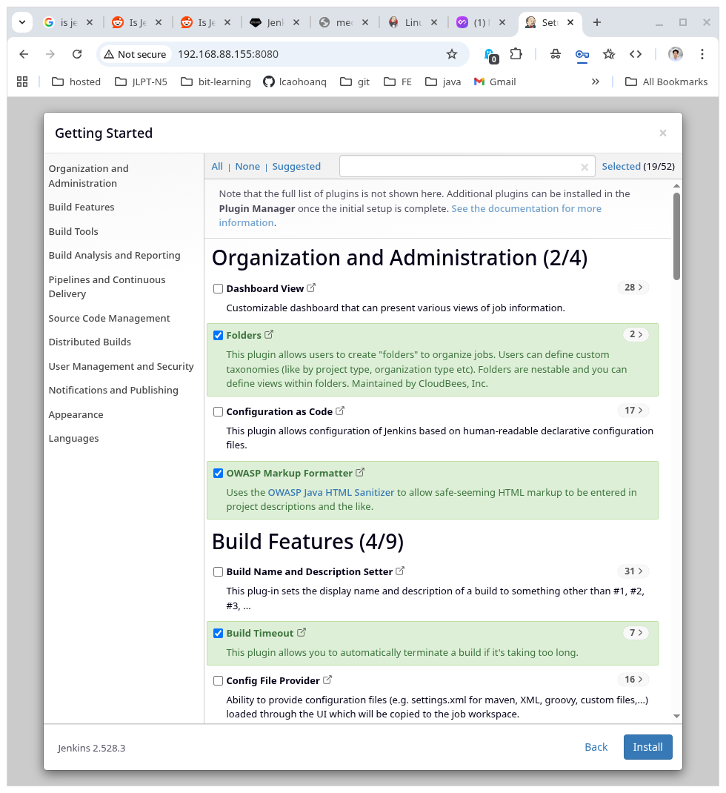
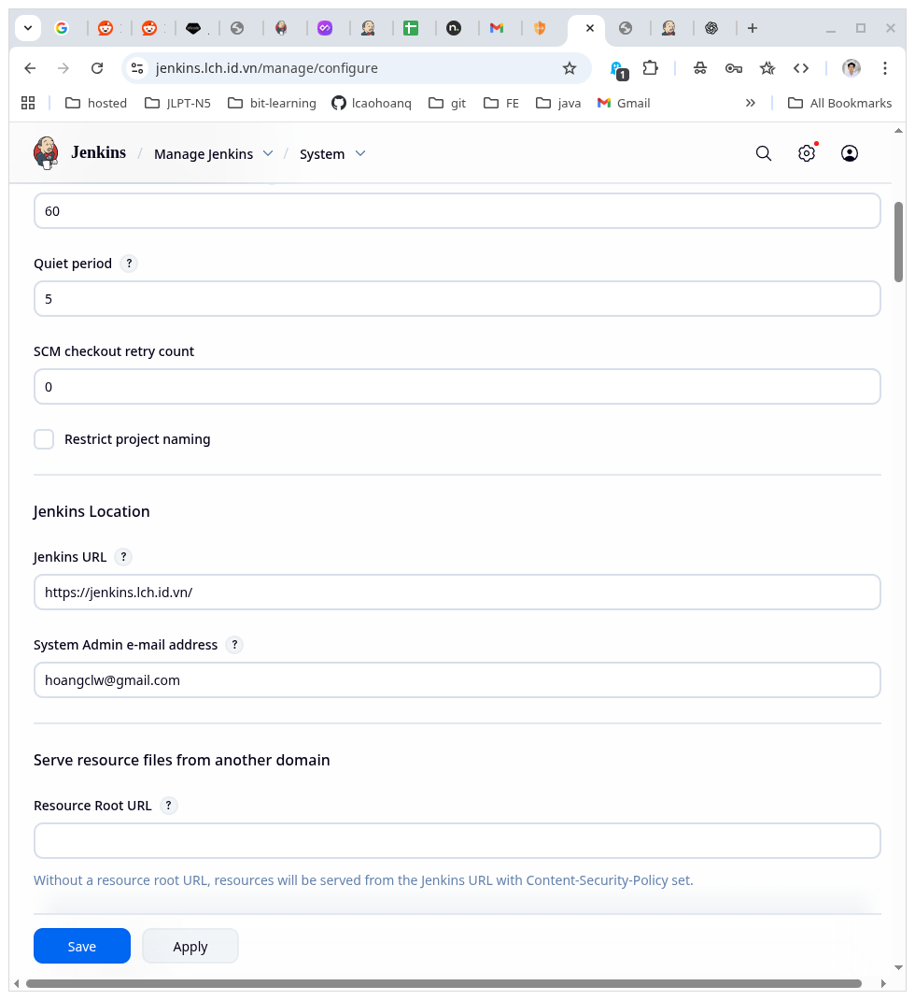
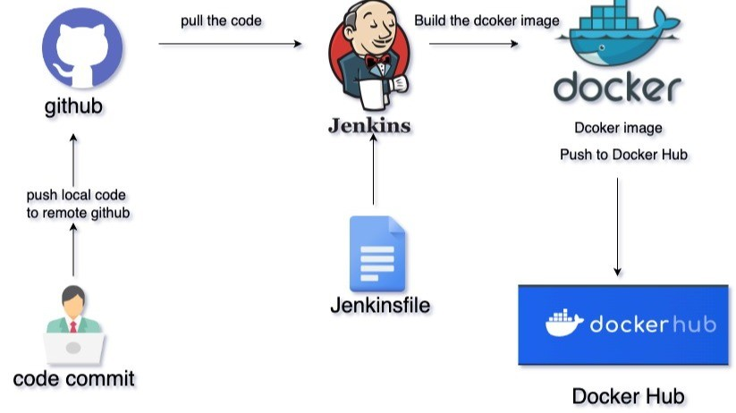
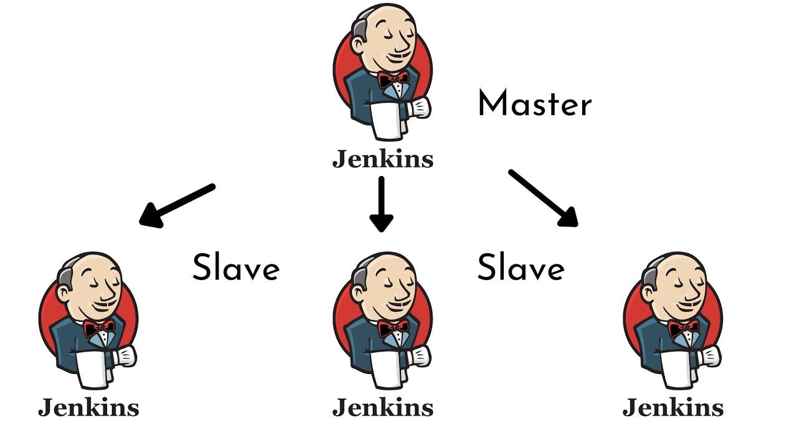

# Jenkins là gì?

- Mình làm với CI/CD nhiều nhất với Github Actions trước khi chuyển sang Jenkins, vì Github Actions tích hợp sẵn với Github, dễ sử dụng, có nhiều action hỗ trợ sẵn. Tuy nhiên, khi làm với dự án lớn hơn, cần nhiều tùy chỉnh hơn, cần chạy trên server riêng, hoặc cần tích hợp với nhiều công cụ khác nhau, Jenkins là lựa chọn tốt hơn vì nó mạnh mẽ, linh hoạt, và có cộng đồng lớn hỗ trợ.

# Cài đặt

- <https://www.jenkins.io/doc/book/installing/linux/#debianubuntu>

- Cài JDK trước

```zsh
sudo apt update
sudo apt install fontconfig openjdk-21-jre
java -version
```

- Cài Jenkins

```zsh
sudo wget -O /etc/apt/keyrings/jenkins-keyring.asc \
  https://pkg.jenkins.io/debian-stable/jenkins.io-2023.key
echo "deb [signed-by=/etc/apt/keyrings/jenkins-keyring.asc]" \
  https://pkg.jenkins.io/debian-stable binary/ | sudo tee \
  /etc/apt/sources.list.d/jenkins.list > /dev/null
sudo apt update
sudo apt install jenkins
```

- Kiểm tra
  - `jenkins --version`: kiểm tra phiên bản jenkins
  - `systemctl status jenkins`: kiểm tra trạng thái jenkins, chú ý password lưu ở `/var/lib/jenkins/secrets/initialAdminPassword`
  - `ls /var/lib/jenkins/`: kiểm tra các file cấu hình jenkins

```zsh
lcaohoanq@kebiansv:~$ jenkins --version
2.528.3
lcaohoanq@kebiansv:~$ systemctl status jenkins
● jenkins.service - Jenkins Continuous Integration Server
     Loaded: loaded (/usr/lib/systemd/system/jenkins.service; enabled; preset: enabled)
     Active: active (running) since Tue 2026-01-06 07:58:06 UTC; 3min 43s ago
   Main PID: 20733 (java)
      Tasks: 50 (limit: 38279)
     Memory: 923.3M (peak: 933.0M)
        CPU: 30.662s
     CGroup: /system.slice/jenkins.service
             └─20733 /usr/bin/java -Djava.awt.headless=true -jar /usr/share/java/jenkins.war --webroot=/var/cache/jenkins/war --httpPort=8080

Jan 06 07:58:00 kebiansv jenkins[20733]: [LF]> This may also be found at: /var/lib/jenkins/secrets/initialAdminPassword
Jan 06 07:58:00 kebiansv jenkins[20733]: [LF]>
Jan 06 07:58:00 kebiansv jenkins[20733]: [LF]> *************************************************************
Jan 06 07:58:00 kebiansv jenkins[20733]: [LF]> *************************************************************
Jan 06 07:58:00 kebiansv jenkins[20733]: [LF]> *************************************************************
Jan 06 07:58:06 kebiansv jenkins[20733]: 2026-01-06 07:58:06.411+0000 [id=62]        INFO        jenkins.InitReactorRunner$1#onAttained: Completed initialization
Jan 06 07:58:06 kebiansv jenkins[20733]: 2026-01-06 07:58:06.429+0000 [id=38]        INFO        hudson.lifecycle.Lifecycle#onReady: Jenkins is fully up and running
Jan 06 07:58:06 kebiansv systemd[1]: Started jenkins.service - Jenkins Continuous Integration Server.
Jan 06 07:58:08 kebiansv jenkins[20733]: 2026-01-06 07:58:08.187+0000 [id=77]        INFO        h.m.DownloadService$Downloadable#load: Obtained the updated data file for >
Jan 06 07:58:08 kebiansv jenkins[20733]: 2026-01-06 07:58:08.187+0000 [id=77]        INFO        hudson.util.Retrier#start: Performed the action check updates server succe>

lcaohoanq@kebiansv:~$ ls /var/lib/jenkins/
config.xml                     jenkins.telemetry.Correlator.xml  nodeMonitors.xml  secret.key                secrets  userContent
hudson.model.UpdateCenter.xml  jobs                              plugins           secret.key.not-so-secret  updates  users
lcaohoanq@kebiansv:~$ 

lcaohoanq@kebiansv:~$ id jenkins
uid=111(jenkins) gid=112(jenkins) groups=112(jenkins)

lcaohoanq@kebiansv:~$ sudo ss -tlnp | grep 8080
LISTEN 0      50                             *:8080             *:*    users:(("java",pid=20733,fd=9))
```

- Trường hợp chưa vào được `ip:8080` do filewall

```zsh
lcaohoanq@kebiansv:~$ sudo ufw allow 8080
Rule added
Rule added (v6)
lcaohoanq@kebiansv:~$ sudo ufw reload
Firewall reloaded
lcaohoanq@kebiansv:~$ sudo ufw status
```

- Đã vào được giờ bắt nhập mật khẩu lúc cài đặt jenkins

```zsh
lcaohoanq@kebiansv:~$ sudo cat /var/lib/jenkins/secrets/initialAdminPassword
```






# Freestyle và Pipeline As Code

# Plugins

## Java Devs

)

- Đối với những dự án Java, cần cài JDK, Maven (chủ yếu), Gradle,... có 2 cách cài
  - Cài trực tiếp trên máy host Jenkins: cách này đơn giản, nhanh, nhưng không linh hoạt, khó quản lý phiên bản

  ```zsh
  # Ví dụ như trên Debian/Ubuntu
  sudo apt update 
  sudo apt install maven openjdk-21-jdk
  # Search các phiên bản khác
  apt search openjdk
  # Set mặc định phiên bản JDK
  sudo update-alternatives --config java
  ```

  - Cài qua Jenkins Manage Plugins (khuyến khích): vì cài qua Jenkins sẽ tự động cấu hình đường dẫn, biến môi trường, dễ sử dụng hơn, gọn hơn

> Trên Debian 12, không có jdk21 tải từ apt, đọc thêm [ở đây](https://unix.stackexchange.com/questions/793947/is-installing-openjdk-21-jdk-on-debian-12-from-jdk-java-net-deb-safe-if-its-op), giải pháp là cài bằng Temurin

## Thông báo

- Slack Notification

# Build Trigger



1. Git Webhook
2. Poll SCM
3. Scheduled jobs
4. Remote triggers
5. Build after other projects are built

# Master và Slave



# Authentication và Authorization

# Tinh chỉnh, cài đặt

> Cre:
>
> - <https://trainingportal.linuxfoundation.org/courses/introduction-to-jenkins-lfs167>
> - Self study và làm việc thực tế với Jenkins
