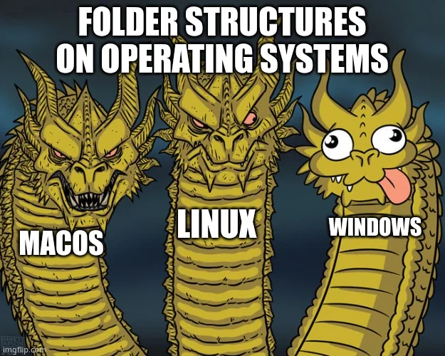
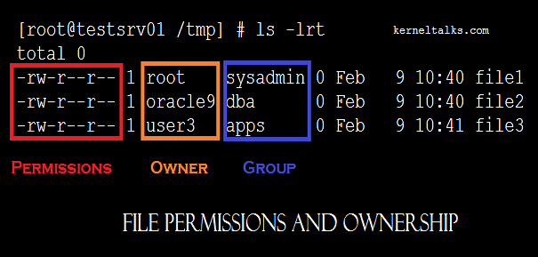
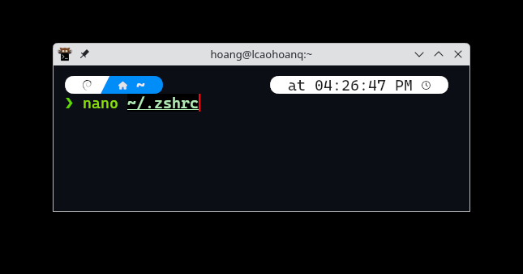
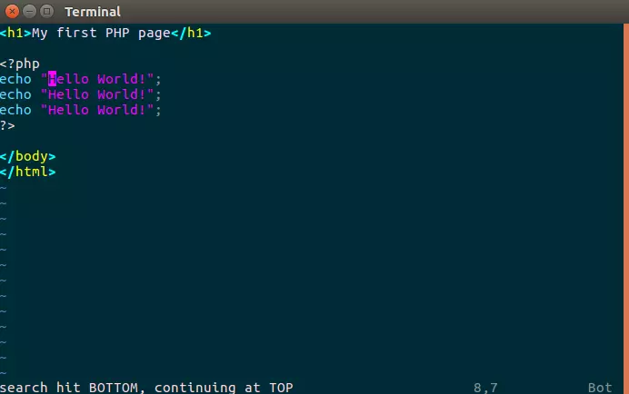
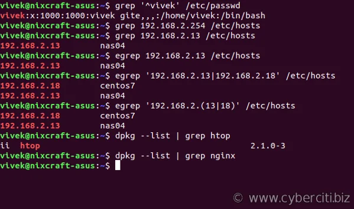
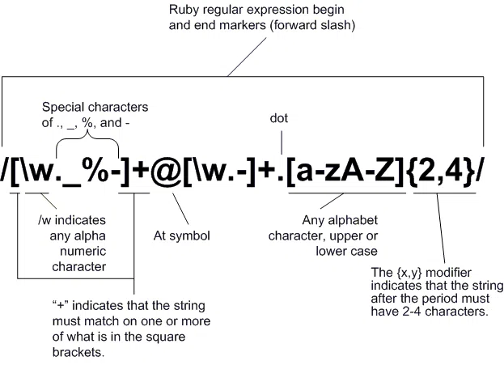
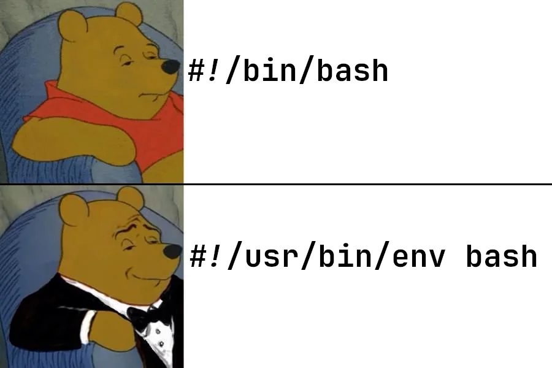
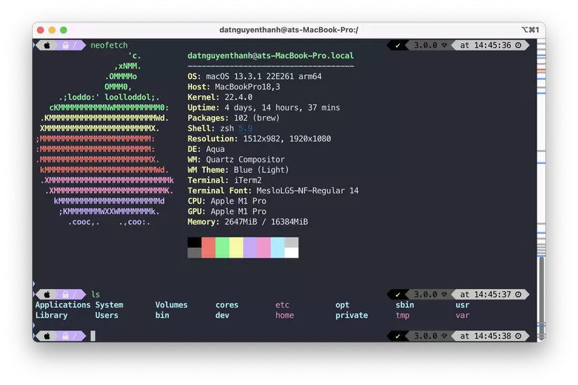

> ### I have tried these three DEs
>
> - Gnome
> - KDE
> - XFCE

- First time trying Gnome with Ubuntu (downloaded ISO from website and install~), it's so pretty and most compatible with my devices, smoothing experience aka Memory waster

- I had decided to move to Debian KDE Plasma (after watching the comparison video of some guys on Youtube), which was overwhelming with the ability to customize KDE features, and it's more lightweight than Gnome xD

- XFCE seems to fit with my X220 (4GB, 128GB 2.5inch SSD, i5 2th) but it lacks the functions that I need

**[Update: 20 June 24]**: Seem i have fall in love with the ricing process, i'm using bspwm and i3 now :) should i move to Arch with Hyperland xD

**[Update: 24 June 24]**: Back to using Gnome Debian (there some issue with my KDE + bspwm), but another session still bspwm xD

> <https://github.com/lcaohoanq/dotfiles>

**[Update 30 June 24]**: I have moved to Arch with Hyprland, my first time using Arch, and it's so fun to rice my system xD

> <https://github.com/lcaohoanq/hypr-arch-dotfiles/>


> Life seem more tough when learning, using Linux but after a long time, 2 years using, fail, break, reinstall many time...every moments worth it, i really love Linux and it became my daily driver now.

# OSS (Open Source Software)

- OSS is software with source code that anyone can inspect, modify, and enhance
- Many famous internet backbones tools:
  - [react](https://github.com/facebook/react)
  - [spring boot](https://github.com/spring-projects/spring-boot)
  - [fzf (fuzzy file finder)](https://github.com/junegunn/fzf)
  - [wireguard-easy](https://github.com/wg-easy/wg-easy)
  - [postgresql](https://wiki.postgresql.org/wiki/Submitting_a_Patch)

Many many many tools are open source now :)


# Linux History


- 1984: The GNU Project and the Free Software Foundation
  - Create open source version of UNIX utilities
  - Create the General Public License (GPL): Software license enforcing open source principles
- 1991: Linus Tovarlds
  - Creates open source, UNIX-like kernel, released under the GPL
  - Ports some GNU utilities, solicits assistance online
- Today:
  - Linux kernel + GNU utilities = complete, open source, UNIX like operating system
    - Packaged for targeted audiences as distributions

- Linux Kernel Repository: <https://github.com/torvalds/linux>, i really want to have a chance to contribute to this repo

# Linux Principles

- Everything is a file (Include Hardware)
- Small Single purpose Programs
- Ability to chain programs together for complex operations
- Avoid Captive User Interface
- Configuration data stored in a text file


# Why Linux?

- Open source
- Community Support
- Support Wide Variaty of Hardware
- Customization
- Most Servers runs on Linux
- Automation
- Security (debatable topic, depend on you)

# Architecture of Linux


- Linux Kernel read, understand the hardware CPU, RAM, pass signal to Shell (Bash, Zsh, Fish,...)

# Popular Linux Distributions (distros)

- List of Linux Distributions: <https://en.wikipedia.org/wiki/List_of_Linux_distributions>


- Desktop
  - Ubuntu
  - Mint
  - Arch
  - Fedora
  - Debian
  - OpenSUSE
- Server
  - RHEL (Red Hat Enterprise Linux): most stable, secured, not open source
  - Ubuntu Server
  - CentOS
  - SUSE Enterprise Linux

- Most used Linux distros currently in IT industry
  - **RPM based or .rpm**: RHEL, Centos, Oracle Linux
    - Example: Google chrome software
    - Package name: google-chrome-stable-57.0.2987.133-1.x86_64.**rpm**
    - Installation: rpm -ivh google-chrome-stable_current_amd64.**rpm**
  - **Debian base or .deb**: Ubuntu server, Kali Linux
    - Example: Google chrome software
    - Package name: google-chrome-stable_current_amd64.**deb**
    - Installation: dpkg -i google-chrome-stable_current_amd64.**deb**

---

# So sánh các distro phổ biến, Release model


## Comparison table of popular Linux distributions

<style>
/* ===== Distro Table – clean & readable ===== */
.distro-table {
  width: 100%;
  border-collapse: collapse;
  margin: 1.5rem 0;
  font-size: 0.95rem;
  line-height: 1.5;
}

.distro-table thead th {
  background: #0f172a;        /* slate-900 */
  color: #e5e7eb;             /* gray-200 */
  text-align: left;
  padding: 10px 12px;
  font-weight: 600;
  border-bottom: 2px solid #334155;
}

.distro-table tbody td {
  padding: 10px 12px;
  border-bottom: 1px solid #e5e7eb;
  vertical-align: top;
}

.distro-table tbody tr:nth-child(even) {
  background: #f8fafc;        /* slate-50 */
}

.distro-table tbody tr:hover {
  background: #e0f2fe;        /* sky-100 */
}

.distro-table td:nth-child(1) {
  font-weight: 600;
  white-space: nowrap;
}

.distro-table td:nth-child(7) {
  white-space: nowrap;
}

/* Dark mode (nếu markdown site có prefers-color-scheme) */
@media (prefers-color-scheme: dark) {
  .distro-table thead th {
    background: #020617;
    border-bottom-color: #1e293b;
  }

  .distro-table tbody td {
    border-bottom-color: #1e293b;
  }

  .distro-table tbody tr:nth-child(even) {
    background: #020617;
  }

  .distro-table tbody tr:hover {
    background: #082f49;
  }
}
</style>

<table class="distro-table">
  <thead>
    <tr>
      <th>Distro</th>
      <th>Base / libc</th>
      <th>Release model</th>
      <th>Điểm mạnh</th>
      <th>Đánh đổi</th>
      <th>Hợp dùng cho</th>
      <th>Đánh giá nhanh</th>
    </tr>
  </thead>
  <tbody>
    <tr>
      <td>Debian 12 (Bookworm)</td>
      <td>glibc</td>
      <td>Fixed</td>
      <td>Ổn định, ít drama, LXC mượt, doc mạnh</td>
      <td>Tool không quá mới</td>
      <td>Infra lâu dài, DB, Jenkins, SonarQube. Service “chạy là chạy mãi”</td>
      <td>Default số 1</td>
    </tr>
    <tr>
      <td>Ubuntu 22.04 (Jammy)</td>
      <td>glibc</td>
      <td>LTS</td>
      <td>Tool mới hơn Debian, guide nhiều, Canonical support tốt</td>
      <td>Hơi “nặng tay”</td>
      <td>App layer, CI/CD, dev</td>
      <td>Rất an toàn</td>
    </tr>
    <tr>
      <td>Ubuntu 24.04 (Noble)</td>
      <td>glibc</td>
      <td>LTS (mới)</td>
      <td>Kernel &amp; tool rất mới</td>
      <td>Chưa đủ thời gian kiểm chứng độ lì</td>
      <td>Lab, non-critical</td>
      <td>Dùng thận trọng</td>
    </tr>
    <tr>
      <td>Debian 13 (Trixie)</td>
      <td>glibc</td>
      <td>Testing branch</td>
      <td>Cân bằng mới &amp; ổn</td>
      <td>Package mới hơn Debian 12, behavior có thể đổi</td>
      <td>Test upgrade, lab</td>
      <td>Không prod lâu dài</td>
    </tr>
    <tr>
      <td>Alpine 3.22</td>
      <td>musl</td>
      <td>Rolling nhẹ, siêu minimal (~4mb)</td>
      <td>Siêu nhẹ, RAM thấp, boot nhanh</td>
      <td>Debug khó, binary compatibility thấp, không hợp với các app phức tạp</td>
      <td>Proxy, sidecar, agent</td>
      <td>Nhẹ, gắt, cực đoan</td>
    </tr>
    <tr>
      <td>Rocky Linux 9/10</td>
      <td>glibc</td>
      <td>Clone RHEL, fixed lâu, update chậm nhưng chắc</td>
      <td>Chuẩn enterprise, rất lì</td>
      <td>Tool cũ, dev chậm</td>
      <td>DB, middleware, prod kiểu corp</td>
      <td>Enterprise vibe</td>
    </tr>
    <tr>
      <td>AlmaLinux 9/10</td>
      <td>glibc</td>
      <td>Fixed lâu</td>
      <td>Như Rocky nhưng mềm hơn</td>
      <td>Gần như giống Rocky</td>
      <td>Enterprise / prod</td>
      <td>Gu cá nhân</td>
    </tr>
    <tr>
      <td>CentOS Stream 9</td>
      <td>glibc</td>
      <td>Ở giữa trời đất (Fedora - RHEL), Rolling nhẹ</td>
      <td>Thấy trước tương lai RHEL</td>
      <td>Không hợp hệ thống cần predictability</td>
      <td>Lab, học enterprise</td>
      <td>Không prod</td>
    </tr>
    <tr>
      <td>Fedora 42</td>
      <td>glibc</td>
      <td>Rolling nhanh</td>
      <td>Công nghệ mới nhất</td>
      <td>Lifecycle ngắn, dễ gãy</td>
      <td>Test infra, học tech mới</td>
      <td>Không lâu dài</td>
    </tr>
    <tr>
      <td>openSUSE Leap 15.6</td>
      <td>glibc</td>
      <td>Fixed</td>
      <td>Rất kỷ luật, sạch</td>
      <td>Ít guide, ít cộng đồng</td>
      <td>Người thích hệ chuẩn</td>
      <td>Kén người</td>
    </tr>
    <tr>
      <td>Gentoo (OpenRC)</td>
      <td>glibc</td>
      <td>Rolling (source)</td>
      <td>Compile từ source, Control tuyệt đối</td>
      <td>Tốn thời gian, mệt</td>
      <td>Hiểu Linux rất sâu, tối ưu theo CPU</td>
      <td>Hành xác, mất thời gian, vận hành server khổ</td>
    </tr>
    <tr>
      <td>Devuan 5</td>
      <td>glibc</td>
      <td>Fixed</td>
      <td>Debian Không systemd, sysvinit / openrc</td>
      <td>Ít lý do dùng</td>
      <td>Anti-systemd, nhẹ hơn chút</td>
      <td>Có lý do rõ</td>
    </tr>
    <tr>
      <td>Arch Linux</td>
      <td>glibc</td>
      <td>Rolling (fast)</td>
      <td>Mới nhất, AUR</td>
      <td>Dễ gãy, tốn công</td>
      <td>Học Linux sâu, power user</td>
      <td>Không ổn định</td>
    </tr>
  </tbody>
</table>

## Some questions worth thinking about before deciding on a distribution include

- What is the main function of the system (server or desktop)?
- What types of packages are important to the organization? For example, web server, word processing, etc.
- How much storage space is required, and how much is available? For example, when installing Linux on an embedded device, space is usually constrained.
- How often are packages updated?
- How long is the support cycle for each release? For example, LTS releases have long-term support.
- Do you need kernel customization from the vendor or a third party?
- What hardware are you running on? For example, it might be X86, RISC-V, ARM, PPC, etc.
- Do you need long-term stability? Or can you accept (or need) a more volatile cutting-edge system running the latest software versions?

## Release model: Rolling releases và Fixed release

Khi chọn distro Linux, một trong những khác biệt **quan trọng nhất** là *mô hình phát hành* (release model).  
Nó quyết định việc **update có “sướng” hay “đau”**, và hệ thống **ổn định đến mức nào**.


### Rolling release là gì?

**Rolling release** cập nhật liên tục.  
Không có “phiên bản lớn” theo năm — chỉ có **update đều đều, không ngừng nghỉ**.

**Ưu điểm**

- Luôn có **phiên bản mới nhất** của kernel, tool, library
- Trải nghiệm công nghệ mới rất nhanh

**Đánh đổi**

- Update có thể **làm gãy hệ thống**
- Dễ gặp lỗi **incompatible**, đổi config, đổi ABI

Ví dụ điển hình: **Arch Linux**, một ngày đẹp trời bạn chạy:

```bash
pacman -Syu
```

Ngày hôm sau có thể gặp:

- nginx báo config deprecated

- openssl bump version

- Service fail vì **lib đổi ABI (Application Binary Interface)**

> Arch **không hứa hẹn stability dài hạn.**
> Arch buộc user phải **hiểu hệ thống và tự sửa khi gãy.**
> Update mà **không đọc Arch Linux News** → xác định ăn hành.

### Fixed release là gì?

**Fixed release** phát hành theo chu kỳ rõ ràng (ví dụ 2 năm / 5 năm).
Trong suốt vòng đời đó, hệ thống ưu tiên **ổn định hơn là mới.**

**Ưu điểm**

- Ít gãy, ít drama

- Rất phù hợp cho **server & production**

**Đánh đổi**

- Package không mới bằng rolling

Ví dụ tiêu biểu: **Ubuntu LTS**

- Không có chuyện hôm nay update, ngày mai service chết

- Canonical test kỹ trước khi release

- Update chủ yếu là **security & bugfix**

Vì vậy **Ubuntu LTS** rất hợp cho **production server**,
còn **Arch Linux** hợp cho người dùng cá nhân hoặc lab thích công nghệ mới.

#### Góc nhìn cá nhân: chia Rolling release thành 3 mức

Theo trải nghiệm thực tế, mình chia rolling release thành 3 nhóm:

##### Rolling nhanh

- Package cập nhật liên tục

- Rất dễ gãy nếu không theo dõi changelog

Ví dụ: Arch Linux, Fedora

##### Rolling vừa

- Có update thường xuyên nhưng **đã qua một lớp kiểm soát**

- Phù hợp để test trước khi lên prod

Ví dụ: Debian Testing

###### Rolling chậm / Fixed lâu

- Update rất chậm

- Ưu tiên ổn định và predictability

Ví dụ: Rocky Linux, AlmaLinux

---

# Package manager


- A  **package manager** in Linux is a tool that automates the entire process of installing, updating, configuring, and removing software. You can think of it as an "app store" or a personal assistant for your operating system's software.

| Operating System | Default Package Manager | Additional Package Managers |
| ---------------- | ----------------------- | --------------------------- |
| Debian           | `apt`                   | `snapd`                     |
| Arch             | `pacman`                | `yay`, `snapd`              |
| Fedora           | `dnf`                   |                             |
| OpenSUSE         | `zypper`                |                             |
| Solus            | `eopkg`                 |                             |
| Gentoo           | `emerge`                |                             |
| Void             | `xbps`                  |                             |
| Alpine           | `apk`                   |                             |
| NixOS            | `nix`                   |                             |
| Slackware        | `slackpkg`              |                             |
| FreeBSD          | `pkg`                   |                             |
| OpenBSD          | `pkg_add`               |                             |
| NetBSD           | `pkgin`                 |                             |
| DragonFly BSD    | `pkg`                   |                             |
| Haiku            | `pkgman`                |                             |
| macOS            | `brew`                  |                             |
| Windows          | `choco`                 |                             |
| Android          | `f-droid`               |                             |
| iOS              | `cydia`                 |                             |
| Termux           | `pkg`                   |                             |
| Chrome OS        | `crostini`              |                             |
| Ubuntu           | `apt`                   |                             |
| CentOS           | `yum`                   |                             |
| RHEL             | `yum`                   |                             |
| Manjaro          | `pacman`                |                             |


```zsh
sudo apt-get install ROSÉ
# when this package release guys?
```

## Package Management Systems on Linux

There are two broad families of package managers widely deployed: those based on Debian and those which use RPM as their low-level package manager. The two systems are incompatible but, broadly speaking, provide the same essential features and satisfy the same needs. In addition, there are some other systems used by more specialized Linux distributions.

Both package management systems operate on two distinct levels: a low-level tool (such as **dpkg** or **rpm**) takes care of the details of unpacking individual packages, running scripts, getting the software installed correctly, while a high-level tool (such as **apt**, **dnf**, or **zypper**) works with groups of packages, downloads packages from the vendor, and figures out dependencies.

Most of the time users need to work only with the high-level tool, which will take care of calling the low-level tool as needed. Dependency resolution is a particularly important feature of the high-level tool, as it handles the details of finding and installing each dependency for you. Be careful, however, as installing a single package could result in many dozens or even hundreds of dependent packages being installed.


<br>

> Cre: The Linux Foundation - [Linux Foundation X LFS101: Introduction to Linux](https://www.edx.org/course/introduction-to-linux)

---

## Working With Different Package Management Systems

The Advanced Packaging Tool (**apt**) is the underlying package management system that manages software on Debian-based systems. While it forms the backend for graphical package managers, such as the Ubuntu Software Center and synaptic, its native user interface is at the command line, with programs that include **apt** (or **apt-get**) and **apt-cache**.

**dnf** is the open source command-line package-management utility for the RPM-compatible Linux systems that belong to the Red Hat family.


**zypper** is the package management system for the SUSE/openSUSE family and is also based on RPM. **zypper** also allows you to manage repositories from the command line. **zypper** is fairly straightforward to use and closely resembles **dnf**.

<br>

- Table: Basic Packaging Commands

| Operation | rpm | deb |
|-----------|-----|-----|
| Install package | `rpm -i foo.rpm` | `dpkg --install foo.deb` |
| Install package, dependencies | `dnf install foo` | `apt install foo` |
| Remove package | `rpm -e foo.rpm` | `dpkg --remove foo.deb` |
| Remove package, dependencies | `dnf remove foo` | `apt autoremove foo` |
| Update package | `rpm -U foo.rpm` | `dpkg --install foo.deb` |
| Update package, dependencies | `dnf update foo` | `apt install foo` |
| Update entire system | `dnf update` | `apt dist-upgrade` |
| Show all installed packages | `rpm -qa` or `dnf list installed` | `dpkg --list` |
| Get information on package | `rpm -qil foo` | `dpkg --listfiles foo` |
| Show packages named foo | `dnf list "foo"` | `apt-cache search foo` |
| Show all available packages | `dnf list` | `apt-cache dumpavail foo` |
| What package is file part of? | `rpm -qf file` | `dpkg --search file` |

<br>

> Cre: The Linux Foundation - [Linux Foundation X LFS101: Introduction to Linux](https://www.edx.org/course/introduction-to-linux)

---

# Commands


> This command `:(){ :|:& };:` is called "shell fork bomb", very dangerous when hacker can access then execute this command on our servers.
> [Read more about fork bomb here](https://www.cyberciti.biz/faq/understanding-bash-fork-bomb/)

## Navigating the File System

> Relative path vs Absolute path

- Relative path: path from current directory

  - `./file.txt` : current directory

  - `../file.txt` : parent directory

- Absolute path: full path from root directory

  - `/home/user/file.txt`
  - `//var/log/syslog`: even with double slash at the beginning, it's still absolute path

`cd`: Change directory

- `cd /home/user`
- `cd ~`
- `cd ..`

  > im using [zoxide](https://github.com/ajeetdsouza/zoxide): better cd

`ls`: List files and directories

- `ls`
- `ls -l` | `ls -al`
- `ls -a`
- ls -lt : sort time descending
- ls -ltr: sort time ascending (r = reverse)

> im using [exa](https://github.com/ogham/exa): better ls

`pw` : print **current** working directory

## Viewing Files

| Command | Usage |
|---------|-------|
| cat     | Used for viewing files that are not very long; it does not provide any scroll-back functionality. |
| less    | A pager program that allows you to view (but not change) the contents of a file one screen at a time. It provides scroll-back functionality.|
| tail    | Used to print the last 10 lines of a file by default. You can change the number of lines by doing -n 15 or just -15 if you wanted to look at the last 15 lines instead of the default.|
| head    | The opposite of tail; by default, it prints the first 10 lines of a file.|
| tac   | Similar to cat, but it displays the contents of a file in reverse order, starting from the last line.|

### Examples

**cat** : View file content

- `cat file.txt`
- `cat -n file.txt` : view line number
- `cat file1.txt file2.txt` : concatenate files and display
- `cat file.txt | less` : view long file with less

> im using [bat](https://github.com/sharkdp/bat),  notice that after install bat, it use the batcat (not bat) so need to remember or assign alias to .zshrc

- Another way using cat with redirection to create multiple lines file:

```bash
$ cat << EOF > myfile
> line one
> line two
> line three
> EOF
$
```

**less** : View file content page by page

- `less file.txt`
- `less +F file.txt` : follow the file (like tail -f)
- Press `q` to quit less
- Use arrow keys or `j`/`k` to navigate up/down
- Use `Space` to go to next page, `b` to go back one page
- `/search_term` to search forward, `?search_term` to search backward
- `n` to go to next search result, `N` to go to previous search result

**head**:  Display the **first 10 lines** (*default*)

- `head filename.txt`
- `head -5 filename.txt` (**first 5 lines**)
- `head -c 45 filename.txt` (**first 45 bytes**)
- `head -f filename.txt` (**follow the file**)
- `cat -n filename.txt | head -20` (**first 20 lines with line numbers**)

**tail**:  Display the **last 10 lines** (*default*)

- `tail filename.txt`
- `tail -20 filename.txt` (**last 20 lines**)
- `tail -c 45 filename.txt` (**last 45 bytes**)
- `tail -f filename.txt` (**follow the file**

**tac** : View file content in reverse order

- `tac file.txt`

## touch

`$ touch <filename>`
This is normally done to create an empty file as a placeholder for a later purpose.

**touch** provides several useful options. For example, the **-t** option allows you to set the date and timestamp of the file to a specific value, as in:

`$ touch -t 202201011200.00 newfile.txt`

This command creates a new file named newfile.txt with a timestamp of January 1, 2022, at 12:00 PM.

## Moving, Copying, Deleting Files and Directories

`mkdir` : Create a directories

- `mkdir hihi`: create directory hihi in current directory
- `mkdir /usr/share/hihi`: create directory hihi in /usr/share
- `mkdir /hihi/hehe/huhu` => No such file or directory => mkdir -p /hihi/hehe/huhu ok
>
> - Because normal mkdir only support one directory, if pass parent/child/... it cause error -> using -p (parent) to fix

`rmdir`

Removing a directory is done with rmdir. The directory must be empty or the command will fail. To remove a directory and all of its contents you have to do rm -rf.

`rm` : Remove files and directories

- `rm file.txt`
- `rm -r dir1`: Remove directory recursively
- `rm -rf dir1`: Remove directory with force and recursively

`cp` : Copy files and directories

- `cp file.txt file2.txt`
- `cp -r dir1 dir2`
- `cp * /usr/share/.fonts`

`mv` : Move files and directories

- `mv file.txt /usr/share/.fonts`
- `mv file.txt file2.txt`
- `mv * /usr/share/.fonts`
- we can perform the rename file or directory by mv command: if i want to rename the file demo.txt to test.txt

  ```bash
  mv demo.txt test.txt
  # same as directory
  ```

`echo` : Write text to file

- `echo "Hello World" > file.txt`
- echo "alias 'yt=ytfzf -t'" >> ~/.bashrc
- echo "alias 'll=ls -al'" >> ~/.bashrc
- echo "alias 'showdisk=cd /media/lcaohoanq/ ; ls -al'" >> ~/.bashrc

`nano` : Text editor

- `nano file.txt`

`unzip` : Unzip files

- `unzip file.zip`

`tree` : Show the current directory with the tree visualization

   ```bash
   # show everything
   tree

   # show directories only
   tree -D

   # show directories except the pattern
   tree -I "node_modules"

   # show except the pattern, directories only
   tree -I "node_modules" -D
   ```

- **history**: Show all previously executed command
  - im currently using [atuin](https://github.com/atuinsh/atuin): better history, with built in sql lite, can search, navigate to the previous command

- Process:
  - `ps`: shows only **processes associated with your current terminal session and use**
  - `ps aux`:  display a **detailed snapshot of all running processes** on the system

    ```bash
    # show detailed all running processes and find obs
    ps aux | grep "obs"
    ```

## find : Search for files and directories

**find** is an extremely useful and often-used utility program in the daily life of a Linux system administrator. It recurses down the filesystem tree from any particular directory (or set of directories) and locates files that match specified conditions. The default pathname is always the present working directory.

**-name**: list files with certain pattern in their name
**-iname**: case insensitive version of -name
**-type**: search by file type (f: regular file, d: directory, l: symbolic link, c: character device, b: block device)
**-size**: search by file size (+: greater than, -: less than, no sign: exactly)
**-ctime**: search by change time (in days, +: more than, -: less than, no sign: exactly)
**-atime**: search by access time (in days, +: more than, -: less than, no sign: exactly)
**-mtime**: search by modification time (in days, +: more than, -: less than, no sign: exactly)

### Examples

Searching for files and directories

`$ find /path/to/search -name "filename"`

Find all txt files in current directory and subdirectories

`$ find . -name "*.txt"`

Find directory named dirname from root

`$ find / -type d -name "dirname"`

Search only for regular file named **gcc**

`$ find /usr -type f -name gcc`

Find files larger than 10MB in /path

`$ find /path -type f -size +10M`

Find files modified in last 7 days in /path

`$ find /path -type f -mtime -7`

Advanced Usage:

- Limit search depth to 3 levels and show first 40 results

`$ find . -maxdepth 3 -type f -o -type d | head -40`

- Find and run command on the files that match (Delete all swap files in current directory and subdirectories)

`$ find -name "*.swp" -exec rm {} ';'`

## System Information

- Check CPU:
  - **nproc**
  - **lscpu**

- Check RAM
  - **free -h**
  - **cat /proc/meminfo**

- Check Disk:
  - **df -h**: disk free

  ```zsh
  ❯ df -h
  Filesystem      Size  Used Avail Use% Mounted on
  udev             16G     0   16G   0% /dev
  tmpfs           3.2G  2.1M  3.2G   1% /run
  /dev/sdb1       208G   88G  111G  45% /
  tmpfs            16G   91M   16G   1% /dev/shm
  tmpfs           5.0M  8.0K  5.0M   1% /run/lock
  tmpfs           1.0M     0  1.0M   0% /run/credentials/systemd-journald.service
  tmpfs            16G   15M   16G   1% /tmp
  /dev/nvme0n1p1  234G  155G   68G  70% /media/data
  tmpfs           3.2G  148K  3.2G   1% /run/user/1000
  ```

  - **lsblk**: list block devices

  ```zsh
  ❯ lsblk
  NAME        MAJ:MIN RM   SIZE RO TYPE MOUNTPOINTS
  sda           8:0    0 931.5G  0 disk 
  ├─sda1        8:1    0 496.7G  0 part 
  └─sda2        8:2    0 434.9G  0 part 
  sdb           8:16   0 223.6G  0 disk 
  ├─sdb1        8:17   0 212.2G  0 part /
  ├─sdb2        8:18   0     1K  0 part 
  └─sdb5        8:21   0  11.4G  0 part [SWAP]
  nvme0n1     259:0    0 238.5G  0 disk 
  └─nvme0n1p1 259:1    0 238.5G  0 part /media/data
  ```

  - `-a`: all devices

  ```zsh
  ❯ lsblk -a
  NAME        MAJ:MIN RM   SIZE RO TYPE MOUNTPOINTS
  sda           8:0    0 931.5G  0 disk 
  ├─sda1        8:1    0 496.7G  0 part 
  └─sda2        8:2    0 434.9G  0 part 
  sdb           8:16   0 223.6G  0 disk 
  ├─sdb1        8:17   0 212.2G  0 part /
  ├─sdb2        8:18   0     1K  0 part 
  └─sdb5        8:21   0  11.4G  0 part [SWAP]
  nvme0n1     259:0    0 238.5G  0 disk 
  └─nvme0n1p1 259:1    0 238.5G  0 part /media/data
  ```

  - `-o`: specify output columns (check all column `lsblk --list-columns`)

  ```zsh
  ❯ lsblk -a -o NAME,SIZE,FSTYPE,UUID,MOUNTPOINT
  NAME          SIZE FSTYPE UUID                                 MOUNTPOINT
  sda         931.5G                                             
  ├─sda1      496.7G ntfs   01D819C87037D350                     
  └─sda2      434.9G ntfs   01D819C871BA0680                     
  sdb         223.6G                                             
  ├─sdb1      212.2G ext4   2c9bf3d9-8c80-4d4d-8632-4b10e65726d3 /
  ├─sdb2          1K                                             
  └─sdb5       11.4G swap   9eacdd7d-3177-4e92-a812-63e0abaade65 [SWAP]
  nvme0n1     238.5G                                             
  └─nvme0n1p1 238.5G ext4   26a0de97-0abd-45e1-b610-129d3045f430 /media/data
  ```

  - **fdisk**: older systems or simple MBR tasks

  ```zsh
  ❯ sudo fdisk -l
  Disk /dev/nvme0n1: 238.47 GiB, 256060514304 bytes, 500118192 sectors
  Disk model: INTEL SSDPEKKF256G8L                    
  Units: sectors of 1 * 512 = 512 bytes
  Sector size (logical/physical): 512 bytes / 512 bytes
  I/O size (minimum/optimal): 512 bytes / 512 bytes
  Disklabel type: gpt
  Disk identifier: 677D2B55-C4FB-4DB8-BEC3-AAADCE78C24A

  Device         Start       End   Sectors   Size Type
  /dev/nvme0n1p1  2048 500117503 500115456 238.5G Linux filesystem


  Disk /dev/sdb: 223.57 GiB, 240057409536 bytes, 468862128 sectors
  Disk model: KINGSTON SA400S3
  Units: sectors of 1 * 512 = 512 bytes
  Sector size (logical/physical): 512 bytes / 512 bytes
  I/O size (minimum/optimal): 512 bytes / 512 bytes
  Disklabel type: dos
  Disk identifier: 0xf6b8904f

  Device     Boot     Start       End   Sectors   Size Id Type
  /dev/sdb1  *         2048 445042687 445040640 212.2G 83 Linux
  /dev/sdb2       445044734 468860927  23816194  11.4G  f W95 Ext'd (LBA)
  /dev/sdb5       445044736 468860927  23816192  11.4G 82 Linux swap / Solaris


  Disk /dev/sda: 931.51 GiB, 1000204886016 bytes, 1953525168 sectors
  Disk model: TOSHIBA MQ04ABF1
  Units: sectors of 1 * 512 = 512 bytes
  Sector size (logical/physical): 512 bytes / 4096 bytes
  I/O size (minimum/optimal): 4096 bytes / 4096 bytes
  Disklabel type: gpt
  Disk identifier: FEDF6762-A8BC-4D15-9D71-AFB6E5CDEA90

  Device          Start        End    Sectors   Size Type
  /dev/sda1        2048 1041569791 1041567744 496.7G Microsoft basic data
  /dev/sda2  1041569792 1953523119  911953328 434.9G Microsoft basic data
  ```

  - **parted**: newer systems or GPT tasks (or `gdisk`)

  ```zsh
  ❯ sudo parted -l
  Model: ATA TOSHIBA MQ04ABF1 (scsi)
  Disk /dev/sda: 1000GB
  Sector size (logical/physical): 512B/4096B
  Partition Table: gpt
  Disk Flags: 

  Number  Start   End     Size   File system  Name                  Flags
  1      1049kB  533GB   533GB  ntfs         Basic data partition  msftdata
  2      533GB   1000GB  467GB  ntfs         Basic data partition  msftdata


  Model: ATA KINGSTON SA400S3 (scsi)
  Disk /dev/sdb: 240GB
  Sector size (logical/physical): 512B/512B
  Partition Table: msdos
  Disk Flags: 

  Number  Start   End    Size    Type      File system     Flags
  1      1049kB  228GB  228GB   primary   ext4            boot
  2      228GB   240GB  12.2GB  extended                  lba
  5      228GB   240GB  12.2GB  logical   linux-swap(v1)  swap


  Model: INTEL SSDPEKKF256G8L (nvme)
  Disk /dev/nvme0n1: 256GB
  Sector size (logical/physical): 512B/512B
  Partition Table: gpt
  Disk Flags: 

  Number  Start   End    Size   File system  Name                  Flags
  1      1049kB  256GB  256GB  ext4         Basic data partition
  ```

- Disk usage:
  - **du -h --max-depth=1**: check current directory disk usage
  - **du -sh /**: check root directory disk usage summary
  - **dust**: better way to check disk usage than `du`, extremely fast

    ```bash
    # check root directory
    dust /
    ```

  - **ncdu**: TUI using ncurses, find exactly what's taking space and want to clean up interactively

    ```bash
    ncdu /
    ```

- Process management
  - **top**: mandatory tool

> im using [htop](https://github.com/htop-dev/htop), [btop](https://github.com/aristocratos/btop), better UI, more efficient to do process management

- Power Management
  - **sudo reboot**: reboot system immediately
  - **sudo shutdown -h**: shutdown after 1 min
  - **sudo shutdown -h now**: shutdown immediately
  - **sudo shutdown -P +10**: schedule shutdown after 10 mins


> Not mandatory command, but im using too many time

- Copy all content of file into clipboard
  - **xclip** way, make sure you installed [xclip](https://github.com/astrand/xclip) with `sudo apt install xclip`

  ```zsh
  cat <filename> | xclip -selection clipboard
  ```

---

## Documentation and Manual Pages

The man pages are the most often-used source of Linux documentation. They provide in-depth documentation about many programs and utilities, as well as other topics, including configuration files and programming APIs for system calls, library routines, and the kernel. They are present on all Linux distributions and are always at your fingertips.

- `$ man <command>`  
  Open the **official manual page** for a command, including its description, options, and usage examples.

- `$ man -f <command>`  
  Display a **short list of manual pages** related to the keyword (same as `whatis`), with brief descriptions.

- `$ man -a <command>`  
  Show **all available manual pages** matching the command name, going through every section instead of just the first one.

---

# File System



Description of the standard Linux file system structure:

```zsh
/               # Root directory – gốc của mọi thứ
├── /boot       # File khởi động: kernel, initramfs, grub
├── /dev        # Device files (ổ cứng, USB, tty, null, random…)
├── /etc        # Config hệ thống (nghĩ: "editable text configs")
├── /home       # Thư mục người dùng (home của user)
│   └── hoang   # Ví dụ home của user hoang
│   └── duyen   # Ví dụ home của user duyen
├── /lib        # Thư viện cần cho /bin và /sbin
├── /lib64      # Thư viện 64-bit
├── /media      # Nơi auto-mount USB, ổ cứng rời
├── /mnt        # Mount tạm (mount thủ công)
├── /opt        # Optional software (app cài ngoài hệ thống)
├── /proc       # Virtual FS – info kernel & process (runtime)
├── /root       # Home của user root
├── /run        # Runtime data (PID, socket, lock file)
├── /sbin       # System binaries (lệnh cho admin/root)
├── /srv        # Data cho service (web, ftp…)
├── /sys        # Virtual FS – kernel, hardware
├── /tmp        # File tạm (có thể bị xoá khi reboot)
├── /usr        # Userland programs & libs
│   ├── /bin    # Binary cho user
│   ├── /sbin   # Binary cho admin
│   ├── /lib    # Thư viện
│   └── /share  # Data dùng chung (icons, fonts, docs)
└── /var        # Variable data
    ├── /log    # Log system
    ├── /cache  # Cache
    ├── /lib    # State data (db, package info)
    └── /www    # Web root (Apache/Nginx – tuỳ distro)

```


---

## Tips to remember

- **/etc** → config

- **/var** → always change (log, cache)

- **/proc & /sys** → not a real file

- **/usr** → app + lib

- **/bin vs /sbin** → user vs admin

- **/dev** → everything is file 😎 (i want fine also)

---

# FD (File Descriptor) in Linux

When commands are executed, by default there are three standard file streams (or descriptors) always open for use: standard input (standard in or **stdin**), standard output (standard out or **stdout**) and standard error (or **stderr**).

Also can called as **pipe** in Linux.

|Name|Symbolic Name|Value|Example|
|-|-|-|-|
|Standard Input|stdin|0|keyboard|
|Standard Output|stdout|1|terminal|
|Standard Error|stderr|2|error log file|

Usually, **stdin** is your keyboard, and **stdout** and **stderr** are printed on your terminal. **stderr** is often redirected to an error logging file, while **stdin** is supplied by directing input to come from a file or from the output of a previous command through a pipe. **stdout** is also often redirected into a file. Since **stderr** is where error messages (and warning) are written, usually nothing will go there.

In Linux, all open files are represented internally by what are called file descriptors. Simply put, these are represented by numbers starting at zero. **stdin** is file descriptor 0, **stdout** is file descriptor 1, and **stderr** is file descriptor 2. Typically, if other files are opened in addition to these three, which are opened by default, they will start at file descriptor 3 and increase from there.

> Cre: The Linux Foundation - [Linux Foundation X LFS101: Introduction to Linux](https://www.edx.org/course/introduction-to-linux)

---

# I/O Redirection

Through the command shell, we can redirect the three standard file streams so that we can get input from either a file or another command, instead of from our keyboard, and we can write output and errors to files or use them to provide input for subsequent commands.

For example, if we have a program called **do_something** that reads from **stdin** and writes to **stdout** and **stderr**, we can change its input source by using the less-than sign (<) followed by the name of the file to be consumed for input data:

`$ do_something < input-file`
Funny that bash not require the same order

`$ < input-file do_something`
It's work too

`$ do_something 0< input-file`
This is the fully specified version, using the file descriptor number for **stdin** (0).

If you want to send the output to a file, use the greater-than sign (>) as in:

`$ do_something > output-file`

Also can be written as:

`$ do_something 1> output-file`

In fact, you can do both at the same time as in:

`$ do_something < input-file > output-file`

Error will be seen in terminal, because this is **stdout**, if you want to redirect **stderr** to a separate file, use `2> output-file` instead like

`$ do_something 2> output-file`

How about i want to both file descriptor 2 (**FD-2**) and **FD-1** to the same place as **FD-1**

`$ do_something > all-output-file 2>&1`

Bash permits an easier syntax

`$ do_something >& all-output-file`

Summary:

- `0<`: where to read input from (default: keyboard)
- `>` or `1>`: where to write output to (default: terminal)
- `2>`: where to write error output to (default: terminal)
- `2>&1`: redirect stderr (FD 2) to where stdout (FD 1) is going

---
Play with **/dev/null**: [about /dev/null](#dev-null)

```bash
# Old
command > /dev/null 2>&1
```

```bash
# New
command &> /dev/null
```

Redirect both **stdout** and **stderr** to `/dev/null`, explanation:

- `> /dev/null`: redirect stdout to `/dev/null`
- `2>&1`: redirect **FD-2** to where **FD-1** is going (which is `/dev/null`)

**Result**:

- Comamnd run normal, no output shown
- Success or fail, preserved by exit code `$?`

---

# Pipes

The UNIX/Linux philosophy is to have many simple and short programs (or commands) cooperate together to produce quite complex results, rather than have one complex program with many possible options and modes of operation. In order to accomplish this, extensive use of pipes is made. You can pipe the output of one command or program into another as its input.


In order to do this, we use the vertical-bar, pipe symbol (**|**), between commands as in:

`$ command1 | command2 | command3`


**Example**: Kill process interactively with `fzf`

```bash
ps aux | fzf | awk '{print $2}' | xargs kill -9
```

This command sequence does the following:

1. `ps aux` lists all running processes.
2. The output is piped (`|`) to `fzf`, an interactive command-line fuzzy finder, allowing you to select a specific process from the list.
3. The selected line is then piped to `awk '{print $2}'`, which extracts the second field from the selected line, typically the process ID (PID).
4. Finally, the PID is piped to `xargs kill -9`, which forcefully terminates the process with the specified PID.

---

# File Permissions

- Every directory have permission for owner and group
  - Owner is who created the file or directory
  - Groups is the set of users who share the same permission



> - : executable file
   r : read
   w: write
   x: execute

- `-rw-r--r--`:
  - owner user: can read, write, not execute (for each file the owner is root, oracle9, user3)
  - group user: can read only
  - other user: can read only

- rwx (**user**)    rwx  (**group**)   rwx (**other**)

## chmod


> change file permissions

 ```zsh
chmod [u/g/o][+/-/=][r/w/x][file]
```

- Syntax:
  - **u/g/o**: user/group/other
  - **+/-/=**: add, remove, set
  - **r/w/x**: read, write, execute

- Change file `data.txt` add groups permission writable

```zsh
chmod g+w data.txt
```

- Using octal notation
  - Easy to figure out what number: <https://chmod-calculator.com/>

```zsh
chmod 664 foo.txt
```

- Syntax:
  - **u/g/o**: 6 6 4
  - read and write: 6, read: 4
  - 400 : read only

- Be careful with `chmod 777`, grant full access, convenience but it violate the principle of privilege


---

# Text Editor

Basic editors:

- nano
- gedit

Advanced editors:

- vi, vim, nvim
- emacs

## nano



- every linux have nano, if not install yet (very rare), usually in distroless docker image or lightweight linux distros

### Install

```zsh
sudo apt-get install nano
```

### Command

- Create new file without touch

```zsh
nano hehe.txt
```

- Create a file name hihi.txt with some text

```zsh
echo "first line" > hihi.txt
```

- Append a text to end of file

```zsh
# Redirection operator
echo "first line" >> hihi.txt
```

- Cut/Delete a line

```zsh
Ctrl + K
```

- Copy, paste selected line

```zsh
Ctrl + 6 #Mark set
Alt  + 6  #Copy selected
Ctrl + U #Paste
```

- Moving a line

```zsh
Ctrl + K
Ctrl + U
```

---

## vi, vim, nvim



- More at here (<https://viblo.asia/p/co-ban-ve-vim-cho-nguoi-moi-bat-dau-GrLZDavnlk0>)
- Vim has 3 mode
  - Normal: **default**, navigate, simple edit
  - Insert: as the name, using as insert character
  - Command Line: saving, exiting,...

### Command


- Copy 1 line (yanking)

```zsh
yy
```

- Copy 3 line

```zsh
3yy
```

- Copy all file content (rather than `32yy`, no this suck)
  - vim will popup that `32 lines yanked into "+`

```zsh
:%y+
```

- Paste (as current cursor pointer)
  - Below: **p**
  - Above: **P**

- Undo

```zsh
u
```

- Delete 1 line (yanking):

```zsh
dd
```

- Delete 3 line

```zsh
3dd
```

- Jump to specific line (Normal mode), type line number with capital G -> Enter

```zsh
118796G
```

- Search word (Command mode -> **ESC**), / then type the keyword want to search -> Enter

```zsh
/Error
```

- Home file (double g)

```zsh
gg
```

- Home line

```zsh
0
```

- End file (capital G)

```zsh
G
```

- End line

```zsh
Shift + 0
```

- Exit (Command mode -> **ESC**)
  - q stand for quit
  - w stand for write

```zsh
:q! #force exit without saving
:wq #save and exit
```

- **Advanced**
  - Combine nvim with **fzf**
    - In terminal type `nvim (space) then Ctrl + T`  => it will open file with nvim immediately
    - Search file with `fzf`, preview with `batcat` then open in `nvim`: i use alias **fn** for this very long command `fn='/opt/nvim-linux-x86_64/bin $(fzf --preview="batcat --color=always {}")'`

- Ref the `alias` at my [dotfile](https://github.com/lcaohoanq/dotfiles)

### LazyVim

- Currently im using LazyVim (<https://www.lazyvim.org/>), it really easy to setup, and support a lot of LUA plugins there, but before going to something comfortable, make sure you have a basic or good foundation of vim, take time to practice :)


- In the current directory, type `nvim .`, it will open with nvim treesitter (same as sidebar in other IDE)

- Shortcut:
  - **Space + Space**: find file, like Ctrl + P (VSCode), Ctrl + Shift + N/Shift +  Shift (IntelliJ)
  - **Ctr + /**: Terminal (enter the Terminal using i mode)

- Linux with Nvim oh man, we nearly become arch user


---

# File Types

- In linux, everything is file, even hardware device also considered as file


## The 7 standard Linux file types

- Regular file
  - **-**: Normal files such as text, data, or executable files
- Directory
  - **d**: Files that are lists of others files
- Symbolic Link
  - **l** : A shortcut that points to the location of the actual file
- Special file
  - **c**: Mechanism using for input and output, such as file in /dev
- Socket
  - **s**: A special file that provides inter-process networking protected by the file system's access control
- Pipe
  - **p**: A special file that allows processes to communicate with each other without using network socket semantics, FIFO (first in, first out)
- Block Device
  - **b**: A special file that provides buffered access to hardware devices, such as hard drives

- Example of `ls -l` output:

```zsh
❯ ls -l
Permissions Size User      Date Modified Name
drwxrwxr-x     - lcaohoanq 27 Dec  2025   Debian-Hyprland
lrwxrwxrwx     - lcaohoanq 16 Dec  2025   hoidanit-java-springboot -> /media/data/courses/hoidanit-java-springboot
drwxr-xr-x     - lcaohoanq 26 Dec  2025   logs_53046524065
drwxrwxr-x     - lcaohoanq  2 Jan 16:55   meme
drwxrwxr-x     - lcaohoanq 19 Dec  2025   vagrant-vms
.rw-r--r--    50 lcaohoanq 14 Dec  2025   .directory
.rw-rw-r--  1.8k lcaohoanq 24 Dec  2025   .env
lrwxrwxrwx     - lcaohoanq 16 Dec  2025   '002 #2. Tài liệu khóa học (Project Y).pdf' -> '/media/data/courses/hoidanit-java-springboot/9 - Y - Chapter 1 Bắt buộc xem'/'002 #2. Tài liệu khóa học (Project Y).pdf'
.rwxrwxr-x   166 lcaohoanq  2 Jan 15:49   4_args.sh
.rwxrwxr-x   535 lcaohoanq  2 Jan 16:40   6_command_subs.sh
.rwxrwxr-x   226 lcaohoanq  2 Jan 23:30   18_decision_making.sh
.rwxrwxr-x   511 lcaohoanq  3 Jan 14:34   21_script_monitoring.sh
.rw-rw-r--  335k lcaohoanq  2 Jan 21:08   377151058_780890013834619_992292982055176227_n.jpg
.rwxrwxr-x   390 lcaohoanq  1 Jan 08:36   firstscript.sh
.rw-rw-r--     5 lcaohoanq 29 Dec  2025   hoang.txt
.rw-rw-r--  2.1k lcaohoanq  1 Jan 23:46   ig.txt
.rw-rw-r--  852k lcaohoanq 26 Dec  2025   logs_53046524065.zip
.rw-rw-r--    81 lcaohoanq 17 Dec  2025   mail.txt
.rw-rw-r--   151 lcaohoanq 25 Dec  2025   server.txt
.rw-rw-r--    14 lcaohoanq 25 Dec  2025   test.txt
.rw-rw-r--  229k lcaohoanq  2 Jan 17:06   ThanhToan_SE181513_LuuCaoHoang_F-Trip2026.jpg
.rwxr-xr-x  2.1M lcaohoanq 18 Jun  2024   wallhaven-zyggly.jpg
.rw-rw-r--   885 lcaohoanq  1 Jan 08:49   websetup.sh
```

- Check the `permissions` column, first character indicate the file type
  - `d`: directory
  - `l`: symbolic link
  - `-`: regular file
  - `.`: special file

---

# Symbolic links


- Like desktop shortcut in windows

```zsh
ln -s source destination

unlink destination
```

- Example:

```zsh
❯ ls -l
Permissions Size User      Date Modified Name
lrwxrwxrwx     - lcaohoanq 16 Dec  2025   hoidanit-java-springboot -> /media/data/courses/hoidanit-java-springboot
lrwxrwxrwx     - lcaohoanq 16 Dec  2025   '002 #2. Tài liệu khóa học (Project Y).pdf' -> '/media/data/courses/hoidanit-java-springboot/9 - Y - Chapter 1 Bắt buộc xem'/'002 #2. Tài liệu khóa học (Project Y).pdf'
```

---

# Filter & IO redirection command

## Grep (Global Regular Expression Print)

- Find text patterns in files

- Syntax: `grep "search_term" [flags] [file_name]`
  - grep "mom" hello.txt
  - grep "mom" -n hello.txt (**-n**: line number)
  - grep "mom" -Rn . (**-R: recursive**, search multiple file all in current directory)
  - grep "^app" hello.txt (**RegEx**, search line start with `app`)
  - grep "error$" mvn_error.log (**RegEx**, search line end with `error`)
  - grep -c NullPointerException SomeErrorLogs.txt (**count how many time** NullPointerException **appear** in SomeErrorLogs.txt)



- Grep help

```zsh
❯ grep --help
Usage: grep [OPTION]... PATTERNS [FILE]...
Search for PATTERNS in each FILE.
Example: grep -i 'hello world' menu.h main.c
PATTERNS can contain multiple patterns separated by newlines.

Pattern selection and interpretation:
  -E, --extended-regexp     PATTERNS are extended regular expressions
  -F, --fixed-strings       PATTERNS are strings
  -G, --basic-regexp        PATTERNS are basic regular expressions
  -P, --perl-regexp         PATTERNS are Perl regular expressions
  -e, --regexp=PATTERNS     use PATTERNS for matching
  -f, --file=FILE           take PATTERNS from FILE
  -i, --ignore-case         ignore case distinctions in patterns and data
      --no-ignore-case      do not ignore case distinctions (default)
  -w, --word-regexp         match only whole words
  -x, --line-regexp         match only whole lines
  -z, --null-data           a data line ends in 0 byte, not newline

Miscellaneous:
  -s, --no-messages         suppress error messages
  -v, --invert-match        select non-matching lines
  -V, --version             display version information and exit
      --help                display this help text and exit

Output control:
  -m, --max-count=NUM       stop after NUM selected lines
  -b, --byte-offset         print the byte offset with output lines
  -n, --line-number         print line number with output lines
      --line-buffered       flush output on every line
  -H, --with-filename       print file name with output lines
  -h, --no-filename         suppress the file name prefix on output
      --label=LABEL         use LABEL as the standard input file name prefix
  -o, --only-matching       show only nonempty parts of lines that match
  -q, --quiet, --silent     suppress all normal output
      --binary-files=TYPE   assume that binary files are TYPE;
                            TYPE is 'binary', 'text', or 'without-match'
  -a, --text                equivalent to --binary-files=text
  -I                        equivalent to --binary-files=without-match
  -d, --directories=ACTION  how to handle directories;
                            ACTION is 'read', 'recurse', or 'skip'
  -D, --devices=ACTION      how to handle devices, FIFOs and sockets;
                            ACTION is 'read' or 'skip'
  -r, --recursive           like --directories=recurse
  -R, --dereference-recursive  likewise, but follow all symlinks
      --include=GLOB        search only files that match GLOB (a file pattern)
      --exclude=GLOB        skip files that match GLOB
      --exclude-from=FILE   skip files that match any file pattern from FILE
      --exclude-dir=GLOB    skip directories that match GLOB
  -L, --files-without-match  print only names of FILEs with no selected lines
  -l, --files-with-matches  print only names of FILEs with selected lines
  -c, --count               print only a count of selected lines per FILE
  -T, --initial-tab         make tabs line up (if needed)
  -Z, --null                print 0 byte after FILE name

Context control:
  -B, --before-context=NUM  print NUM lines of leading context
  -A, --after-context=NUM   print NUM lines of trailing context
  -C, --context=NUM         print NUM lines of output context
  -NUM                      same as --context=NUM
      --group-separator=SEP  print SEP on line between matches with context
      --no-group-separator  do not print separator for matches with context
      --color[=WHEN],
      --colour[=WHEN]       use markers to highlight the matching strings;
                            WHEN is 'always', 'never', or 'auto'
  -U, --binary              do not strip CR characters at EOL (MSDOS/Windows)

When FILE is '-', read standard input.  With no FILE, read '.' if
recursive, '-' otherwise.  With fewer than two FILEs, assume -h.
Exit status is 0 if any line is selected, 1 otherwise;
if any error occurs and -q is not given, the exit status is 2.

Report bugs to: bug-grep@gnu.org
GNU grep home page: <https://www.gnu.org/software/grep/>
General help using GNU software: <https://www.gnu.org/gethelp/>
```

- Usecase 1: We have sample file **0_Run predefined test cases.txt** contain the log from Github Action CI pipeline. Search error logs find the error. Problem is the file are too long (10k ~ line), and we are in server, we not have any IDE to use.
- Find text contain "Exception"

```zsh
grep "Exception" 0_Run predefined test cases.txt
```

- Syntax:
  - grep "key_word" -param file_name

- Param
  - R: search recursively
  - n: show line number

- Usecase 2: Find the export port of docker container name pgadmin. We can easily use **docker ps** then use eyes to look for the pgadmin container. But when the number of container become 50, 100 or even more. Using **docker ps** and search manually make you look silly :).

- Search with grep + pipe operator **|**

```zsh
❯ docker ps | grep pgadmin
7ed17a84f912   dpage/pgadmin4   "/entrypoint.sh"         12 days ago   Up 39 minutes             443/tcp, 0.0.0.0:5050->80/tcp, [::]:5050->80/tcp   pgadmin
```

## Sed (non-interactive text editor)

- Mainly use RegEx, play with RegEx here: <https://regex101.com/>



- **s**: subtitution

```zsh
❯ sed 's/mom/dad' main.js
```

- Above command just print the file with replaced part, not a real change

- We use redirection operator to take the output of command then input for sed

```zsh
❯ sed 's/mom/dad' main.js > hihi.js
```

- Using sed at 2nd half pipe, this mean replace all `q` with `vl`, g for global search

```zsh
❯ echo "lcaohoanqqqq" | sed "s/q/vl/g"
lcaohoanvlvlvlvl
```

---

# Bash Scripting


- Instead of doing manually command in Linux enviroment, we use text file to automate day to day regular tasks, that text file tell system run each command we defined.
- We have many cool tools outside: Ansible, Puppet, Chef, SaltStack, Terraform why to learn Bash script

> Many concept derived from bash script concepts

- Create new `firstscript.sh`:

```bash
#!/bin/bash

### This script prints system info ###

echo "Welcome to bash script"
echo

# Checking system uptime
echo "###############################"
echo "The uptime of the system is:"
uptime
echo

# Memory utilization
echo "###############################"
echo "Memory utilization"
free -m
echo

# Disk utilization
echo "###############################"
echo "Disk utilization"
df -h
```

> #! called SHEBANG, tell the script to interpreter the reset of file using /bin/bash interpreter, so if we change to /usr/bin/python  it will use python interpreter to run the script



- Now we execute `firstscript.sh`

```bash
❯ nvim firstscript.sh
❯ ./firstscript.sh
zsh: permission denied: ./firstscript.sh
❯ chmod +x ./firstscript.sh
❯ ./firstscript.sh
Welcome to bash script

###############################
The uptime of the system is:
 08:37:01 up 30 min,  1 user,  load average: 0.33, 0.44, 0.42

###############################
Memory utilization
               total        used        free      shared  buff/cache   available
Mem:           31963        5103       23971         837        4170       26859
Swap:          11628           0       11628

###############################
Disk utilization
Filesystem      Size  Used Avail Use% Mounted on
udev             16G     0   16G   0% /dev
tmpfs           3.2G  2.0M  3.2G   1% /run
/dev/sdb1       208G   82G  116G  42% /
tmpfs            16G   80M   16G   1% /dev/shm
tmpfs           5.0M  8.0K  5.0M   1% /run/lock
tmpfs           1.0M     0  1.0M   0% /run/credentials/systemd-journald.service
tmpfs            16G   20M   16G   1% /tmp
/dev/nvme0n1p1  234G  144G   79G  65% /media/data
tmpfs           3.2G  140K  3.2G   1% /run/user/1000
```


- `websetup.sh`: script for host a website

```bash
#!/bin/bash

# Install on CentOS
# sudo yum install wget unzip httpd -y
# -y continue to install the relate pakage if not install

# I don't want to see that much infomation about installing package
sudo yum install wget unzip httpd -y >/dev/null
# Redirection: error, generate some output, if not error put to /dev/null

sudo systemctl start httpd
sudo systemctl enable httpd

# Why use -p tag
# -p: mean parent, without -p, will throw error
# without -p will create only one level directory
mkdir -p /tmp/webfiles

cd /tmp/webfiles

# Download this zip using wget, can use curl,...
wget https://www.tooplate.com/zip-templates/2098_health.zip
unzip 2098_health.zip

# cp - r: recursive, copy all file, subfiles, folder
# source: all unzip file inside 2098_health to /var/www/html/
cp -r 2098_health/* /var/www/html/

systemctl restart httpd

# Clean up resources
rm -rf /tmp/webfiles
```

- More optimized, unzip to destination directory

```bash
unzip 2098_health.zip -d /var/www/html/
```



- There are too many shell nowadays: **bash**, **zsh**, **fish**,.. you can check your current shell using `echo $SHELL` command:

```zsh
❯ echo $SHELL
/usr/bin/zsh
```

My favorite shell is **zsh** (sound with z-shell, zsh is **default shell on MacOS**, in Linux need to install manually), im using with **oh-my-zsh**, it's powerful with lot of plugin and really pretty

---

## Variables


- `websetup.sh`: refactored version

```bash
#!/bin/bash
set -e

### ====== VARIABLES ======
PKG_MANAGER="yum"
PACKAGES=("wget" "unzip" "httpd")

SERVICE_NAME="httpd"

TMP_DIR="/tmp/webfiles"
ZIP_URL="https://www.tooplate.com/zip-templates/2098_health.zip"
ZIP_FILE="2098_health.zip"
UNZIP_DIR="2098_health"

WEB_ROOT="/var/www/html"
### =======================

echo "▶ Installing packages..."
sudo $PKG_MANAGER install -y "${PACKAGES[@]}" >/dev/null

echo "▶ Starting & enabling service: $SERVICE_NAME"
sudo systemctl start $SERVICE_NAME
sudo systemctl enable $SERVICE_NAME

echo "▶ Preparing temp directory: $TMP_DIR"
mkdir -p "$TMP_DIR"
cd "$TMP_DIR"

echo "▶ Downloading template..."
wget "$ZIP_URL"

echo "▶ Extracting..."
unzip "$ZIP_FILE"

echo "▶ Deploying to web root: $WEB_ROOT"
sudo cp -r "$UNZIP_DIR"/* "$WEB_ROOT"

echo "▶ Restarting service..."
sudo systemctl restart $SERVICE_NAME

echo "▶ Cleaning up..."
rm -rf "$TMP_DIR"

echo "✅ Done!"

```

- **Advantages**:
  - `set -e`: fail fast, any command error (exitcode != 0) script stop immediately.
  - Pass arguement : `ZIP_URL=$1 UNZIP_DIR=$2`, run: ```bash ./websetup.sh https://example.com/site.zip mysite```
  - Array of needed packages: can extend when runtime `PACKAGES+=("curl")`

- More enhance version

```bash
#!/bin/bash
set -euo pipefail

### ========= CONFIG =========
LOG_FILE="/var/log/web_deploy.log"

TMP_DIR="/tmp/webfiles"
ZIP_URL="https://www.tooplate.com/zip-templates/2098_health.zip"
ZIP_FILE="2098_health.zip"
UNZIP_DIR="2098_health"
WEB_ROOT="/var/www/html"
SERVICE_NAME="httpd"
### ==========================

### ========= LOGGING =========
exec > >(tee -a "$LOG_FILE") 2>&1
echo "===== START DEPLOY: $(date) ====="
### ===============================

### ========= CHECK OS =========
if [ -f /etc/os-release ]; then
    . /etc/os-release
    OS=$ID
else
    echo "❌ Cannot detect OS"
    exit 1
fi

echo "▶ Detected OS: $OS"

### ========= DETECT PACKAGE MANAGER =========
if command -v dnf >/dev/null; then
    PKG_MANAGER="dnf"
elif command -v yum >/dev/null; then
    PKG_MANAGER="yum"
elif command -v apt >/dev/null; then
    PKG_MANAGER="apt"
else
    echo "❌ No supported package manager found"
    exit 1
fi

echo "▶ Using package manager: $PKG_MANAGER"

### ========= INSTALL PACKAGES =========
if [[ "$PKG_MANAGER" == "apt" ]]; then
    sudo apt update -y
    sudo apt install -y wget unzip apache2
    SERVICE_NAME="apache2"
else
    sudo $PKG_MANAGER install -y wget unzip httpd
fi

### ========= SERVICE =========
sudo systemctl enable "$SERVICE_NAME"
sudo systemctl start "$SERVICE_NAME"

### ========= DEPLOY =========
echo "▶ Preparing temp dir"
rm -rf "$TMP_DIR"
mkdir -p "$TMP_DIR"
cd "$TMP_DIR"

echo "▶ Downloading template"
wget "$ZIP_URL"

echo "▶ Extracting"
unzip "$ZIP_FILE"

echo "▶ Copying files to web root"
sudo rm -rf "$WEB_ROOT"/*
sudo cp -r "$UNZIP_DIR"/* "$WEB_ROOT"

sudo systemctl restart "$SERVICE_NAME"

### ========= CLEAN =========
rm -rf "$TMP_DIR"

echo "✅ DEPLOY SUCCESS"
echo "===== END DEPLOY: $(date) ====="
```

- **Advantages**:
  - Check OS (CentOS / Rocky / Alma / Ubuntu / Debian)

  ```zsh
  ❯ cat /etc/os-release
  PRETTY_NAME="Debian GNU/Linux 13 (trixie)"
  NAME="Debian GNU/Linux"
  VERSION_ID="13"
  VERSION="13 (trixie)"
  VERSION_CODENAME=trixie
  DEBIAN_VERSION_FULL=13.2
  ID=debian
  HOME_URL="https://www.debian.org/"
  SUPPORT_URL="https://www.debian.org/support"
  BUG_REPORT_URL="https://bugs.debian.org/"
  ```

  - Auto detect package manager (`yum | dnf | apt`)

  ```zsh
  command -v dnf
  command -v yum
  command -v apt
  ```

  - Log to file -> `/var/log/web_deploy.log`
    - `exec > >(tee -a "$LOG_FILE") 2>&1`
      - **stdout**
      - **stderr**
      - **console**

  - Fail fast pro vip
    - `set -euo pipefail`:
      - **-e**: if error stop
      - **-u**: any variable not set -> fail
      - **pipefail**: pipe fail -> fail

## CLI Arguments

- Prepare `4_args.sh`, with content

```zsh
#!/bin/bash

echo "Demo CLI arugments"
echo "Value of 0 is: "
echo $0

echo "Value of 1 is: "
echo $1

echo "Value of 2 is: "
echo $2

echo "Value of 3 is: "
echo $3
```

- Let's test

```zsh
❯ ./4_args.sh
Demo CLI arugments
Value of 0 is:
./4_args.sh
Value of 1 is:

Value of 2 is:

Value of 3 is:

❯ ./4_args.sh linux hoang hello
Demo CLI arugments
Value of 0 is:
./4_args.sh
Value of 1 is:
linux
Value of 2 is:
hoang
Value of 3 is:
hello
```

- When the variable are not declare, it will be empty, but with **0** is the **name of the scripts**, 1, 2, 3 are nothing
- Let's give a look to `web_setup.sh`
  - I will comment out this line `ZIP_URL="https://www.tooplate.com/zip-templates/2098_health.zip"` and `ZIP_FILE="2098_health.zip"`, then pass any web size resources i want:

```bash
#!/bin/bash
set -euo pipefail

### ========= CONFIG =========
LOG_FILE="/var/log/web_deploy.log"

TMP_DIR="/tmp/webfiles"
# ZIP_URL="https://www.tooplate.com/zip-templates/2098_health.zip"
# ZIP_FILE="2098_health.zip"
UNZIP_DIR="2098_health"
WEB_ROOT="/var/www/html"
SERVICE_NAME="httpd"
### ==========================

### ========= LOGGING =========
exec > >(tee -a "$LOG_FILE") 2>&1
echo "===== START DEPLOY: $(date) ====="
### ===============================

### ========= CHECK OS =========
if [ -f /etc/os-release ]; then
    . /etc/os-release
    OS=$ID
else
    echo "❌ Cannot detect OS"
    exit 1
fi

echo "▶ Detected OS: $OS"

### ========= DETECT PACKAGE MANAGER =========
if command -v dnf >/dev/null; then
    PKG_MANAGER="dnf"
elif command -v yum >/dev/null; then
    PKG_MANAGER="yum"
elif command -v apt >/dev/null; then
    PKG_MANAGER="apt"
else
    echo "❌ No supported package manager found"
    exit 1
fi

echo "▶ Using package manager: $PKG_MANAGER"

### ========= INSTALL PACKAGES =========
if [[ "$PKG_MANAGER" == "apt" ]]; then
    sudo apt update -y
    sudo apt install -y wget unzip apache2
    SERVICE_NAME="apache2"
else
    sudo $PKG_MANAGER install -y wget unzip httpd
fi

### ========= SERVICE =========
sudo systemctl enable "$SERVICE_NAME"
sudo systemctl start "$SERVICE_NAME"

### ========= DEPLOY =========
echo "▶ Preparing temp dir"
rm -rf "$TMP_DIR"
mkdir -p "$TMP_DIR"
cd "$TMP_DIR"

echo "▶ Downloading template"
wget $1 #################This line###################

echo "▶ Extracting"
unzip $2 #################This line###################

echo "▶ Copying files to web root"
sudo rm -rf "$WEB_ROOT"/*
sudo cp -r "$UNZIP_DIR"/* "$WEB_ROOT"

sudo systemctl restart "$SERVICE_NAME"

### ========= CLEAN =========
rm -rf "$TMP_DIR"

echo "✅ DEPLOY SUCCESS"
echo "===== END DEPLOY: $(date) ====="
```

- Then using like

```zsh
./web_setup.sh https://www.tooplate.com/zip-templates/2150_living_parallax.zip 2150_living_parallax
```

---

## System Variables

Some System Variables, there are a few other variables that the system sets for you to use as well.

- $0 - The name of the Bash script.

- $1-$9-The first 9 arguments to the Bash script. (As mentioned above.)

- $# - How many arguments were passed to the Bash script.

- $@ - All the arguments supplied to the Bash script.

- $? - The exit status of the most recently run process.

- $$ - The process ID of the current script.

- $USER - The username of the user running the script.

- $HOSTNAME - The hostname of the machine the script is running on.

- $SECONDS - The number of seconds since the script was started.

- $RANDOM - Returns a different random number each time is it referred to.

- $LINENO - Returns the current line number in the Bash script.

- $SHELL - Return current using shell location  (/bin/bash, /usr/bin/zsh,...)

> `$?`:  Exit code = 0, the last command work

```zsh

❯ free -m
               total        used        free      shared  buff/cache   available
Mem:           31963        5661       20414         840        7182       26302
Swap:          11628           0       11628
❯ echo $?
0
❯ freeeeeee -m
zsh: command not found: freeeeeee
❯ echo $?
127
❯ fre -m12312312
zsh: command not found: fre
❯ echo $?
127
❯ cdd
zsh: command not found: cdd
❯ echo $?
127
❯ free -masdfasdfas
free: invalid option -- 'a'

Usage:
 free [options]

Options:
 -b, --bytes         show output in bytes
     --kilo          show output in kilobytes
     --mega          show output in megabytes
     --giga          show output in gigabytes
     --tera          show output in terabytes
     --peta          show output in petabytes
 -k, --kibi          show output in kibibytes
 -m, --mebi          show output in mebibytes
 -g, --gibi          show output in gibibytes
     --tebi          show output in tebibytes
     --pebi          show output in pebibytes
 -h, --human         show human-readable output
     --si            use powers of 1000 not 1024
 -l, --lohi          show detailed low and high memory statistics
 -L, --line          show output on a single line
 -t, --total         show total for RAM + swap
 -v, --committed     show committed memory and commit limit
 -s N, --seconds N   repeat printing every N seconds
 -c N, --count N     repeat printing N times, then exit
 -w, --wide          wide output

     --help     display this help and exit
 -V, --version  output version information and exit

For more details see free(1).
❯ echo $?
1
```

---

## Quotes

### Double quotes v.s Single quotes

- Double quotes same as string in other programming language

- Using **exclude special character** backward slash (`\`) for `$9` to print it directly without let the shell think it is **9th argument**

```zsh
❯ SKILL="DevOps"

❯ echo $SKILL
DevOps

❯ SKILL='Devops'

❯ echo $SKILL
Devops

❯ echo "I have got $SKILL skill"
I have got Devops skill

❯ echo 'I have got $SKILL skill'
I have got $SKILL skill

❯ FOOD="kfc"

❯ echo "I want to eat some $FOOD, i go to the mall with $9 invoice"

I want to eat some kfc, i go to the mall with  invoice

❯ echo 'I want to eat some $FOOD, i go to the mall with $9 invoice'

I want to eat some $FOOD, i go to the mall with $9 invoice

❯ echo "I want to eat some $FOOD, i go to the mall with \$9 invoice"

I want to eat some kfc, i go to the mall with $9 invoice
```

---

## Command Substitution


- Example with `free -m` command to get free memory then store to variable

- Idea: store the output of command to a variable then using pipe chain
  - `free -m`: show current memory using
  - `grep -i mem`: find ignore case word "mem"
  - `awk '{print $4}'`: 4th column, value is **19692 MB**

Connect them using pipe `|`, let's see step by step

```zsh
❯ free -m
               total        used        free      shared  buff/cache   available
Mem:           31963        6347       19646         995        7417       25615
Swap:          11628           0       11628

❯ free -m | grep -i mem
Mem:           31963        6301       19692         972        7395       25661

❯ free -m | grep -i mem | awk `{print $4}`
Usage: mawk [Options] [Program] [file ...]

Program:
    The -f option value is the name of a file containing program text.
    If no -f option is given, a "--" ends option processing; the following
    parameters are the program text.

Options:
    -f program-file  Program  text is read from file instead of from the
                     command-line.  Multiple -f options are accepted.
    -F value         sets the field separator, FS, to value.
    -v var=value     assigns value to program variable var.
    --               unambiguous end of options.

    Implementation-specific options are prefixed with "-W".  They can be
    abbreviated:

    -W version       show version information and exit.
    -W dump          show assembler-like listing of program and exit.
    -W help          show this message and exit.
    -W interactive   set unbuffered output, line-buffered input.
    -W exec file     use file as program as well as last option.
    -W posix         stricter POSIX checking.
    -W random=number set initial random seed.
    -W sprintf=number adjust size of sprintf buffer.
    -W traditional   pre-POSIX 2001.
    -W usage         show this message and exit.

# Be careful with backtick, or single quotes

❯ free -m | grep -i mem | awk '{print $4}'
19438

❯ FREE_RAM=`free -m | grep -i mem | awk '{print $4}'`

❯ echo "Free RAM is $FREE_RAM mb"
Free RAM is 19498 mb
```

- Create new `6_command_subs.sh`:

```zsh
#!/bin/bash

echo "Welcome $USER on $HOSTNAME."

echo "################################################"

FREERAM=$(free -m | grep Mem | awk '{print $4}')
LOAD=$(uptime | awk '{print $9}')
ROOTFREE=$(df -h | grep '/dev/sdal' | awk '{print $4}')

echo "################################################"
echo "Available free RAM is $FREERAM MB"
echo "################################################"
echo "Current Load Average $LOAD"
echo "################################################"
echo "Free ROOT partiotion size is $ROOTFREE"
```

- Output

```zsh
❯ ./6_command_subs.sh
Welcome lcaohoanq on hoang.
################################################
################################################
Available free RAM is 19528 MB
################################################
Current Load Average 0.35,
################################################
Free ROOT partiotion size is
```

---

## Export Variables (Environment Variables)


> Too much env variables make you dizzy :D

### 1. Shell variables vs environment variables

When you define a variable like this:

```zsh
MY_NAME="hoang"
```

- This variable exists only in the current shell

- It is not inherited by new shells or programs

Example:

```zsh
❯ MY_NAME="hoang"
❯ echo $MY_NAME
hoang

❯ bash
❯ echo $MY_NAME
# no output
❯ exit
```

The new `bash` shell does not know about `MY_NAME`.

### 2. What does `export` do?

The`export` command turns a shell variable into an environment variable.

- Environment variables are passed from a parent process to its child processes

Example:

```zsh
❯ export MY_NAME="hoang"

❯ bash
❯ echo $MY_NAME
hoang
❯ exit
```

Now `MY_NAME` is available in the child shell.

### 3. Parent process vs child process

- **Parent process**: the current shell

- **Child process**: a process started by the parent

Example:

```zsh
bash
```

- Current shell → parent process

- New bash shell → child process

> Only **exported variables** are inherited by child processes.

## Export variables permanently

### 4. Make a variable permanent for the current user

To make a variable available every time you open a terminal, add it to your shell config file:

- Bash: `~/.bashrc`

- Zsh: `~/.zshrc`

Example (Zsh):

```zsh
❯ nvim ~/.zshrc

# add at the end
export MY_NAME="hoang"
```

Reload the file:

```zsh
❯ source ~/.zshrc
```

Verify:

```zsh
❯ echo $MY_NAME
hoang
```

### 5. System-wide environment variables

To make a variable available for **all users**, add it to /etc/profile:

```zsh
sudo vim /etc/profile

# add at the end
export MY_SYSTEM_VAR="system_var_value"
```

Reload (or open a new terminal):

```zsh
❯ source /etc/profile
```

Check:

```zsh
❯ echo $MY_SYSTEM_VAR
system_var_value
```

### 6. Why variables are missing after sudo -i

```zsh
❯ sudo -i
root@hoang:~# echo $MY_SYSTEM_VAR
```

Explanation:

- `sudo -i` starts a **new login shell** for the root user

- sudo resets most environment variables for security

- The root shell loads **root’s own config files**, not yours

This behavior is **expected** and **intentional**.

---

## User Input


- Read user input using `read` command

```zsh
#!/bin/bash
echo "Enter your name: "
read NAME
echo "Hello, $NAME!"
```

- Run the script

```zsh
❯ ./user_input.sh
Enter your name:
Hoang
Hello, Hoang!
```

- `vim user_input.sh`:

```zsh
#!/bin/bash

echo "Enter your skills: "
read SKILLS

echo "Your $SKILLS skill is in high Demand in the IT Industry!"

read -p 'Username: ' USR
read -sp 'Password: ' pass

echo

echo "Login successful: Welcome USER $USR,"
```

- Run the script

```zsh
❯ ./user_input.sh
Enter your skills:
DevOps
Your DevOps skill is in high Demand in the IT Industry!
Username: hoang
Password:
Login successful: Welcome USER hoang,
```

- Explain:
  - `read -p 'Username: ' USR`: prompt inline
  - `read -sp 'Password: ' pass`: silent input (no echo)

---

## Decision Making


### if statement

- Basic if statement

```zsh
if [ condition ]; then
 # commands to execute if condition is true
fi
```

- Example: Check if a number is positive

```zsh
#!/bin/bash
echo "Enter a number: "
read NUM
if [ $NUM -gt 0 ]; then
 echo "$NUM is a positive number."
fi
```

- Run the script

```zsh
❯ ./if_example.sh
Enter a number:
5
5 is a positive number.
```

### if-else statement

```zsh
#!/bin/bash

read -p "Enter a number: " NUM
echo

if [ $NUM -gt 100 ]; then
  echo "$NUM is happy"
else
  echo "Very sad momment"
fi
```

- Run the script

```zsh
❯ ./18_decision_making.sh
Enter a number: 103

103 is happy
❯ ./18_decision_making.sh
Enter a number: 5

Very sad momment
```

- Update a little syntax with more command

```zsh
#!/bin/bash

read -p "Enter a number: " NUM
echo

if [ $NUM -gt 100 ]; then
  echo "$NUM is happy"
  sleep 3
  echo "hihihihihi"
  echo
  date
  free -m

else
  echo "Very sad momment"

fi

echo "Command execute successfully"
```

- Run the script

```zsh
❯ ./18_decision_making.sh
Enter a number: 103

103 is happy
hihihihihi

Fri Jan  2 11:30:40 PM +07 2026
               total        used        free      shared  buff/cache   available
Mem:           31963       15978        6948        1519       11009       15985
Swap:          11628           0       11628
Command execute successfully
❯ cat 18_decision_making.sh | xclip -selection clipboard
```

- Explanation of additional commands:
  - `sleep 3`: pauses the script for 3 seconds
  - `date`: displays the current date and time
  - `free -m`: shows memory usage in megabytes

### if-elif-else statement


- Update command with elif, we test this chain pipe

```zsh
❯ ip a | wc -l
54

❯ ip a
1: lo: <LOOPBACK,UP,LOWER_UP> mtu 65536 qdisc noqueue state UNKNOWN group default qlen 1000
    link/loopback 00:00:00:00:00:00 brd 00:00:00:00:00:00
    inet 127.0.0.1/8 scope host lo
       valid_lft forever preferred_lft forever
    inet6 ::1/128 scope host noprefixroute 
       valid_lft forever preferred_lft forever
2: enp5s0: <NO-CARRIER,BROADCAST,MULTICAST,UP> mtu 1500 qdisc fq_codel state DOWN group default qlen 1000
    link/ether 3c:7c:3f:16:8e:de brd ff:ff:ff:ff:ff:ff
    altname enx3c7c3f168ede
3: wlp1s0: <BROADCAST,MULTICAST,UP,LOWER_UP> mtu 1500 qdisc noqueue state UP group default qlen 1000
    link/ether 00:bb:60:b8:96:3d brd ff:ff:ff:ff:ff:ff
    altname wlx00bb60b8963d
    inet 192.168.88.171/24 brd 192.168.88.255 scope global dynamic noprefixroute wlp1s0
       valid_lft 32372sec preferred_lft 32372sec
    inet6 fe80::2bb:60ff:feb8:963d/64 scope link noprefixroute 
       valid_lft forever preferred_lft forever
4: tailscale0: <POINTOPOINT,MULTICAST,NOARP,UP,LOWER_UP> mtu 1280 qdisc fq_codel state UNKNOWN group default qlen 500
    link/none 
    inet 100.101.189.57/32 scope global tailscale0
       valid_lft forever preferred_lft forever
    inet6 fd7a:115c:a1e0::7537:bd39/128 scope global 
       valid_lft forever preferred_lft forever
    inet6 fe80::ed55:eb39:cb1b:885c/64 scope link stable-privacy proto kernel_ll 
       valid_lft forever preferred_lft forever
5: br-2778de006a7e: <NO-CARRIER,BROADCAST,MULTICAST,UP> mtu 1500 qdisc noqueue state DOWN group default 
    link/ether ba:37:5b:81:6b:42 brd ff:ff:ff:ff:ff:ff
    inet 172.19.0.1/16 brd 172.19.255.255 scope global br-2778de006a7e
       valid_lft forever preferred_lft forever
6: br-9e3f99bdd6f8: <BROADCAST,MULTICAST,UP,LOWER_UP> mtu 1500 qdisc noqueue state UP group default 
    link/ether de:bb:a7:b9:66:f8 brd ff:ff:ff:ff:ff:ff
    inet 172.18.0.1/16 brd 172.18.255.255 scope global br-9e3f99bdd6f8
       valid_lft forever preferred_lft forever
    inet6 fe80::dcbb:a7ff:feb9:66f8/64 scope link proto kernel_ll 
       valid_lft forever preferred_lft forever
7: docker0: <NO-CARRIER,BROADCAST,MULTICAST,UP> mtu 1500 qdisc noqueue state DOWN group default 
    link/ether 0a:e9:2d:18:84:f4 brd ff:ff:ff:ff:ff:ff
    inet 172.17.0.1/16 brd 172.17.255.255 scope global docker0
       valid_lft forever preferred_lft forever
8: veth4f8b07e@if2: <BROADCAST,MULTICAST,UP,LOWER_UP> mtu 1500 qdisc noqueue master br-9e3f99bdd6f8 state UP group default 
    link/ether 4e:fb:2c:cb:67:de brd ff:ff:ff:ff:ff:ff link-netnsid 0
    inet6 fe80::4cfb:2cff:fecb:67de/64 scope link proto kernel_ll 
       valid_lft forever preferred_lft forever
9: veth388b003@if2: <BROADCAST,MULTICAST,UP,LOWER_UP> mtu 1500 qdisc noqueue master br-9e3f99bdd6f8 state UP group default 
    link/ether f6:0f:25:03:f8:7b brd ff:ff:ff:ff:ff:ff link-netnsid 1
    inet6 fe80::f40f:25ff:fe03:f87b/64 scope link proto kernel_ll 
       valid_lft forever preferred_lft forever
10: veth3470dee@if2: <BROADCAST,MULTICAST,UP,LOWER_UP> mtu 1500 qdisc noqueue master br-9e3f99bdd6f8 state UP group default 
    link/ether fe:8e:48:85:99:1d brd ff:ff:ff:ff:ff:ff link-netnsid 2
    inet6 fe80::fc8e:48ff:fe85:991d/64 scope link proto kernel_ll 
       valid_lft forever preferred_lft forever
11: veth8a12733@if2: <BROADCAST,MULTICAST,UP,LOWER_UP> mtu 1500 qdisc noqueue master br-9e3f99bdd6f8 state UP group default 
    link/ether 52:f6:b2:7b:fa:75 brd ff:ff:ff:ff:ff:ff link-netnsid 3
    inet6 fe80::50f6:b2ff:fe7b:fa75/64 scope link proto kernel_ll 
       valid_lft forever preferred_lft forever

❯ ip a | grep -v LOOPBACK | grep -ic mtu
10
```

- `ip a | wc -l`: count all line of `ip a` output

- `ip a | grep -v LOOPBACK | grep -ic mtu`: count all line without LOOPBACK line, case insensitive with word mtu

```zsh
#!/bin/bash

value=$(ip a | grep -v LOOPBACK | grep -ic mtu)

if [ $value -eq 1 ]; then
  echo "1 Active network found"
elif [ $value -gt 1 ]; then
  echo "Found multiple active network"
else
  echo "Not found any active network"
fi
```

- Run the script

```zsh
❯ ./18_decision_making.sh
Found multiple active network
```

- Explanation of operators:
  - `elif`: else if
  - `else`: default case
  - `fi`: end of if statement
  - `[]`: test condition
  - `-gt`: greater than
  - `-lt`: less than
  - `-eq`: equal to
  - `-ne`: not equal to
  - `-ge`: greater than or equal to
  - `-le`: less than or equal to

---

## Script for Monitoring

- We see that: if docker service running, the pid file `/var/run/docker.pid` exist, and the `echo $?` return 0, else the service `httpd` not running, the `/var/run/httpd.pid` file not exist, and the `echo $?` return value different 0 (4)

```zsh
❯ sudo systemctl status docker
[sudo] password for lcaohoanq: 
● docker.service - Docker Application Container Engine
     Loaded: loaded (/usr/lib/systemd/system/docker.service; enabled; preset: enabl>
     Active: active (running) since Sat 2026-01-03 14:17:58 +07; 5min ago
 Invocation: c51fe347fdc2465ca0a7736979bddd86
TriggeredBy: ● docker.socket
       Docs: https://docs.docker.com
   Main PID: 1441 (dockerd)
      Tasks: 114
     Memory: 170.9M (peak: 172.4M)
        CPU: 1.675s
     CGroup: /system.slice/docker.service
             ├─1441 /usr/bin/dockerd -H fd:// --containerd=/run/containerd/containe>
             ├─2030 /usr/bin/docker-proxy -proto tcp -host-ip 0.0.0.0 -host-port 90>
             ├─2039 /usr/bin/docker-proxy -proto tcp -host-ip :: -host-port 9092 -c>
             ├─2053 /usr/bin/docker-proxy -proto tcp -host-ip 0.0.0.0 -host-port 90>
             ├─2060 /usr/bin/docker-proxy -proto tcp -host-ip :: -host-port 9093 -c>
             ├─2075 /usr/bin/docker-proxy -proto tcp -host-ip 0.0.0.0 -host-port 96>
             ├─2082 /usr/bin/docker-proxy -proto tcp -host-ip :: -host-port 9644 -c>
             ├─2104 /usr/bin/docker-proxy -proto tcp -host-ip 0.0.0.0 -host-port 63>
             ├─2111 /usr/bin/docker-proxy -proto tcp -host-ip :: -host-port 6379 -c>
             ├─2126 /usr/bin/docker-proxy -proto tcp -host-ip 0.0.0.0 -host-port 54>
             ├─2134 /usr/bin/docker-proxy -proto tcp -host-ip :: -host-port 5432 -c>
             ├─2156 /usr/bin/docker-proxy -proto tcp -host-ip 0.0.0.0 -host-port 50>
             └─2163 /usr/bin/docker-proxy -proto tcp -host-ip :: -host-port 5050 -c>

Jan 03 14:17:57 hoang dockerd[1441]: time="2026-01-03T14:17:57.161991074+07:00" lev>
Jan 03 14:17:57 hoang dockerd[1441]: time="2026-01-03T14:17:57.173795135+07:00" lev>
Jan 03 14:17:57 hoang dockerd[1441]: time="2026-01-03T14:17:57.175525565+07:00" lev>
Jan 03 14:17:57 hoang dockerd[1441]: time="2026-01-03T14:17:57.522669755+07:00" lev>
Jan 03 14:17:57 hoang dockerd[1441]: time="2026-01-03T14:17:57.557318565+07:00" lev>
Jan 03 14:17:57 hoang dockerd[1441]: time="2026-01-03T14:17:57.558896128+07:00" lev>
Jan 03 14:17:58 hoang dockerd[1441]: time="2026-01-03T14:17:58.109646948+07:00" lev>
Jan 03 14:17:58 hoang dockerd[1441]: time="2026-01-03T14:17:58.118689141+07:00" lev>
Jan 03 14:17:58 hoang dockerd[1441]: time="2026-01-03T14:17:58.118722878+07:00" lev>
Jan 03 14:17:58 hoang systemd[1]: Started docker.service - Docker Application Conta>
❯ cat /var/run/docker.pid
1441%                                                                               ❯ echo $?
0
❯ sudo systemctl status httpd
Unit httpd.service could not be found.
❯ echo $?
4
```

- Create `21_script_monitoring.sh` script

```zsh
❯ nvim 21_script_monitoring.sh
#!/bin/bash

echo "######################################"
date

PROCESS_NAME=$1
PROCESS_DIR="$PROCESS_NAME.pid"

ls /var/run/$PROCESS_NAME/$PROCESS_DIR

if [ $? -eq 0 ]; then
  echo "$PROCESS_NAME is running"
else
  echo "$PROCESS_NAME is not running"
  echo "Starting the process"
  systemctl start $PROCESS_NAME
  if [ $? -eq 0 ]; then
    echo "$PROCESS_NAME started successfully"
  else
    echo "$PROCESS_NAME fail to start, contact the admin."
  fi
fi

echo "######################################"
echo
❯ ./21_script_monitoring.sh
######################################
Sat Jan  3 02:35:25 PM +07 2026
ls: cannot access '/var/run//.pid': No such file or directory
 is not running
Starting the process
Too few arguments.
 fail to start, contact the admin.
######################################

❯ ./21_script_monitoring.sh docker
######################################
Sat Jan  3 02:35:38 PM +07 2026
ls: cannot access '/var/run/docker/docker.pid': Permission denied
docker is not running
Starting the process
docker started successfully
######################################

❯ ./21_script_monitoring.sh httpd
######################################
Sat Jan  3 02:36:18 PM +07 2026
ls: cannot access '/var/run/httpd/httpd.pid': No such file or directory
httpd is not running
Starting the process
Failed to start httpd.service: Unit httpd.service not found.
httpd fail to start, contact the admin.
######################################
```

- Explanation:
  - `$1`: first argument to the script (process name)
  - `ls /var/run/$PROCESS_NAME/$PROCESS_DIR`: check if pid file exists
  - `if [ $? -eq 0 ]; then`: check exit status of last command
  - `systemctl start $PROCESS_NAME`: start the process if not running

- But above script come with a lot of problems:
  - Depend on path of pid file, not all service have pid file in `/var/run/` directory, so may lead to false negative
  - Permission denied != not running, so may lead to false positive
  - Some service may have different name between systemctl and pid file, e.g: `httpd` on `CentOS/RHEL` v.s `apache2` on `Debian/Ubuntu`
  - Input validation missing
    - Solution: check if `$1` is empty, if empty exit with error
  - If any error (exit code != 0), the script continue run, may lead to unwanted behavior
    - Solution: add `set -euo pipefail` at the top of the script to make it fail fast, or simpler with `set -e`

> Unreliable script, just for demo purpose

- Improve the script to be more reliable:

```zsh
#!/bin/bash
set -e

if [ -z "$1" ]; then
  echo "Usage: $0 <process_name>"
  exit 1
fi

PROCESS_NAME="$1"

echo "######################################"
date

if systemctl is-active --quiet "$PROCESS_NAME"; then
  echo "$PROCESS_NAME is running"
else
  echo "$PROCESS_NAME is not running"
  echo "Starting the process..."

  if systemctl start "$PROCESS_NAME"; then
    echo "$PROCESS_NAME started successfully"
  else
    echo "$PROCESS_NAME failed to start, contact the admin."
    exit 1
  fi
fi

echo "######################################"
echo
```

### set -e

- `set -e`: basic fail fast, if any command return exit code different 0, the script stop immediately
But it cannot catch
- Variables not set
  - Solution: use `set -u` (Any variable not set -> fail)
- Pipeline fail
  - Solution: use `set -o pipefail` (Pipe fail -> fail)
  
  ```zsh
  # No pipefail
  set -e
  false | true
  echo "still running"
  # Output: still running
  ```

  ```zsh
  # With pipefail
  set -eo pipefail
  false | true
  echo "still running"
  # No output, script stops
  ```

- So the best practice is to use `set -euo pipefail` at the top of your bash scripts

- If that using `set -euo pipefail` is good, when not need to use
  - script interactive
  - script small and simple, no complex logic

<a id="dev-null"></a>

### /dev/null

- The **black hole** 🕳 in Linux, anything sent to `/dev/null` will be discarded

- Example: suppress output of a command

```zsh
❯ ls non_existent_file
ls: cannot access 'non_existent_file': No such file or directory
❯ ls non_existent_file > /dev/null 2>&1
❯ echo $?
2
```

- The script fully silent, no output shown, but the exit code still preserved

### Cron Job

How to write a cron schedule expression: <https://crontab.guru/>

Syntax

```zsh
❯ crontab --help
crontab: invalid option -- '-'
crontab: usage error: unrecognized option
usage: crontab [-u user] [-n] file
 crontab [ -u user ] [ -i ] { -e | -l | -r }

 -h (displays this help message)

 file (default operation is replace, per 1003.2)
 -n (dry run: checks the syntax, then bails out)
 -u user (choose the user whose crontab is touched)

 -e (edit user's crontab)
 -l (list user's crontab)
 -r (delete user's crontab)

 -i (prompt before deleting user's crontab)
```

Example: automate the web deployment script with cron job

```zsh
crontab -e
```

Add the following line to run the **deployment script every day at 2 AM**

```zsh
0 2 * * * /path/to/web_setup.sh https://www.tooplate.com/zip-templates/2150_living_parallax.zip 2150_living_parallax >> /var/log/web_deploy.log 2>&1
```

- Explanation:
  - `0 2 * * *`: schedule to run at 2:00 AM every day
  - `/path/to/web_setup.sh ...`: command to run the deployment script with arguments
  - `>> /var/log/web_deploy.log 2>&1`: **append** both stdout and stderr to a log file for monitoring, can use without `2>&1` in new bash version,

## Loops

### For loop

> When to use for loop:
>
> - When the number of iterations is known in advance
> - When iterating over a list or array of items

Syntax:

```zsh
for VAR in item1 item2 item3; do
  # commands to execute for each item
done
```

- Example: Loop through a list of items

```zsh
#!/bin/bash
for ITEM in "apple" "banana" "cherry"; do
  echo "I like $ITEM"
done
```

- Run the script

```zsh
❯ ./for_loop.sh
I like apple
I like banana
I like cherry
```

```zsh
#!/bin/bash

for VAR1 in java .net python ruby golang javascript; do
  sleep 1
  echo "I love $VAR1 programming language"
  date
done
```

- Run the script

```zsh
❯ ./for_loop.sh
I love java programming language
Sat Jan  3 03:10:12 PM +07 2026
I love .net programming language
Sat Jan  3 03:10:13 PM +07 2026
I love python programming language
Sat Jan  3 03:10:14 PM +07 2026
I love ruby programming language
Sat Jan  3 03:10:15 PM +07 2026
I love golang programming language
Sat Jan  3 03:10:16 PM +07 2026
I love javascript programming language
Sat Jan  3 03:10:17 PM +07 2026
```

- Bash do not need quote for conduct string, but better to use quote to avoid unexpected behavior with special character

### While loop

> When to use while loop:
>
> - When the number of iterations is not known in advance
> - When you want to repeat a block of code until a specific condition is met

Syntax:

```zsh
while [ condition ]; do

  # commands to execute while condition is true
done
```

- Example: Loop while a condition is true

```zsh
#!/bin/bash
COUNT=1
while [ $COUNT -le 5 ]; do
  echo "Count is $COUNT"
  COUNT=$((COUNT + 1))
done
```

- Run the script

```zsh
❯ ./while_loop.sh
Count is 1
Count is 2
Count is 3
Count is 4
Count is 5
```

``(( ))``: arithmetic evaluation in bash,

- outside of it, everything is treated as string, use `$` to get value of variable
- inside of it, treated as number, no need `$`

## Remote Command Execution (RCE)

Execute command on remote server using `ssh` (Secure Shell) protocol.


```zsh
ssh user@remote_host 'command_to_execute'
```

Example: Check disk usage on a remote server

```zsh
ssh lcaohoanq@123.456.78.102 'df -h'
```

- Output:

```zsh
Filesystem      Size  Used Avail Use% Mounted on
devtmpfs        15G     0   15G   0% /dev
tmpfs           15G  1.6M   15G   1% /dev/shm
tmpfs           15G  2.0G   13G  14% /run
tmpfs           15G     0   15G   0% /sys/fs/cgroup
/dev/sda1     100G   25G   71G  27% /
/dev/sda2     200G   50G  140G  27% /home
tmpfs          3.0G     0  3.0G   0% /run/user/1000
```

SSH with specific port, after setup our new server, we tend to change default ssh port from `22` to another port for security reason, e.g: `2222`

```zsh
ssh -p 2222 lcaohoanq@123.456.78.102
```

Tired to type long command every time

1. Create alias for it, inside `~/.zshrc` or `~/.bashrc`

```zsh
echo "alias ssh_myserver='ssh -p 2222 lcaohoanq@123.456.78.102'" >> ~/.zshrc
# reload to take effect
source ~/.zshrc
```

1. Inside `~/.ssh/config` file, create new config

```zsh
Host myserver
    HostName 123.456.78.102
    User lcaohoanq
    Port 2222
```

- Now you can connect to your server with simple command

```zsh
ssh myserver
```


### SSH without password

We tired to type password every time we SSH to the remote server 🐧, we can setup ssh key based authentication to avoid typing password every time.

- Technically way, use `ssh-keygen` to generate ssh key pair, then **copy the public key** to **remote server** with `ssh-copy-id`

```zsh
# Generate ssh key pair
ssh-keygen
# Copy public key to remote server
ssh-copy-id -p 2222 lcaohoanq@123.456.78.102
```

- Explain: the above command copy the content of `~/.ssh/id_rsa.pub` to remote server's `~/.ssh/authorized_keys` file, this mechanism called public key authentication, server take the public key to verify the private key on client side. We can see that public key on server

```zsh
ssh lcaohoanq@123.456.78.102 'cat ~/.ssh/authorized_keys'
# ssh-rsa AAAAB3NzaC1yc2EAAAADAQABAAABAQCy... user@hostname
```

- If we have many key here, we can specify which key to use with `-i` option
  - `~/.ssh/my_special_key`: the private key file

```zsh
ssh -i ~/.ssh/my_special_key -p 2222 lcaohoanq@123.456.78.102
```

### OpenSSH Config File

- Locate at `/etc/ssh/ssh_config`
