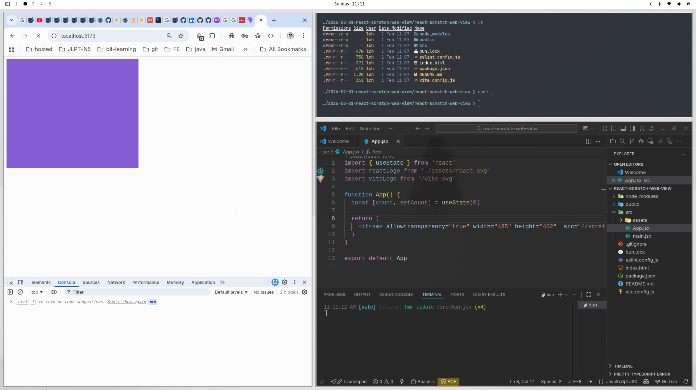
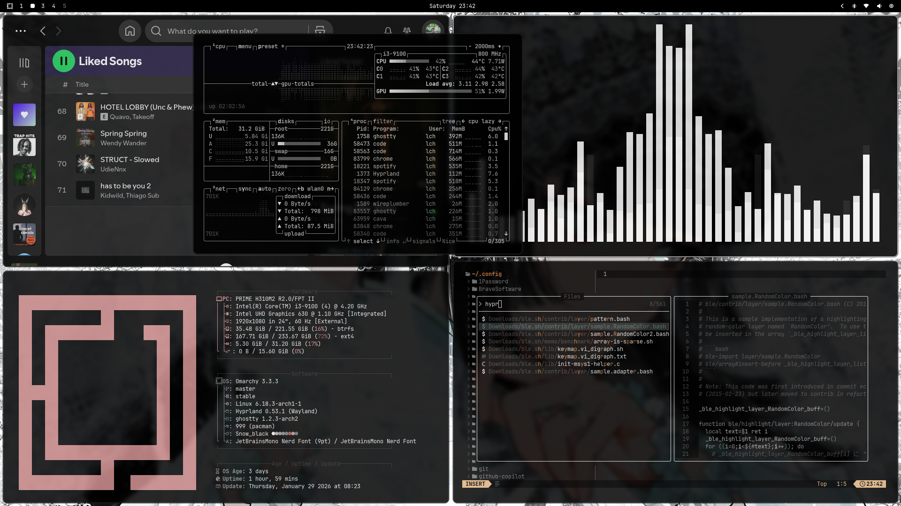

# Introduction

Im using Omarchy as my main OS for a while, and I want to share my experience with you. Omarchy is a Arch-based distribution that focuses on simplicity and customization.


---



# Docs

- Good document, you can find it here: [Omarchy document](https://learn.omacom.io/2/the-omarchy-manual)

# Install Windows VM

# My shortcuts

## Navigation

- `Super + Tab`: Move to the next workspace
- `Super + Shift + Tab`: Move to the previous workspace
- `Super + 1-9`: Move to the workspace number 1-9 (1-5 is visible, 6-9 is hidden)
- `Super + Shift + 1-9`: Move the current window to the workspace number and switch to it
- `Super + S`: Hidden workspaces
- `Super + Alt + S`: Move the current window to the hidden workspaces

## Toggles

- `Super + Shift + Space`: Toggle top bar
- `Super + Ctrl + I`: Toggle idle/sleep prevention
- `Super + Ctrl + L`: Toggle lock screen
- `Super + Ctrl + N`: Toggle night mode

## Style

- `Super + Ctrl + Shift + Space`: Change themes
- `Super + Ctrl + Space`: Change wallpapers of the current theme

## Tools

- `Super + Enter`: Open terminal

## Capture

- `Super + Ctrl + C`: For keyboard with no Print Screen key

## Clipboard

- `Super + Ctrl + V`: Open clipboard history
- `Super + C`: Copy
- `Super + X`: Cut (not in terminalc)
- `Super + V`: Paste

# Disk full with snapshots

- Omarchy uses Btrfs as the default filesystem, which allows it to create snapshots of the system. However, if you have a lot of snapshots, it can fill up your disk space. To check how many snapshots you have, you can run the following command:

```bash
sudo btrfs subvolume list /
```

```bash
[sudo] password for lch:
ID 256 gen 49759 top level 5 path @
ID 257 gen 49759 top level 5 path @home
ID 258 gen 49759 top level 5 path @log
ID 259 gen 48440 top level 5 path @pkg
ID 260 gen 48440 top level 256 path var/lib/portables
ID 261 gen 48440 top level 256 path var/lib/machines
ID 262 gen 49714 top level 256 path .snapshots
ID 263 gen 49713 top level 257 path @home/.snapshots
```

```bash
sudo btrfs subvolume delete ./snapshots/7
```

- Let the system balance the disk to free up space

```bash
sudo btrfs filesystem balance start -dusage=50 /
```

# Extra themes

Look at the [Omarchy themes](https://learn.omacom.io/2/the-omarchy-manual/52/themes) section in the manual for more themes, or you can install themes from GitHub using the following command:

```bash
omarchy-theme-install https://github.com/dfrico/omarchy-solarized-light-theme.git
```
