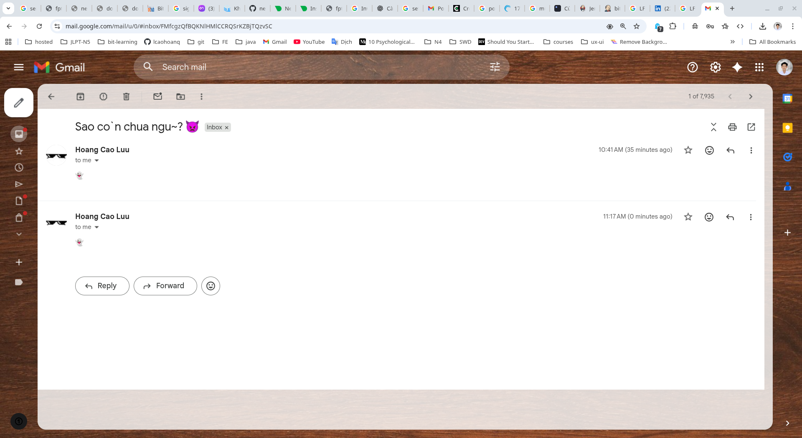

# Mở đầu

- Giữa vô vàn các thể loại tạo mail server, hôm nay mình sẽ hướng dẫn các bạn dựng một Postfix Mail Server, ưu điểm là nhanh, nhẹ và dễ cấu hình.
- Mình sẽ hướng dẫn trên Debian 13, các distro khác tương tự nhé.

# Chuẩn bị

- Gmail bật 2FA
- Tạo app password SMTP
  - Google Account → Security → App passwords
  - Chọn: Mail / Other
  - Lưu lại password dạng: abcd efgh ijkl mnop

# Setup

```bash
sudo apt update 
sudo apt install mailutils postfix -y
```

**mailutils**: Viết thư xong bỏ lên bàn -> gửi ra bưu điện là **postfix** để chuyển đi smtp

```bash
❯ systemctl status postfix
● postfix.service - Postfix Mail Transport Agent (main/default instance)
     Loaded: loaded (/usr/lib/systemd/system/postfix.service; enabled; preset: enab>
     Active: active (running) since Mon 2026-01-19 10:32:41 +07; 20min ago
 Invocation: 734dd8c24a73495ebed6499557f0b5ac
       Docs: man:postfix(1)
    Process: 90130 ExecStartPre=postfix check (code=exited, status=0/SUCCESS)
    Process: 90237 ExecStart=postfix debian-systemd-start (code=exited, status=0/SU>
   Main PID: 90245 (master)
      Tasks: 4 (limit: 38265)
     Memory: 4.9M (peak: 10.8M)
        CPU: 412ms
     CGroup: /system.slice/postfix.service
             ├─90245 /usr/lib/postfix/sbin/master -w
             ├─90246 pickup -l -t unix -u -c
             ├─90247 qmgr -l -t unix -u
             └─90393 tlsmgr -l -t unix -u -c
```

```bash
❯ ss -lntp | grep :25

LISTEN 0      100                        0.0.0.0:25         0.0.0.0:*                                               
LISTEN 0      100                           [::]:25            [::]:*
```

```bash
# Cài SASL (bắt buộc để auth Gmail)
sudo apt install sasl2-bin libsasl2-modules
```

Tạo file auth Gmail

```bash
sudo nano /etc/postfix/sasl_passwd
```

Nội dung file:

```txt
[smtp.gmail.com]:587    hoangclw@gmail.com:APP_PASSWORD_O_DAY
```

- Lưu ý:
  - Không có khoảng trắng thừa
  - Email và password cách nhau bởi dấu hai chấm (:)

Hash file & set quyền (rất quan trọng)

```bash
sudo postmap /etc/postfix/sasl_passwd
sudo chmod 600 /etc/postfix/sasl_passwd /etc/postfix/sasl_passwd.db
```

Cấu hình postfix dùng Gmail SMTP

```bash
sudo nano /etc/postfix/main.cf
```

Nội dung mặc định

```txt
# See /usr/share/postfix/main.cf.dist for a commented, more complete version

# See http://www.postfix.org/COMPATIBILITY_README.html
compatibility_level = 3.9

# Which domain that locally-originated mail appears to come from.
# Debian policy suggests to read this value from /etc/mailname.
#XX needs a review in postinst&config
#myorigin = /etc/mailname
#myorigin = $mydomain
myorigin = /etc/mailname

# Text that follows the 220 code in the SMTP server's greeting banner.
# You MUST specify $myhostname at the start due to an RFC requirement.
smtpd_banner = $myhostname ESMTP $mail_name (Debian)

# IP protocols to use: ipv4, ipv6, or all
# (set this explicitly so `post-install upgrade-configuration' wont complain)
inet_protocols = all

# List of "trusted" SMTP clients (maptype:mapname allowed) that have more
# privileges than "strangers".  If mynetworks is not specified (the default),
# mynetworks_style is used to compute its value.
#mynetworks_style = class
#mynetworks_style = subnet
mynetworks_style = host
#
mynetworks = 127.0.0.0/8 [::ffff:127.0.0.0]/104 [::1]/128

# Uncomment the next line to generate "delayed mail" warnings
#delay_warning_time = 4h

# List of domains (maptype:mapname allowed) that this machine considers
# itself the final destination for.
mydestination = $myhostname, hoang.hoang, localhost.hoang, , localhost

# Maximum size of a user mailbox
mailbox_size_limit = 0

# Optional external command to use instead of mailbox delivery.  If set,
# you must set up an alias to forward root mail to a real user.
#mailbox_command = /usr/bin/procmail
#mailbox_command = /usr/bin/procmail -a "$EXTENSION"
mailbox_command = 

# List of alias maps to use to lookup local addresses.
# Per Debian Policy it should be /etc/aliases.
alias_maps = hash:/etc/aliases

# List of alias maps to make indexes on, when running newaliases.
alias_database = hash:/etc/aliases

# Notify (or not) local biff service when new mail arrives.
# Rarely used these days.
biff = no

# Separator between user name and address extension (user+foo@domain)
#recipient_delimiter = +
recipient_delimiter = +

# A host to send "other" mail to
#relayhost = $mydomain
#relayhost = [gateway.example.com]
#relayhost = [ip.add.re.ss]:port
#relayhost = uucphost
relayhost = 

# Where to look for Cyrus SASL configuration files.  Upstream default is unset
# (use compiled-in SASL library default), Debian Policy says it should be
# /etc/postfix/sasl.
cyrus_sasl_config_path = /etc/postfix/sasl

# SMTP server RSA key and certificate in PEM format
smtpd_tls_key_file = /etc/ssl/private/ssl-cert-snakeoil.key
smtpd_tls_cert_file = /etc/ssl/certs/ssl-cert-snakeoil.pem
# SMTP Server security level: none|may|encrypt
smtpd_tls_security_level = may

# List of CAs for SMTP Client to trust
# Prefer this over _CApath when smtp is running chrooted
smtp_tls_CAfile = /etc/ssl/certs/ca-certificates.crt
# SMTP Client TLS security level: none|may|encrypt|...
smtp_tls_security_level = may
# SMTP Client TLS session cache
smtp_tls_session_cache_database = btree:${data_directory}/smtp_scache
smtpd_relay_restrictions = permit_mynetworks permit_sasl_authenticated defer_unauth_destination
myhostname = hoang.hoang
inet_interfaces = all
```

Thêm / sửa các dòng sau

```txt
relayhost = [smtp.gmail.com]:587

smtp_sasl_auth_enable = yes
smtp_sasl_password_maps = hash:/etc/postfix/sasl_passwd
smtp_sasl_security_options = noanonymous
smtp_sasl_tls_security_options = noanonymous

smtp_use_tls = yes
smtp_tls_security_level = encrypt
smtp_tls_CAfile = /etc/ssl/certs/ca-certificates.crt
```

Reload postfix

```bash
sudo systemctl restart postfix
```

# Test gửi mail

```bash
echo "👻" | mail -s "Sao co\`n chua ngu~? 👿" hoangclw@gmail.com
```

Với syntax:

```bash
echo "Nội dung thư" | mail -s "Tiêu đề thư" email@gmail.com
```



- Kiểm tra hộp thư đến của bạn xem đã nhận được mail chưa nhé.
- Nếu không nhận được mail, check mail có bị vào spam không, hoặc xem mail có bị queue không:

```bash
mailq
```

- Nếu có mail trong queue, dùng lệnh sau để gửi lại:

```bash
sudo postfix flush
```
