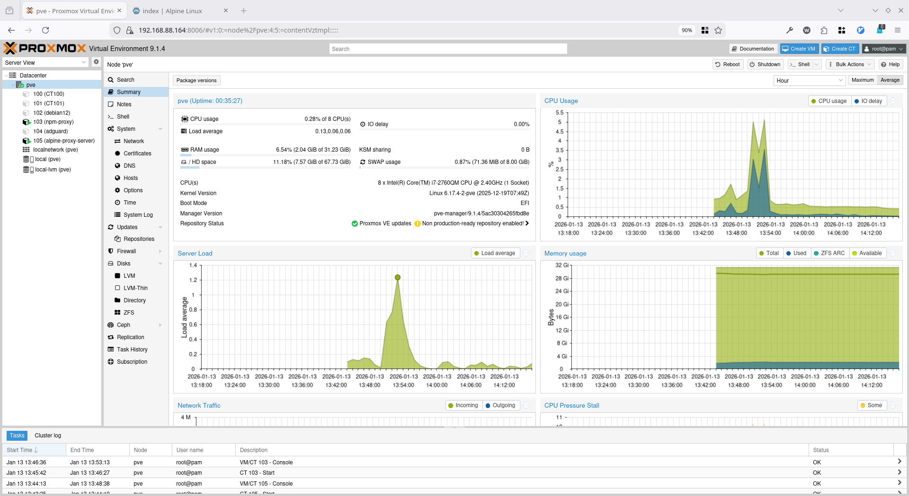
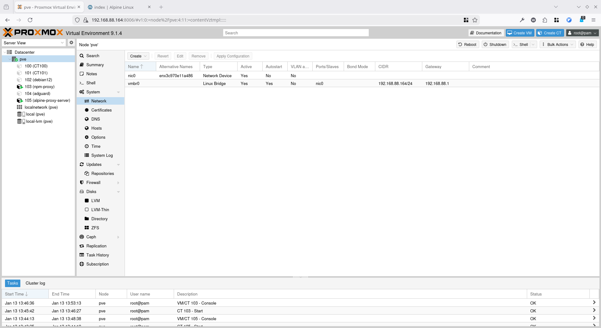
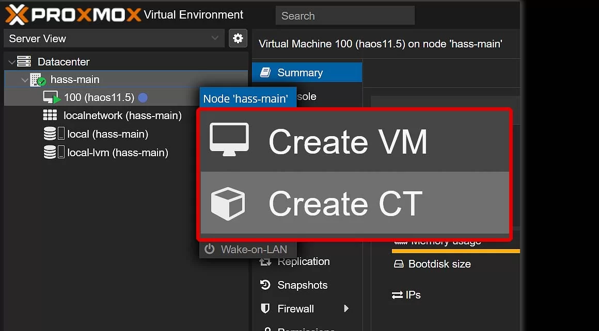
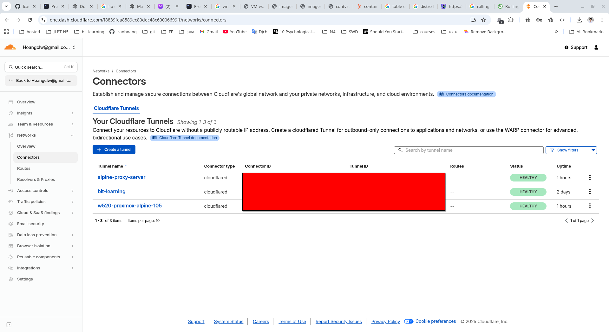

# Mở đầu

- Đang nệm êm chăn ấm cùng chiếc Homelab Server của mình, bỗng muốn thử xem các distro Linux khác nhau như thế nào.


- Nghĩ ngay đến tạo thêm máy ảo, mà khổ cái Ubuntu Server không có GUI, mà tương tác sâu xuống như KVM + libvirt, Terraform thì hơi quá sức với mình. Mình tìm đến Proxmox VE, một nền tảng ảo hóa mã nguồn mở dựa trên Debian, cung cấp giao diện web để quản lý máy ảo và container một cách dễ dàng.

- Proxmox trở thành một cloud mini
- Cao cấp hơn sẽ là OpenStack: Xây dựng cloud riêng kiểu AWS, GCP, Azure -> Siêu siêu khó,

---

# Cài đặt

- Theo hướng dẫn này nha, dễ cài lắm:

<iframe width="100%" height="468" src="https://www.youtube.com/embed/cXIJ-pd1ZVs" title="YouTube video player" frameborder="0" allow="accelerometer; autoplay; clipboard-write; encrypted-media; gyroscope; picture-in-picture; web-share" allowfullscreen></iframe>

- Sau khi cài xong sẽ như thế này:


- Vào bằng trình duyệt với địa chỉ `https://<IP-ADDRESS>:8006`, `<IP-ADDRESS>`, ip sẽ hiển thị sau khi cài đặt xong, boot lên là thấy



- Trong lúc cài mình set static ip luôn, tiện quản lý, `192.168.88.164/24`



---

# Vmbr0

> Mặc định Proxmox tạo sẵn 1 bridge tên vmbr0, gán với card mạng vật lý (ví dụ: eth0)

Check `ip a`:

```zsh
4: vmbr0: <BROADCAST,MULTICAST,UP,LOWER_UP> mtu 1500 qdisc noqueue state UP group default qlen 1000
    link/ether 3c:97:0e:11:a4:86 brd ff:ff:ff:ff:ff:ff
    inet 192.168.88.164/24 scope global vmbr0
       valid_lft forever preferred_lft forever
    inet6 fe80::3e97:eff:fe11:a486/64 scope link proto kernel_ll 
       valid_lft forever preferred_lft forever
```

Vmbr0 là bridge network, kết nối giữa các máy ảo/container với mạng vật lý bên ngoài. Các máy ảo/container khi tạo sẽ được gán vào bridge này, có thể cấu hình static IP, DHCP

- Vmbr0 hoạt động như một switch ảo, chuyển tiếp gói tin giữa máy ảo/container và mạng vật lý
- Có thể tạo thêm bridge khác (vmbr1, vmbr2,...) để phân tách mạng cho các mục đích khác nhau
- Quản lý bridge network qua giao diện web hoặc dòng lệnh, tham khảo thêm: <https://pve.proxmox.com/wiki/Network_Configuration>

---

# VM vs LXC



- Proxmox hỗ trợ 2 loại ảo hóa chính: KVM (Kernel-based Virtual Machine) và LXC (Linux Containers).
- KVM là ảo hóa toàn phần, mỗi máy ảo có hệ điều hành riêng biệt, phù hợp cho các hệ điều hành khác nhau.
  - Ưu điểm: Cô lập hoàn toàn, hỗ trợ nhiều hệ điều hành.
  - Nhược điểm: Tốn nhiều tài nguyên hơn.
- LXC là ảo hóa cấp hệ điều hành, chia sẻ kernel với máy chủ vật lý, phù hợp cho các ứng dụng nhẹ.
  - Ưu điểm: Tiết kiệm tài nguyên, khởi động nhanh.
  - Nhược điểm: Hạn chế về hệ điều hành, không cô lập hoàn toàn.
- Tùy vào nhu cầu sử dụng mà chọn loại ảo hóa phù hợp.

> Tham khảo thêm: <https://www.youtube.com/watch?v=CDBGQWsdRbY>
---

# Đổi mật khẩu LXC container

- Khi tạo LXC thì mình tự set password, nhưng nếu quên thì làm sao đổi lại?

## Các bước thực hiện

- SSH vào shell của Proxmox host
- Liệt kê các container hiện có

```bash
root@pve:~# pct list
VMID       Status     Lock         Name                
100        running                 CT100               
101        running                 CT101   
```

- Đổi mật khẩu cho container cho VMID 100
  - Nhanh thì pct passwd `<VMID>`
  - Chậm thì pct enter `<VMID>` rồi dùng lệnh passwd trong container

```bash
root@pve:~# pct passwd 100
Enter new password:
Retype new password:
```

---

# Tạo một Alpine Proxy Server dùng Cloudflare Tunnel

Chuyện là khi muốn vào dashboard của Proxmox từ bên ngoài mạng nhà mình, thì có vài cách:

- Mở port 8006 của router, để traffic từ bên ngoài vào thẳng Promox host
  - Cách này không an toàn, dễ bị tấn công brute-force
- Dùng VPN: tự cài OpenVPN, Wireguard, Tailscale (dễ config nhất) trên một server khác, kết nối VPN vào rồi mới truy cập Proxmox
  - Cách này khá ổn, nhưng cũng phức tạp, config lằng nhằng phết đấy
- Tunnel: mình hay dùng thằng Cloudflare Tunnel vì nó miễn phí, dễ dùng, bảo mật tốt, tận dụng tối đã hệ sinh thái của Cloudflare luôn.
  - Yêu cầu đã có domain riêng, trỏ về Cloudflare

> Tại sao lại chọn Alpine để làm proxy server?
>
> 1. Proxy không cần nhiều tool, thường chỉ forward traffic, không xử lí bussiness logic, không cần native lib phức tạp
> 2. Security tốt
> 3. Nhẹ, tốn ít tài nguyên

> Tại sao không cài luôn docker, cloudflare tunnel trên Proxmox host?
>
> 1. Proxmox host nên giữ nguyên trạng thái càng sạch càng tốt, tránh cài thêm phần mềm không cần thiết làm ảnh hưởng đến hiệu năng và độ ổn định của Proxmox
> 2. Dễ quản lý, backup, di chuyển khi dùng container
> 3. Keep the hypervisor clean and simple

- Các bước cần làm sau:

## Bước 1. Tạo LXC container Alpine trên Proxmox

- CT templates: **alpine-3.22-default_20250617_amd64.tar.xz** (siêu nhẹ chỉ **3.27MB**)

- CPU: 1 core
- RAM: 512MB
- Disk: 5GB
- Network:
  - IPv4: DHCP
  - IPv6: Disable

## Bước 2: Cài đặt docker, docker-compose-cli trong container

- Theo doc: <https://wiki.alpinelinux.org/wiki/Docker>

```bash
apk update
apk add docker

rc-update add docker default
service docker start

apk add docker-cli-compose
```

## Bước 3: Tạo file docker-compose.yml để chạy Cloudflare Tunnel

```zsh
touch docker-compose.yml
```

- Copy nội dung này vào, nhớ thay `<YOUR_TUNNEL_TOKEN>` bằng token của bạn nha

```yaml
services:
  cloudflared:
    image: cloudflare/cloudflared:latest
    restart: unless-stopped
    command: tunnel --no-autoupdate run --token <YOUR_TUNNEL_TOKEN>
```

- Lên dashboard của cloudflare kiểm tra **Healthy** là ok rồi đó


