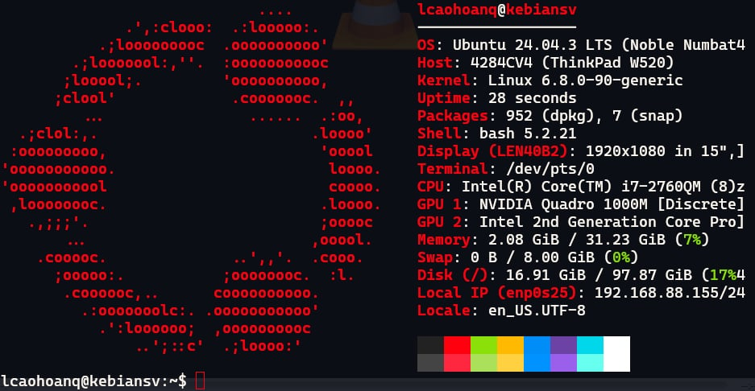
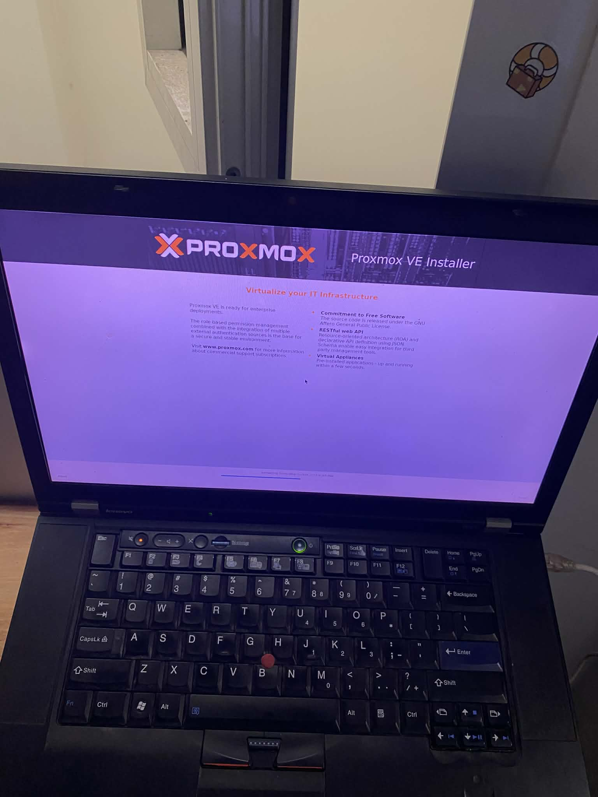

# Mở đầu

- Đang nệm êm chăn ấm cùng chiếc Homelab Server của mình, bỗng muốn thử xem các distro Linux khác nhau như thế nào.



- Nghĩ ngay đến tạo thêm máy ảo, mà khổ cái Ubuntu Server không có GUI, mà tương tác sâu xuống như KVM + libvirt, Terraform thì hơi quá sức với mình. Mình tìm đến Proxmox VE, một nền tảng ảo hóa mã nguồn mở dựa trên Debian, cung cấp giao diện web để quản lý máy ảo và container một cách dễ dàng.

- Proxmox trở thành một cloud mini
- Cao cấp hơn sẽ là OpenStack: Xây dựng cloud riêng kiểu AWS, GCP, Azure -> Siêu siêu khó

# Cài đặt

- Theo hướng dẫn này nha, dễ cài lắm:

<iframe width="100%" height="468" src="https://www.youtube.com/embed/cXIJ-pd1ZVs" title="YouTube video player" frameborder="0" allow="accelerometer; autoplay; clipboard-write; encrypted-media; gyroscope; picture-in-picture; web-share" allowfullscreen></iframe>

- Mình đã cài thành công



- Vào bằng trình duyệt với địa chỉ `https://<IP-ADDRESS>:8006`, `<IP-ADDRESS>` check bằng lệnh `ip a` trên terminal của Proxmox host hoặc nó sẽ hiển thị sau khi cài đặt xong, boot lên là thấy.

# VM vs LXC

- Proxmox hỗ trợ 2 loại ảo hóa chính: KVM (Kernel-based Virtual Machine) và LXC (Linux Containers).
- KVM là ảo hóa toàn phần, mỗi máy ảo có hệ điều hành riêng biệt, phù hợp cho các hệ điều hành khác nhau.
  - Ưu điểm: Cô lập hoàn toàn, hỗ trợ nhiều hệ điều hành.
  - Nhược điểm: Tốn nhiều tài nguyên hơn.
- LXC là ảo hóa cấp hệ điều hành, chia sẻ kernel với máy chủ vật lý, phù hợp cho các ứng dụng nhẹ.
  - Ưu điểm: Tiết kiệm tài nguyên, khởi động nhanh.
  - Nhược điểm: Hạn chế về hệ điều hành, không cô lập hoàn toàn.
- Tùy vào nhu cầu sử dụng mà chọn loại ảo hóa phù hợp.

# Đổi mật khẩu LXC container

- Khi tạo LXC thì mình tự set password, nhưng nếu quên thì làm sao đổi lại?

## Cac bước thực hiện

- SSH vào shell của Proxmox host
- Liệt kê các container hiện có

```bash
root@pve:~# pct list
VMID       Status     Lock         Name                
100        running                 CT100               
101        running                 CT101   
```

- Đổi mật khẩu cho container cho VMID 100
  - Nhanh thì pct passwd `<VMID>`
  - Chậm thì pct enter `<VMID>` rồi dùng lệnh passwd trong container

```bash
root@pve:~# pct passwd 100
Enter new password:
Retype new password:
```
