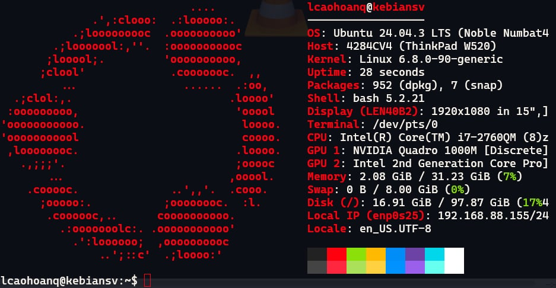
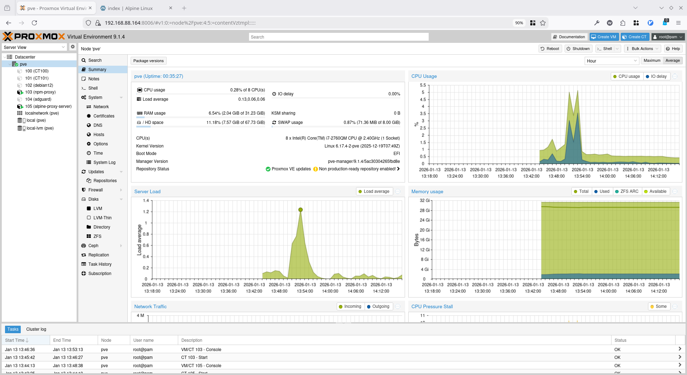
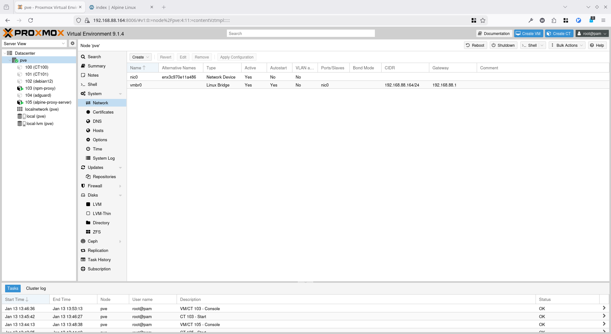
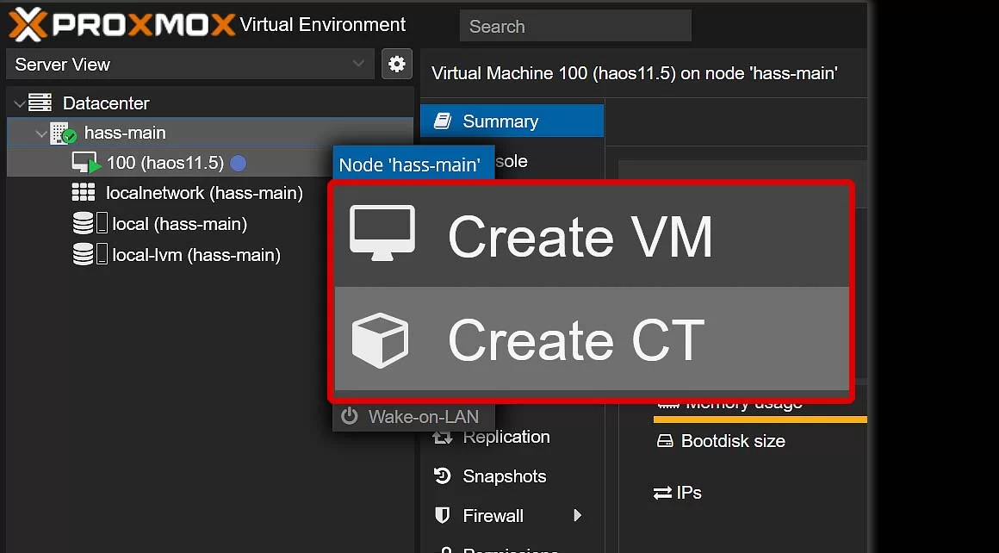
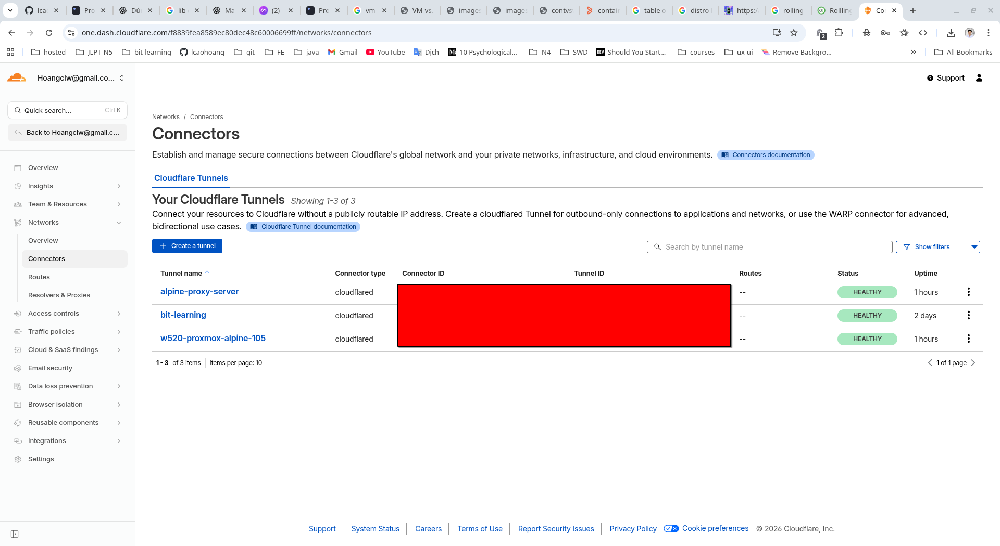

# Mở đầu

- Đang nệm êm chăn ấm cùng chiếc Homelab Server của mình, bỗng muốn thử xem các distro Linux khác nhau như thế nào.



- Nghĩ ngay đến tạo thêm máy ảo, mà khổ cái Ubuntu Server không có GUI, mà tương tác sâu xuống như KVM + libvirt, Terraform thì hơi quá sức với mình. Mình tìm đến Proxmox VE, một nền tảng ảo hóa mã nguồn mở dựa trên Debian, cung cấp giao diện web để quản lý máy ảo và container một cách dễ dàng.

- Proxmox trở thành một cloud mini
- Cao cấp hơn sẽ là OpenStack: Xây dựng cloud riêng kiểu AWS, GCP, Azure -> Siêu siêu khó,

---

# Cài đặt

- Theo hướng dẫn này nha, dễ cài lắm:

<iframe width="100%" height="468" src="https://www.youtube.com/embed/cXIJ-pd1ZVs" title="YouTube video player" frameborder="0" allow="accelerometer; autoplay; clipboard-write; encrypted-media; gyroscope; picture-in-picture; web-share" allowfullscreen></iframe>

- Sau khi cài xong sẽ như thế này:


- Vào bằng trình duyệt với địa chỉ `https://<IP-ADDRESS>:8006`, `<IP-ADDRESS>`, ip sẽ hiển thị sau khi cài đặt xong, boot lên là thấy



- Trong lúc cài mình set static ip luôn, tiện quản lý, `192.168.88.164/24`



---

# Vmbr0

> Mặc định Proxmox tạo sẵn 1 bridge tên vmbr0, gán với card mạng vật lý (ví dụ: eth0)

Check `ip a`:

```zsh
4: vmbr0: <BROADCAST,MULTICAST,UP,LOWER_UP> mtu 1500 qdisc noqueue state UP group default qlen 1000
    link/ether 3c:97:0e:11:a4:86 brd ff:ff:ff:ff:ff:ff
    inet 192.168.88.164/24 scope global vmbr0
       valid_lft forever preferred_lft forever
    inet6 fe80::3e97:eff:fe11:a486/64 scope link proto kernel_ll 
       valid_lft forever preferred_lft forever
```

Vmbr0 là bridge network, kết nối giữa các máy ảo/container với mạng vật lý bên ngoài. Các máy ảo/container khi tạo sẽ được gán vào bridge này, có thể cấu hình static IP, DHCP

- Vmbr0 hoạt động như một switch ảo, chuyển tiếp gói tin giữa máy ảo/container và mạng vật lý
- Có thể tạo thêm bridge khác (vmbr1, vmbr2,...) để phân tách mạng cho các mục đích khác nhau
- Quản lý bridge network qua giao diện web hoặc dòng lệnh, tham khảo thêm: <https://pve.proxmox.com/wiki/Network_Configuration>

---

# Đổi IP tĩnh cho Proxmox Host

Oái ăm khi cài đặt proxmox mình set ip tĩnh luôn, nhưng mình cần đem server về quê xài trong kì nghỉ Tết, giờ đổi router khác nên ip cũ không vào được, phải đổi lại ip mới cho Proxmox host.

Nói sâu thêm về kĩ thuật, **router** sẽ có **gateway** và subnet mask, ví dụ gateway là `192. 168.1.1`, thì sẽ cấp ip trong dải `192.168.1.x` với subnet mask là `...` để có cái nhìn tổng quan về mạng. Mình cần set đúng ip trong dải này để có thể truy cập được vào Proxmox host. Mình chọn `192.168.1.100` để dễ nhớ, và dùng số cao để tránh trùng với các thiết bị khác trong mạng. (Số cao số thấp, ví dụ `192.168.1.10` là số thấp dễ bị trùng hơn, vì router thường cấp ip từ số thấp lên cao)

## Kiểm tra gateway và subnet mask

Ủa vậy làm sao mình kiểm tra được router của mình có gateway là gì, subnet mask là gì? Mình check bằng lệnh `ip route` trên terminal:

```bash
root@pve:~# ip route
default via 192.168.27.1 dev vmbr0 proto kernel onlink
192.168.27.0/24 dev vmbr0 proto kernel scope link src 192.168.27.164
```

Ở đây `.27` là do mình đã đổi thêm một router mới nữa, nên gateway của mình là `192.168.27.1` cũng là trang đăng nhập router.

Ta cần thu thập các thông tin:

- Gateway: `192.168.27.1`
- Tên card mạng vật lý: `vmbr0`

## Mở file network

```bash
nano /etc/network/interfaces
```

Sẽ thấy đại khái

```ini
auto lo
iface lo inet loopback

iface eno1 inet manual

auto vmbr0
iface vmbr0 inet static
    address 192.168.88.164/24
    gateway 192.168.88.1
    bridge-ports eno1
    bridge-stp off
    bridge-fd 0
```

- Sửa lại cho đúng các thông tin (gateway, address, bridge-ports)

> Đây là file của mình sau khi hoàn thành:

```ini
auto lo
iface lo inet loopback

iface nic0 inet manual

auto vmbr0
iface vmbr0 inet static
        address 192.168.27.164/24
        gateway 192.168.27.1
        dns-nameservers 1.1.1.1 8.8.8.8
        bridge-ports nic0
        bridge-stp off
        bridge-fd 0


source /etc/network/interfaces.d/*
```

## Restart network

```bash
systemctl restart networking
```

hoặc

```bash
reboot
```

## Test

Sau khi server khởi động lên, test các lệnh sau

```bash
ip a
ip route
ping 8.8.8.8
ping google.com
```

```bash
root@pve:~# ping -c 3 8.8.8.8
PING 8.8.8.8 (8.8.8.8) 56(84) bytes of data.
64 bytes from 8.8.8.8: icmp_seq=1 ttl=114 time=30.9 ms
64 bytes from 8.8.8.8: icmp_seq=2 ttl=114 time=30.1 ms
64 bytes from 8.8.8.8: icmp_seq=3 ttl=114 time=30.4 ms

--- 8.8.8.8 ping statistics ---
3 packets transmitted, 3 received, 0% packet loss, time 2003ms
rtt min/avg/max/mdev = 30.075/30.469/30.947/0.360 ms
root@pve:~# ping -c 3 google.com
PING google.com (142.250.198.174) 56(84) bytes of data.
64 bytes from nchkgb-ak-in-f14.1e100.net (142.250.198.174): icmp_seq=1 ttl=114 time=29.4 ms
64 bytes from nchkgb-ak-in-f14.1e100.net (142.250.198.174): icmp_seq=2 ttl=114 time=27.5 ms
64 bytes from nchkgb-ak-in-f14.1e100.net (142.250.198.174): icmp_seq=3 ttl=114 time=27.5 ms

--- google.com ping statistics ---
3 packets transmitted, 3 received, 0% packet loss, time 2004ms
rtt min/avg/max/mdev = 27.450/28.120/29.431/0.926 ms
root@pve:~# ip route
default via 192.168.27.1 dev vmbr0 proto kernel onlink
192.168.27.0/24 dev vmbr0 proto kernel scope link src 192.168.27.164
root@pve:~# ip -c -br a
lo               UNKNOWN        127.0.0.1/8 ::1/128
nic0             UP
tailscale0       UNKNOWN        100.113.111.1/32 fd7a:115c:a1e0::8137:6f01/128 fe80::d15f:1b46:d600:5120/64
vmbr0            UP             192.168.27.164/24 fe80::3e97:eff:fe11:a486/64
veth105i0@if2    UP
fwbr105i0        UP
fwpr105p0@fwln105i0 UP
fwln105i0@fwpr105p0 UP
root@pve:~# ip a
1: lo: <LOOPBACK,UP,LOWER_UP> mtu 65536 qdisc noqueue state UNKNOWN group default qlen 1000
    link/loopback 00:00:00:00:00:00 brd 00:00:00:00:00:00
    inet 127.0.0.1/8 scope host lo
       valid_lft forever preferred_lft forever
    inet6 ::1/128 scope host noprefixroute
       valid_lft forever preferred_lft forever
2: nic0: <BROADCAST,MULTICAST,UP,LOWER_UP> mtu 1500 qdisc fq_codel master vmbr0 state UP group default qlen 1000
    link/ether 3c:97:0e:11:a4:86 brd ff:ff:ff:ff:ff:ff
    altname enx3c970e11a486
3: tailscale0: <POINTOPOINT,MULTICAST,NOARP,UP,LOWER_UP> mtu 1280 qdisc fq_codel state UNKNOWN group default qlen 500
    link/none
    inet 100.113.111.1/32 scope global tailscale0
       valid_lft forever preferred_lft forever
    inet6 fd7a:115c:a1e0::8137:6f01/128 scope global
       valid_lft forever preferred_lft forever
    inet6 fe80::d15f:1b46:d600:5120/64 scope link stable-privacy proto kernel_ll
       valid_lft forever preferred_lft forever
4: vmbr0: <BROADCAST,MULTICAST,UP,LOWER_UP> mtu 1500 qdisc noqueue state UP group default qlen 1000
    link/ether 3c:97:0e:11:a4:86 brd ff:ff:ff:ff:ff:ff
    inet 192.168.27.164/24 scope global vmbr0
       valid_lft forever preferred_lft forever
    inet6 fe80::3e97:eff:fe11:a486/64 scope link proto kernel_ll
       valid_lft forever preferred_lft forever
5: veth105i0@if2: <BROADCAST,MULTICAST,UP,LOWER_UP> mtu 1500 qdisc noqueue master fwbr105i0 state UP group default qlen 1000
    link/ether fe:45:a1:5c:53:04 brd ff:ff:ff:ff:ff:ff link-netnsid 0
6: fwbr105i0: <BROADCAST,MULTICAST,UP,LOWER_UP> mtu 1500 qdisc noqueue state UP group default qlen 1000
    link/ether 72:bb:af:a7:10:bd brd ff:ff:ff:ff:ff:ff
7: fwpr105p0@fwln105i0: <BROADCAST,MULTICAST,UP,LOWER_UP> mtu 1500 qdisc noqueue master vmbr0 state UP group default qlen 1000
    link/ether e2:90:4c:6a:1d:74 brd ff:ff:ff:ff:ff:ff
8: fwln105i0@fwpr105p0: <BROADCAST,MULTICAST,UP,LOWER_UP> mtu 1500 qdisc noqueue master fwbr105i0 state UP group default qlen 1000
    link/ether 72:bb:af:a7:10:bd brd ff:ff:ff:ff:ff:ff
```

## Sau này tôi đổi router khác nữa thì sao?

Ví dụ router mới là `192.168.69.1`

Mình chỉ cần sửa trong file `/etc/network/interfaces` lại thành

```ini
address 192.168.69.100/24
gateway 192.168.69.1
```

KHÔNG cần:

- DHCP reservation
- config lại VM
- config lại bridge

## Tại sao cách này là tốt nhất

- không phụ thuộc router
- không mất cấu hình khi đổi router
- Proxmox luôn có IP cố định
- dễ port forward
- dễ SSH, dễ quản trị

## Các lỗi xảy ra

### 1. Ping ip được nhưng không ping được domain

Nếu ping được ip nhưng không ping được domain, thì có thể là do DNS không được cấu hình đúng. **DNS không resolve được tên mền**. Mình check lại file `/etc/network/interfaces` xem có dòng `dns-nameservers` không, nếu không có thì thêm vào như này:

```ini
dns-nameservers 1.1.1.1 8.8.8.8
```

Nếu vẫn không được thì ta cần check lại file `/etc/resolv.conf` xem có đúng không, nếu không đúng thì sửa lại thành:

Từ

```ini
search lan
nameserver 192.168.88.1
```

Sửa thành

```ini
nameserver 1.1.1.1
nameserver 8.8.8.8
```

Ping lại google.com được rồi đó (100%)

> Fix vĩnh viễn (Proxmox + systemd-resolved)

```bash
nano /etc/systemd/resolved.conf
```

```ini
[Resolve]
DNS=1.1.1.1 8.8.8.8
FallbackDNS=8.8.4.4
```

Lưu lại.

Restart DNS service:

```bash
systemctl restart systemd-resolved
```

Kiểm tra rằng `resolv.conf` không bị ghi đè sai:

```bash
ls -l /etc/resolv.conf

```

Nếu thấy `resolv.conf` là một symbolic link đến `../run/systemd/resolve/stub-resolv.conf` thì đúng rồi đó, không cần sửa gì nữa.

Nếu không ép link lại

```bash
ln -sf /run/systemd/resolve/resolv.conf /etc/resolv.conf
```

Bước cuối cùng là restart lại Proxmox host để chắc chắn mọi thứ hoạt động ổn định:

```bash
reboot
```

### 2. Trùng ip

Quái lạ rằng mình set `192.168.1.100`, lúc thì mình vào được từ web `192.168.1.100:8006` nhưng refresh lại thì không hoặc không vào được luôn từ đầu. Mình nghi nghi ip này đã có thiết bị dùng rồi, check bằng **arp** xem có đúng không:

**arp** là một công cụ dùng để hiển thị và quản lý bảng ARP (Address Resolution Protocol) trên hệ thống. Bảng ARP lưu trữ các cặp địa chỉ IP và địa chỉ MAC tương ứng của các thiết bị trong mạng LAN. Khi một thiết bị muốn giao tiếp với một thiết bị khác trong cùng mạng, nó sẽ sử dụng ARP để tìm địa chỉ MAC của thiết bị đích dựa trên địa chỉ IP.

```bash
# Arch
sudo pacman -S net-tools
```

```bash
❯ arping 192.168.1.100 
ARPING 192.168.1.100 from 192.168.1.13 enp0s31f6 
Unicast reply from 192.168.1.100 [3C:97:0E:11:A4:86] 1.213ms
Unicast reply from 192.168.1.100 [00:12:31:62:55:0B] 1.510ms
Unicast reply from 192.168.1.100 [00:12:31:62:55:0B] 1.881ms
Unicast reply from 192.168.1.100 [00:12:31:62:55:0B] 1.608ms
```

Rồi bắt đúng bệnh rồi, có 2 thiết bị đang dùng ip này rồi, một là Proxmox host của mình, hai là một thiết bị khác (địa chỉ MAC khác). Sau này nếu muốn dùng ip nào đó, nên check trước xem có thiết bị nào đang dùng ip đó không, tránh bị trùng ip dẫn đến lỗi mạng khó chịu.

```bash
# Ping check để xem có thiết bị nào đang dùng ip đó không
…/data/project ✗ ping -c 3 192.168.27.165
PING 192.168.27.165 (192.168.27.165) 56(84) bytes of data.
From 192.168.27.11 icmp_seq=1 Destination Host Unreachable
From 192.168.27.11 icmp_seq=2 Destination Host Unreachable
From 192.168.27.11 icmp_seq=3 Destination Host Unreachable

--- 192.168.27.165 ping statistics ---
3 packets transmitted, 0 received, +3 errors, 100% packet loss, time 2031ms
pipe 3
[ble: exit 1]

# Arp check xem có thiết bị nào đang dùng ip đó không
```bash
…/data/project ✗ arp 192.168.27.168
192.168.27.168 (192.168.27.168) -- no entry
```

---

# VM vs LXC



- Proxmox hỗ trợ 2 loại ảo hóa chính: KVM (Kernel-based Virtual Machine) và LXC (Linux Containers).
- KVM là ảo hóa toàn phần, mỗi máy ảo có hệ điều hành riêng biệt, phù hợp cho các hệ điều hành khác nhau.
  - Ưu điểm: Cô lập hoàn toàn, hỗ trợ nhiều hệ điều hành.
  - Nhược điểm: Tốn nhiều tài nguyên hơn.
- LXC là ảo hóa cấp hệ điều hành, chia sẻ kernel với máy chủ vật lý, phù hợp cho các ứng dụng nhẹ.
  - Ưu điểm: Tiết kiệm tài nguyên, khởi động nhanh.
  - Nhược điểm: Hạn chế về hệ điều hành, không cô lập hoàn toàn.
- Tùy vào nhu cầu sử dụng mà chọn loại ảo hóa phù hợp.

> Tham khảo thêm: <https://www.youtube.com/watch?v=CDBGQWsdRbY>
---

# Đổi mật khẩu LXC container

- Khi tạo LXC thì mình tự set password, nhưng nếu quên thì làm sao đổi lại?

## Các bước thực hiện

- SSH vào shell của Proxmox host
- Liệt kê các container hiện có

```bash
root@pve:~# pct list
VMID       Status     Lock         Name                
100        running                 CT100               
101        running                 CT101   
```

- Đổi mật khẩu cho container cho VMID 100
  - Nhanh thì pct passwd `<VMID>`
  - Chậm thì pct enter `<VMID>` rồi dùng lệnh passwd trong container

```bash
root@pve:~# pct passwd 100
Enter new password:
Retype new password:
```

---

# Tạo một Alpine Proxy Server dùng Cloudflare Tunnel

Chuyện là khi muốn vào dashboard của Proxmox từ bên ngoài mạng nhà mình, thì có vài cách:

- Mở port 8006 của router, để traffic từ bên ngoài vào thẳng Promox host
  - Cách này không an toàn, dễ bị tấn công brute-force
- Dùng VPN: tự cài OpenVPN, Wireguard, Tailscale (dễ config nhất) trên một server khác, kết nối VPN vào rồi mới truy cập Proxmox
  - Cách này khá ổn, nhưng cũng phức tạp, config lằng nhằng phết đấy
- Tunnel: mình hay dùng thằng Cloudflare Tunnel vì nó miễn phí, dễ dùng, bảo mật tốt, tận dụng tối đã hệ sinh thái của Cloudflare luôn.
  - Yêu cầu đã có domain riêng, trỏ về Cloudflare

> Tại sao lại chọn Alpine để làm proxy server?
>
> 1. Proxy không cần nhiều tool, thường chỉ forward traffic, không xử lí bussiness logic, không cần native lib phức tạp
> 2. Security tốt
> 3. Nhẹ, tốn ít tài nguyên

> Tại sao không cài luôn docker, cloudflare tunnel trên Proxmox host?
>
> 1. Proxmox host nên giữ nguyên trạng thái càng sạch càng tốt, tránh cài thêm phần mềm không cần thiết làm ảnh hưởng đến hiệu năng và độ ổn định của Proxmox
> 2. Dễ quản lý, backup, di chuyển khi dùng container
> 3. Keep the hypervisor clean and simple

- Các bước cần làm sau:

## Bước 1. Tạo LXC container Alpine trên Proxmox

- CT templates: **alpine-3.22-default_20250617_amd64.tar.xz** (siêu nhẹ chỉ **3.27MB**)

- CPU: 1 core
- RAM: 512MB
- Disk: 5GB
- Network:
  - IPv4: DHCP
  - IPv6: Disable

## Bước 2: Cài đặt docker, docker-compose-cli trong container

- Theo doc: <https://wiki.alpinelinux.org/wiki/Docker>

```bash
apk update
apk add docker

rc-update add docker default
service docker start

apk add docker-cli-compose
```

## Bước 3: Tạo file docker-compose.yml để chạy Cloudflare Tunnel

```zsh
touch docker-compose.yml
```

- Copy nội dung này vào, nhớ thay `<YOUR_TUNNEL_TOKEN>` bằng token của bạn nha

```yaml
services:
  cloudflared:
    image: cloudflare/cloudflared:latest
    restart: unless-stopped
    command: tunnel --no-autoupdate run --token <YOUR_TUNNEL_TOKEN>
```

- Lên dashboard của cloudflare kiểm tra **Healthy** là ok rồi đó



---

### Proxmox VE Helper-Scripts

- <https://community-scripts.github.io/ProxmoxVE/scripts?id=jellyfin>

Tiện lợi khi muốn cài đặt nhanh các ứng dụng phổ biến như Jellyfin, Nextcloud, Home Assistant,... trên Proxmox, có thể sử dụng các helper-scripts này để tự động hóa quá trình cài đặt, tiết kiệm thời gian và công sức.

Cách sử dụng siêu đơn giản, chỉ cần copy và chạy script trong promox host.

### Bind mount host directory vào container

Vấn đề xảy ra khi mình chạy một VE-Scripts của jellyfin, nó sẽ tạo một container mới, nhưng dữ liệu media của mình lại nằm trên host, nên mình cần bind mount thư mục media từ host vào container để jellyfin có thể truy cập được.

Mục tiêu là mount thư mục `/media` trên host vào container, để container có thể đọc được dữ liệu media.

Mình có gắn thêm một ổ cứng mới vào proxmox, nên sẽ format và mount, check lại với `lsblk`

```bash
root@pve:~# lsblk
NAME                         MAJ:MIN RM   SIZE RO TYPE MOUNTPOINTS
sda                            8:0    0 238.5G  0 disk
├─sda1                         8:1    0  1007K  0 part
├─sda2                         8:2    0     1G  0 part /boot/efi
└─sda3                         8:3    0 237.5G  0 part
  ├─pve-swap                 252:0    0     8G  0 lvm  [SWAP]
  ├─pve-root                 252:1    0  69.4G  0 lvm  /
  ├─pve-data_tmeta           252:2    0   1.4G  0 lvm
  │ └─pve-data-tpool         252:4    0 141.2G  0 lvm
  │   ├─pve-data             252:5    0 141.2G  1 lvm
  │   └─pve-vm--105--disk--0 252:6    0     5G  0 lvm
  └─pve-data_tdata           252:3    0 141.2G  0 lvm
    └─pve-data-tpool         252:4    0 141.2G  0 lvm
      ├─pve-data             252:5    0 141.2G  1 lvm
      └─pve-vm--105--disk--0 252:6    0     5G  0 lvm
sdb                            8:16   0 465.8G  0 disk
└─sdb1                         8:17   0 465.8G  0 part /mnt/data
```

Lệnh để bindmount thư mục `/mnt/data` trên host vào container có VMID là `105`:

```bash
pct set 105 -mp0 /mnt/data,mp=/media
```

Lưu ý rằng với bindmount thứ 2 thì sẽ đổi `-mp0` thành `-mp1`, `-mp2`,... tùy vào số lượng bindmount bạn muốn tạo. Ví dụ nếu bạn đã có một bindmount trước đó với `-mp0`, thì bindmount tiếp theo sẽ là `-mp1`.

Kiểm tra lại cấu hình của container với lệnh `pct config <VMID>` để đảm bảo rằng bindmount đã được thiết lập đúng:

```bash
root@pve:~# pct config 115
arch: amd64
cores: 2
description: <div align='center'>%0A  <a href='https%3A//Helper-Scripts.com' target='_blank' rel='noopener noreferrer'>%0A    %0A  </a>%0A%0A  <h2 style='font-size%3A 24px; margin%3A 20px 0;'>Jellyfin LXC</h2>%0A%0A  <p style='margin%3A 16px 0;'>%0A    <a href='https%3A//ko-fi.com/community_scripts' target='_blank' rel='noopener noreferrer'>%0A      %0A    </a>%0A  </p>%0A%0A  <span style='margin%3A 0 10px;'>%0A    <i class="fa fa-github fa-fw" style="color%3A #f5f5f5;"></i>%0A    <a href='https%3A//github.com/community-scripts/ProxmoxVE' target='_blank' rel='noopener noreferrer' style='text-decoration%3A none; color%3A #00617f;'>GitHub</a>%0A  </span>%0A  <span style='margin%3A 0 10px;'>%0A    <i class="fa fa-comments fa-fw" style="color%3A #f5f5f5;"></i>%0A    <a href='https%3A//github.com/community-scripts/ProxmoxVE/discussions' target='_blank' rel='noopener noreferrer' style='text-decoration%3A none; color%3A #00617f;'>Discussions</a>%0A  </span>%0A  <span style='margin%3A 0 10px;'>%0A    <i class="fa fa-exclamation-circle fa-fw" style="color%3A #f5f5f5;"></i>%0A    <a href='https%3A//github.com/community-scripts/ProxmoxVE/issues' target='_blank' rel='noopener noreferrer' style='text-decoration%3A none; color%3A #00617f;'>Issues</a>%0A  </span>%0A</div>%0A
dev0: /dev/dri/renderD128,gid=993
dev1: /dev/dri/renderD129,gid=993
dev2: /dev/dri/card0,gid=44
dev3: /dev/dri/card1,gid=44
features: nesting=1,keyctl=1
hostname: jellyfin
memory: 2048
mp0: /mnt/data/linux-bootcamp/The-Linux-CLI-Bootcamp-Beginner-To-PowerUser/,mp=/media/linux-bootcamp
mp1: /mnt/data/aws-funds/AWS-Cloud-Co-Ban/,mp=/media/aws-funds
mp2: /mnt/data/ccna,mp=/media/ccna
mp3: /mnt/data/jenkins,mp=/media/jenkins
mp4: /mnt/data/hoidanit-java-springboot/,mp=/media/hoidanit-java-springboot
mp5: /mnt/data/imran-devops/,mp=/media/imran-devops
net0: name=eth0,bridge=vmbr0,hwaddr=BC:24:11:32:0C:59,ip=192.168.27.15/24,type=veth
onboot: 1
ostype: ubuntu
rootfs: local-lvm:vm-115-disk-0,size=16G
swap: 512
tags: community-script;media
timezone: Asia/Ho_Chi_Minh
unprivileged: 1
```

Vậy là xong, giờ mình exec vào container với lệnh `pct enter <VMID>` rồi vào thư mục `/media` sẽ thấy dữ liệu media của mình đã được mount vào đó rồi, jellyfin có thể truy cập được dữ liệu media để phục vụ cho việc streaming rồi đó.

```bash
root@pve:~# pct enter 115
root@jellyfin:~# cd /media/
root@jellyfin:/media# ls
aws  aws-funds  ccna  hoidanit-java-springboot  imran-devops  jenkins  linux-bootcamp
```
