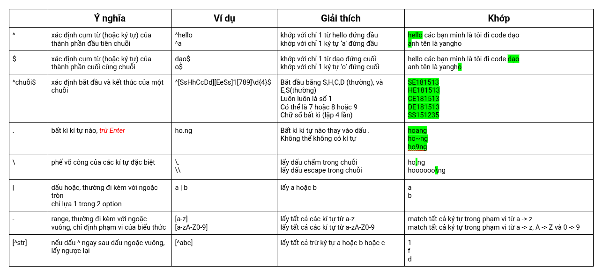

# Mở đầu


Regex là các mẫu (pattern) thay vì các chuỗi cụ thể được sử dụng tìm/thay thế (Find/Replace). Là một công cụ **cực mạnh** cho xử lý chuỗi trong các ngôn ngữ lập trình.

Ví dụ: Khi kiểm tra tính hợp lệ của email hoặc số điện thoại thì điều bạn nghĩ tới đầu tiên chính là regex. Regex là viết tắt của Regular Expression, tên thuần Việt là biểu thức chính quy.

```javascript
\w+([-+.']\w+)*@\w+([-.]\w+)*\.\w+([-.]\w+)*
```

- Đây là một regex dùng để kiểm tra định dạng email. <https://stackoverflow.com/questions/21608294/regex-for-validating-emails>

Mình lần đầu tiên tiếp xúc với Regex là hồi mới học Java. Có method này:

```java
public boolean matches(String regex)
```

dùng để kiểm tra string có khớp với regex hay không. Mới làm quen rất lú, không hiểu regex là gì, sao nhìn nó lằng nhằng thế.

Tuy nhiên mưa dầm thấm lâu, dành thời gian luyện tập thì cũng quen dần hihi.

# Biểu diễn trong các ngôn ngữ lập trình

Ví dụ:

Javascript

```js
let pattern =/^[SsHhCcDd][EeSs]1[789]\\d{4}$/gmi
```

Java

```java
Pattern p = Pattern.compile(“^[SsHhCcDd][EeSs]1[789]\\d{4}$”)
```

Python

```python
pattern = r"^[SsHhCcDd][EeSs]1[789]\d{4}$"
```

C#

```csharp
Regex pattern = new Regex("^[SsHhCcDd][EeSs]1[789]\\d{4}$", RegexOptions.IgnoreCase | RegexOptions.Multiline);
```

Bash

```bash
pattern='^[SsHhCcDd][EeSs]1[789]\\d{4}$'
```

Go

```go
pattern := "^[SsHhCcDd][EeSs]1[789]\\d{4}$"
```

Rust

```rust
let pattern = r"^[SsHhCcDd][EeSs]1[789]\d{4}$";
```

- Chung quy lại, regex được đặt trong dấu ngoặc kép ("") hoặc dấu gạch chéo (/.../) tùy ngôn ngữ lập trình.
- Một số ngôn ngữ yêu cầu phải escape ký tự đặc biệt bằng dấu gạch chéo ngược (\), ví dụ: \d, \s, \w, v.v.
- Các cờ (flags) như g, i, m, s, u, y có thể được thêm vào để điều chỉnh hành vi của regex.

# Flags (cờ)

`g`: global, tìm tất cả các kết quả khớp (matches), không dừng lại ở kết quả đầu tiên
`i`: ignore case, không phân biệt chữ hoa/thường
`m`: multi-line, làm việc với nhiều dòng
`s`: single line, dấu chấm (.) khớp với cả ký tự xuống dòng
`u`: unicode, hỗ trợ ký tự unicode
`y`: sticky, tìm kiếm từ vị trí hiện tại trong chuỗi

Doc tham khảo: <https://stackoverflow.com/questions/4542304/what-does-regex-flag-y-do>

# Cú pháp

## Cơ bản



## Ký tự thường

`\s`: khoảng trắng (space, tab, newline)

`\S`: không là khoảng trắng
= `[^\s]`

`\d`: chữ số (0-9)
= `[0-9]`

`\D`: không phải ký tự chữ số
= `[^0-9]`

`\w`: ký tự từ (**a-z**,**A-Z**, **0-9**, **_**)
= `[a-zA-Z0-9_]`

`\W`: không phải ký tự từ

= `[^w]`
= `[^a-zA-Z0-9_]`

## Tần suất xuất hiện

`*`: >= 0 lần

`+`: >= 1 lần

`?`: có hoặc không (0 hoặc 1 lần)

`??`: không tham lam (non-greedy) cho phép **khớp ít nhất** ký tự (cụm ký tự) có thể

`{n}`: đúng n lần

`{n,}`: ít nhất n lần

`{min,max}`: từ min đến max lần
