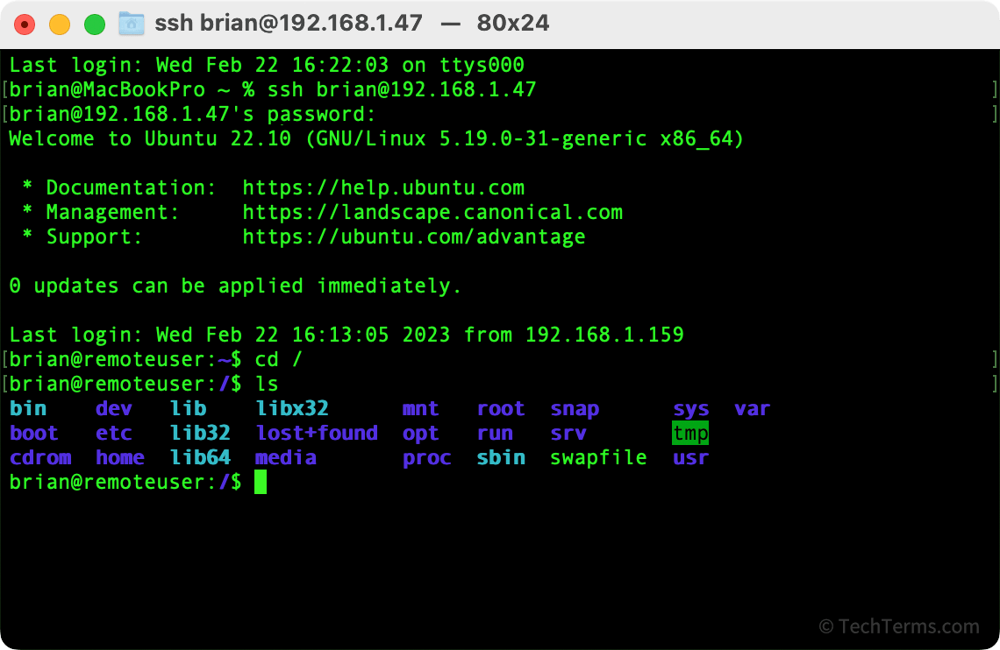
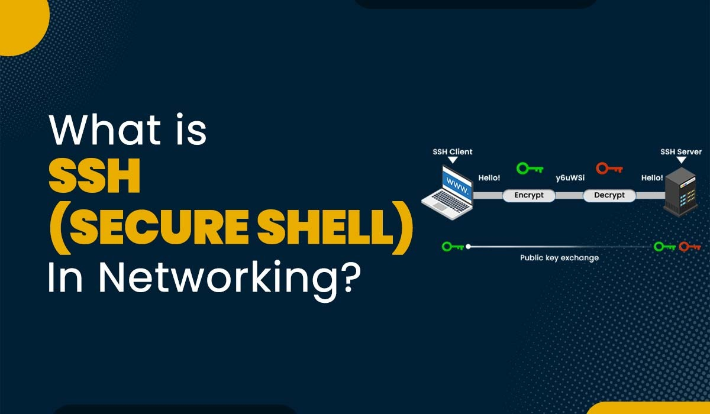
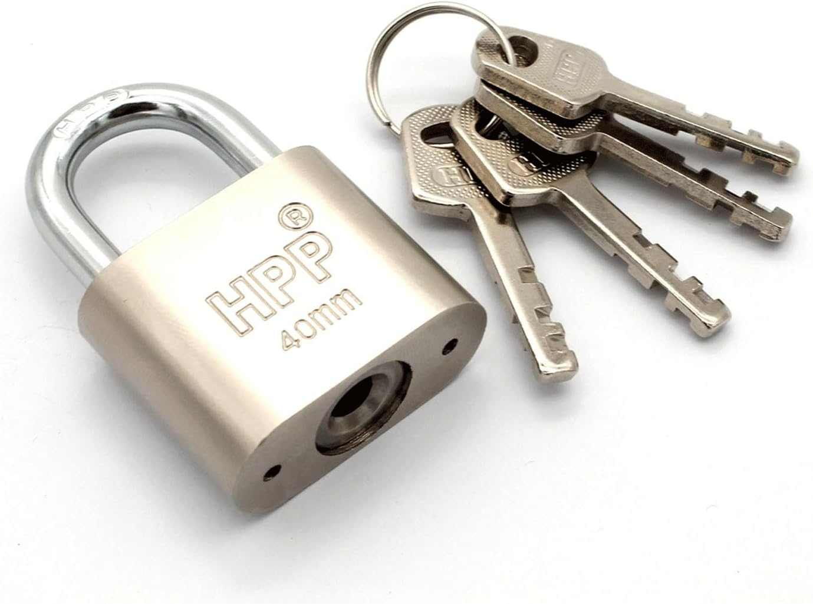

# SSH – Thứ bạn dùng mỗi ngày nhưng rất nhiều người… hiểu nhầm 😄

Nếu bạn làm Dev / DevOps mà chưa từng gõ:

```zsh
ssh user@server_ip
```

thì… chắc bạn đang làm nghề khác.



Nhưng nếu mình hỏi:

> “SSH hoạt động **thực sự** như thế nào?”

Rất nhiều người (kể cả mình trước đây) sẽ:

- dùng **quen tay**

- fix lỗi bằng **bản năng**

- và khi nó fail thì… *“ủa sao hồi nãy được?”*

Bài này là để **chấm dứt vòng lặp mơ hồ đó.**

## SSH là gì?

SSH = **Secure Shell**

Nó không chỉ là “kết nối vào server”, mà là một **thỏa thuận 3 bên**:

1. 🔐 **Xác thực** – mày là ai?

2. 🔒 **Mã hoá** – tao không muốn hàng xóm nghe lén

3. 🧠 **Ủy quyền** – mày được làm gì sau khi vào?

Fail ở bước 1 → khỏi bàn bước 2, 3.



- Sử dụng **giao thức TCP**, mặc định **cổng 22**
- Phương pháp mã hóa đối xứng và bất đối xứng
  - Mã hóa bất đối xứng (Asymmetric Encryption): Dùng để khởi tạo phiên kết nối. (**Thuật toán**: Public key cryptography, phổ biến nhất là **RSA**, DSA, ECDSA, Ed25519)
  - Mã hóa đối xứng (Symmetric Encryption): Dùng để truyền dữ liệu trong phiên kết nối. (**Thuật toán**: phổ biến nhất là **AES**, Blowfish, Twofish, ChaCha20/Salsa20. Mặc định là AES-256)

## Public key và Private key

- Private key:
  - Header: `BEGIN RSA PRIVATE KEY` / `BEGIN OPENSSH PRIVATE KEY`

- Public key:
  - Header: `ssh-ed25519 AAAAC3NzaC1lZDI1NTE5AAAAI... user@host`

## Lần đầu SSH: “Mày có tin server này không?”

Ai dùng SSH lần đầu cũng từng thấy:

```zsh
The authenticity of host 'x.x.x.x' can't be established.
Are you sure you want to continue connecting (yes/no)?
```

Nhiều người nghĩ:

> “À, mình đang cấp quyền cho user login”

❌ Sai hoàn toàn

### Thực chất chuyện gì đang xảy ra?

- Server gửi **host public key**

- Client hỏi:

> “Server này có phải là server thật không, hay thằng giả mạo?”

Khi bạn gõ `yes` client lưu thông tin vào:

```zsh
~/.ssh/known_hosts
```

📌 **File này nằm ở CLIENT**
📌 Nó dùng để **chống giả mạo server (MITM)**
📌 **KHÔNG liên quan gì tới user, password hay SSH key của bạn**

## authorized_keys – chỗ mà rất nhiều người nhầm

Trái ngược với `known_hosts`, **nằm ở SERVER**

```zsh
~/.ssh/authorized_keys
```

File này trả lời câu hỏi:

> “Client này có được phép login user này không?”

Nó chứa:
`PUBLIC KEY của client`

## Tóm lại về luồng SSH, nó diễn ra như thế nào?

- Khi bạn gõ

```zsh
ssh devops@192.168.88.106
```

- 2 phía nói chuyện với nhau như sau

```css
[Client]  →  Xin chào, tôi muốn vào với user devops
[Server]  →  OK, chứng minh đi
```

### 1. Server sẽ cho phép các kiểu chứng minh nào?

Dựa vào `/etc/ssh/sshd_config` (file config của SSH server)

```ini
PubkeyAuthentication yes
PasswordAuthentication yes
KbdInteractiveAuthentication no
```

- Server nói:
  - Có thể dùng **SSH key** (PubkeyAuthentication yes)
  - Hoặc dùng **password** (PasswordAuthentication yes

### 2. Client sẽ bắt đầu thử theo thứ tự

Bước 1: Thử SSH Key (luôn ưu tiên)
Client sẽ:

1. Lấy private key từ `~/.ssh/id_rsa` (mặc định)
2. Gửi **public key fingerprint** cho server

Server kiểm tra:

```txt
/home/devops/.ssh/authorized_keys
```

- Nếu có → cho vào
- Nếu không → Reject, **không hỏi password**

Bước 2: Thử password (nếu bước 1 fail và server cho phép)

```ini
PasswordAuthentication yes
```

Server sẽ

```txt
Password:
```

- Nếu đúng → cho vào
- Nếu sai → Reject

## Làm sao để SSH vào không cần password?

Câu chuyện quen thuộc:

- Bạn SSH lần đầu → nhập password

- SSH lần sau → vẫn hỏi password

- Bạn bực → google → `ssh-copy-id`

- Tự nhiên… khỏi hỏi password nữa

**Vì sao?**

Flow chuẩn của SSH là:

```txt
Try SSH key → FAIL
Fallback password → SUCCESS
```

Lý do SSH key fail:

- server không có public key của bạn

- hoặc permission .ssh sai

- hoặc key không đúng user

### ssh-copy-id – vị cứu tinh thầm lặng

Lệnh:

```zsh
ssh-copy-id -i ~/.ssh/id_ed25519 devops@192.168.88.106
```

Nó làm đúng 3 việc:

1. Login bằng password (lần cuối cùng)

2. Lấy public key của client (dùng `-i` nếu bạn không dùng mặc định)

3. Nối vào:

```zsh
/home/devops/.ssh/authorized_keys
```

Sau đó:

```txt
SSH key OK → khỏi hỏi password
```

Nhớ câu này:

> **ssh-copy-id = “dán public key của tao vào server để server tin tao”**

## SSH key là gì?

SSH key = **chìa khoá & ổ khoá**

| **Thành phần**  | **Ở đâu**    |**Vai trò**    |
|-----------------|--------------|---------------|
| Private key     | Máy bạn      | Chìa khoá 🔑  |
| Public key      | Server       | Ổ khoá 🔒     |
  
> Private key luôn ở máy bạn

Khi login:

- Server đưa challenge

- Client signed bằng private key

- Server verify bằng public key



## Vì sao Ansible SSH không được dù SSH tay được?

Ansible dùng SSH là chính nên có vài lỗi rất hay gặp:

Cú lừa kinh điển 😄

SSH tay:

```zsh
ssh devops@server
```

Flow:

```txt
key fail → hỏi password → bạn gõ → OK
```

Với Ansible:

```zsh
ansible all -m ping
```

Flow:

```zsh
key fail → KHÔNG được hỏi password → FAIL
```

> Mặc định Ansible dùng SSH key-based authentication, vẫn hỗ trợ password nhưng cần cấu hình thêm.

## ~/.ssh/config – thứ khiến bạn “lười mà chuyên”

File này là **bộ não của SSH client.**

Ví dụ:

```zsh
Host proxmox
    HostName 192.168.88.164
    User root
    IdentityFile ~/.ssh/id_ed25519
```

Giờ bạn chỉ cần:

```zsh
ssh proxmox
```

Không user, không IP, không `-i`.

## Permission

SSH cực kỳ khó tính:

~/.ssh            → 700
authorized_keys   → 600
owner đúng user

Nếu:

- group writable
- owner sai

> SSH coi là **không an toàn → reject silently**

- Lỗi hay gặp, public key too open, xử lí bằng cách chuyển quyền sang 400 (chỉ đọc) hoặc 644 (đọc cho tất cả, ghi cho owner):

```zsh
chmod 400 ~/.ssh/id_rsa.pub
```

## File `.pem` của AWS

File `.pem` là **private key** mà AWS cung cấp khi bạn tạo EC2 instance.

Khi bạn tạo EC2:

1. AWS bảo bạn tạo **key pair***
2. AWS
   - Giữ public key
   - Gửi private key về bạn (file `.pem`)

Khi EC2 boot lần đầu:

- AWS chép public key vào:

```zsh
/home/ec2-user/.ssh/authorized_keys
```

> AWS tự làm ssh-copy-id cho bạn

### Vì sao dùng `.pem` để login mà không cần password?

```ini
PasswordAuthentication no
PermitRootLogin prohibit-password
```

AWS AMI mặc định:

- Không password
- Không root SSH
- Chỉ cho phép SSH key

### `.pem` khác gì `id_ed25519`?

|Tiêu chí         |.pem AWS       | id_ed25519          |
|-----------------|---------------|----------------     |
|Bản chất         | Private key   | Private key         |
|Format           | PEM (RSA)     | OpenSSH (ED25519)   |
|Ai tạo           | AWS           | Bạn                 |
|Bảo mật          | RSA 2048      | ED25519 (mạnh hơn)  |
|Có password      | ❌            | có thể có           |

- Khác **format** & **thuật toán** nhưng không khác vai trò

## Kết luận

SSH không khó.
Chỉ là:

- bạn dùng nó **mỗi ngày**

- nhưng chưa từng được ai **kể câu chuyện cho trọn vẹn**

Nếu bạn hiểu được SSH, bạn sẽ:

- debug Ansible nhanh hơn

- deploy tự tin hơn

- và không còn “ủa sao hồi nãy được?”
